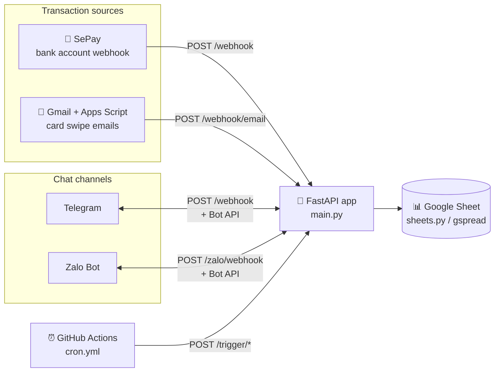
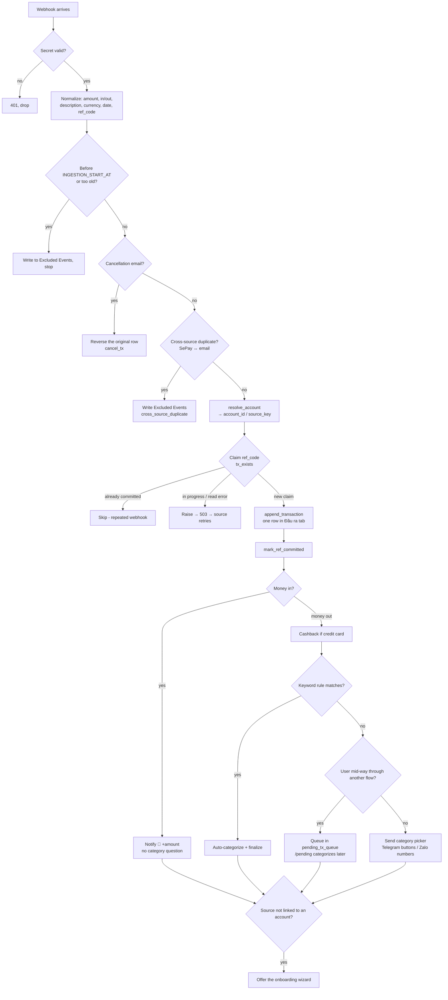

# My Money Went Bot architecture

[🇻🇳 Tiếng Việt](ARCHITECTURE.vi.md)

This document explains what the bot is made of and how one transaction moves
through it, from the moment a bank reports money in or out until it sits in
your Google Sheet and shows up on Telegram or Zalo. It is written for people
who want to read or change the code; if you only want to run a bot, start with
the [README](README.md) and the
[wiki](https://github.com/maingocanh1702/my-money-went-bot/wiki).

---

## 1. The one-sentence version

The bot is **a single FastAPI application** (one process, one user) that
receives webhooks from **SePay** (bank accounts) and **Google Apps Script**
(card notification emails), writes each transaction as one row in **your own
Google Sheet**, and asks for or receives its category over **Telegram** (and
optionally **Zalo**). There is no database: the Google Sheet is the whole
backend.



| Piece | Technology |
|---|---|
| Language | Python 3.11 (`.python-version`, `runtime.txt`) |
| Web framework | FastAPI + uvicorn (`requirements.txt`) |
| Storage | Google Sheets via `gspread` and a service account |
| Outbound HTTP | `httpx` (Telegram Bot API, Zalo Bot API) |
| Deployment | Railway, nixpacks, `uvicorn main:app` (`railway.toml`) |
| Scheduled jobs | GitHub Actions calling `/trigger/*` (`.github/workflows/cron.yml`) |
| Tests | pytest with an in-memory fake spreadsheet (`tests/conftest.py`) |

**Single-tenant:** everyone runs their own bot. Everything is pinned to one
Telegram `CHAT_ID` (and one `ZALO_CHAT_ID`); messages from any other chat are
ignored.

---

## 2. Source map

```
main.py                 FastAPI entry point: every route, the Telegram dispatcher,
                        all Zalo flows (text state machines), scheduled jobs.
config.py               Environment variables, fail-fast validation, sheet tab names.
sheets.py               Data layer: every Google Sheets read/write, caches, locks,
                        the dedup ledger, conversation state, ledger, cashback I/O.
telegram_api.py         Telegram Bot API wrapper (send/edit/delete, inline buttons, command menu).
messenger.py            Multi-channel send: Telegram keeps Markdown; Zalo strips it,
                        turns buttons into a numbered list and chunks long messages.
utils.py                Money parsing ("50k", "1tr2", "1.234.567"), md_safe for outside text.
handlers/
  sepay.py              ★ Transaction pipeline: authenticate → filter → dedup →
                        resolve account → write sheet → cashback → categorize.
  email_parser.py       Bank email → SePay-shaped payload (public repo: Cake only).
  account_resolver.py   Which account/card a transaction belongs to (source_key).
  accounts.py           /accounts, new-account onboarding wizard, history backfill.
  transaction.py        Category picker (parent → sub), finalize, ledger write, keyword learning.
  keywords.py           /keywords — auto-categorize rules.
  allocation.py         /allocate — monthly budget per category.
  manage.py             /manage — add/edit/delete categories, daily cap.
  report.py             /report — 2 lenses (account × category) × 4 periods.
  reports.py            /today, end-of-day recap.
  cashback.py           /cashback — UI for card config, rules, MCC, statement cycle.
  cashback_engine.py    ★ Pure cashback math (no I/O), easy to test.
  cancel_tx.py          /cancel_tx — cancel a transaction, give back credit line + cashback.
  zalo_render.py        Zalo message formatting.
  zalo_queue.py         Queue of Zalo transactions waiting to be categorized.
  lang.py               /lang
i18n/                   vi/en strings and t(); the language is stored in Bot State.
card_templates/         YAML card definitions (cake_freedom, example_visa) + schema + validator.
google_apps_script.js   Runs in Google Apps Script: scans Gmail every minute, posts emails to the bot.
storage/                PostgreSQL connection (strict TLS) — NOT used yet, see §10.
scripts/                Operational tools: webhook simulator, personal-data guard,
                        parity check against the private repo, cashback reconcile, Zalo chat id lookup.
tests/unit/             ~550 tests, run without network access.
```

The two largest files are `main.py` (~3,800 lines) and `sheets.py` (~3,900
lines). If you read only three files to understand the bot, read
`handlers/sepay.py`, `sheets.py` and `main.py`, in that order.

---

## 3. HTTP endpoints

All of them live in `main.py`. FastAPI's generated docs are turned off
(`docs_url=None`) so a stranger cannot list the routes.

| Route | Called by | Authentication | Handling |
|---|---|---|---|
| `POST /webhook` | Telegram **and** SePay (same URL) | Telegram: header `X-Telegram-Bot-Api-Secret-Token` = `TELEGRAM_WEBHOOK_SECRET`. SePay: header `Authorization: Apikey <SEPAY_SECRET>` | Has `update_id` → Telegram, answer 200 at once and process in the background. Otherwise → SePay, **finish processing before answering** |
| `POST /webhook/email` | Google Apps Script | `secret` in the body = `EMAIL_SECRET` | Parse the email → same pipeline as SePay |
| `POST /zalo/webhook` | Zalo Bot Platform | header `X-Bot-Api-Secret-Token` = `ZALO_SECRET_TOKEN` | Only when `ZALO_ENABLED`; processed in the background |
| `POST /trigger/weekly`, `/monthly-report`, `/monthly-allocation`, `/auto-alloc-fallback`, `/daily-recap` | GitHub Actions / crontab | `Authorization: Bearer <CRON_SECRET>` (or `?secret=`) | Run the job in the background, answer 200 at once |
| `GET /healthz`, `GET /` | Railway healthcheck | — | Return OK |

Secrets are always compared with `hmac.compare_digest` (no timing attacks).

**Why are SePay and email handled synchronously but Telegram is not?** Losing a
chat update is an annoyance. With money, answering 200 before writing the sheet
means a failed write makes the transaction disappear for good (SePay won't
resend, Apps Script marks the email processed). So the SePay and email routes
only report success once the row is written; a transient error returns **503**
so the source retries. SePay also requires a `{"success": true}` body, or it
retries forever.

---

## 4. The life of a transaction (main flow)

This is the most important part. The central function is
`handlers/sepay.py::_handle_transaction`, shared by SePay and email alike.



### 4.1 Two sources, one shape

- **SePay** watches linked bank accounts and POSTs JSON for each transaction
  (`transferAmount`, `transferType` in/out, `content`, `accountNumber`, `id`…).
- **Card emails** (credit or debit): `google_apps_script.js` runs in your
  Google account, looks every minute for mail from the addresses in
  `BANK_SENDERS`, and posts each email to `/webhook/email`. It deduplicates
  **by message ID** (kept in `PropertiesService`), not by thread, because Gmail
  groups two swipes with the same subject into one thread. Only emails that
  were delivered successfully are marked processed, so a 503 from the bot means
  the email is sent again on the next run.
- `handlers/email_parser.py` identifies the bank from the sender (forwarded
  emails included), parses the email and returns **exactly a SePay-shaped
  payload** with `_source = "email_<bank>"`. From here on every step is
  identical. Adding a bank = adding its sender to `BANK_SENDERS` + writing a
  `_parse_<bank>` function (see `_parse_cake`). An email that "looks like a
  transaction" but fails to parse returns 503, so a change in the bank's
  template does not lose transactions.

### 4.2 Transaction identity (`ref_code`)

In order of preference:

1. SePay sent an `id` → `ref_code = "sepay:<id>"` (stable across retries).
2. Otherwise → the bank's `referenceCode`.
3. Otherwise → md5 of `amount|description|date` (16 characters).

`ref_code` is stored in **column I** of the `Đầu ra` tab. The
`SEPAY_LEGACY_REF_LOOKUP` flag also checks the old key for a while, so a retry
that spans the identity upgrade does not create a duplicate row.

### 4.3 Time boundary

When a webhook is first registered, SePay may replay old history. The bot
blocks it with:

- `INGESTION_START_AT` (recommended): transactions before this instant are excluded.
- If unset: SePay transactions older than `TX_MAX_AGE_MINUTES` (default 10
  minutes) and emails older than `EMAIL_TX_MAX_AGE_MINUTES` (default 7 days)
  are excluded.

Excluded transactions are **never dropped silently**: they are written to the
`Excluded Events` tab with a reason. If that write itself fails, the bot
refuses to answer 200 (`_require_recorded`) so the source retries.

### 4.4 Deduplication: two layers

1. **Cross-source duplicates** (`sheets.find_recent_duplicate`): the same card
   swipe can arrive both from SePay and by email. The bot compares the last 50
   rows by amount, direction, currency, time proximity and a *different*
   source. Two events from the same source are never paired, because two
   coffees at the same price in the same minute are two transactions.
2. **Repeated webhooks** (`sheets.tx_exists`, `Processed Refs` tab): before
   writing, the bot "claims" the `ref_code` as `processing`, writes the row,
   then flips it to `committed`. If a sheet write times out and it is unclear
   whether it landed, `_append_claimed_transaction` re-reads the sheet by
   `ref_code` before deciding. Every uncertain state **fails closed**: raise so
   the source retries, never guess.

`tx_write_lock` (a `threading.RLock`) guards both the claim and the append, so
two concurrent webhooks cannot overwrite the same row.

### 4.5 Account resolution (`account_resolver.py`)

From the payload the bot extracts an identifier (the SePay account number, or a
hint such as `cake_cc`/`cake_main` from email) and builds
`source_key = "<source>:<identifier>"`, e.g. `sepay:1903xxxx888` or
`email_cake:cake_cc`. The result has three states:

| State | Meaning | Behavior |
|---|---|---|
| `matched` | An account in the `Accounts` tab already owns this `source_key` | Write `account_id` on the row |
| `new_identifier` | There is an identifier, but no account owns it | Still write the row (empty account_id, `source_key` kept in column U), then offer onboarding |
| `no_identifier` | Nothing could be extracted | Write the row, stay quiet |

Onboarding wizard (`handlers/accounts.py`): name → type (bank / debit / credit
/ cash) → done. A credit card also asks for its limit, current outstanding
balance, statement day and due day. The invitation is kept in the
`Pending Accounts` tab for 24 hours, so later transactions don't lose the
"Setup" button. On completion the bot **backfills** every earlier row with the
same `source_key` (`backfill_account_id_by_source_key`) and recomputes their
cashback.

### 4.6 Writing the transaction row

`sheets.append_transaction` writes exactly one row, columns A–U, to the
`Đầu ra` tab:

| Column | Content | Column | Content |
|---|---|---|---|
| B | Date/time (ISO, Vietnam time) | O | Month (`fmt_month`) |
| F | Description | P | Currency (default VND) |
| G | `Tiền ra` (out) / `Tiền vào` (in) | Q | `account_id` |
| H | Amount | R | `expense` / `income` / `transfer` / `cc_payment` |
| I | `ref_code` | S | Linked row (transfers, card payments) |
| K, L | Parent category, sub-category | T | Ledger written yet? |
| M | Is it "Daily Spending"? | U | Original `source_key` |
| N | Categorization confirmed | V | Cancellation time (`/cancel_tx`) |

The order of columns A–P is legacy and **must not change**; new columns are
only ever added at the end. Rows are never deleted, because the ledger and
cashback refer to them by row number.

### 4.7 After the write

- **Money in**: just a "💚 +X just arrived" notice, no category question (the
  bot's goal is tracking spending).
- **Money out**:
  1. If the account is a credit card with cashback configured → compute
     cashback (§6).
  2. Make sure this month has categories: copy last month's, or create the
     default set and send a welcome (`_ensure_buckets`, under `bootstrap_lock`).
  3. The description matches a keyword rule (`Keyword Rules` tab) →
     auto-categorize, no question.
  4. No match → send the category picker. If the user is mid-way through
     another flow (typing a budget, picking the previous transaction's
     category…), the transaction is **queued** in `pending_tx_queue` instead of
     breaking that flow; `/pending` brings it back later.
- Finally, if the source isn't linked to an account → offer onboarding.

### 4.8 Categorizing and finalizing (`handlers/transaction.py`)

The user taps a parent category (`p_<row>_…`) → a sub-category (`s_…`) or types
one. `_finalize` then:

1. Writes the categories to columns K/L and sets N = TRUE.
2. Writes one `Account Ledger` entry (idempotent via column T; skipped on a
   currency mismatch or a cancelled row). The ledger is the source of truth for
   balances; `running_balance`/`outstanding_balance` in `Accounts` are caches.
3. Reports progress against the category budget / daily cap.
4. May offer to "learn" a keyword from the description (`lr_…`) so the next
   one is auto-categorized.
5. Pulls the next transaction from the queue, if any.

---

## 5. Conversations: a state machine stored in the sheet

The bot has no in-memory session it can trust (Railway may restart it at any
time), so conversation state is JSON stored in the `Bot State` tab, one row
per key:

| Key | Used for |
|---|---|
| `<CHAT_ID>` | Telegram flow: `step`, `row_num`, `amount`, `pending_tx_queue`, `lang`… |
| `zalo:<ZALO_CHAT_ID>` | Zalo flow: `step`, `queue`, numbered `buckets`… |
| Zalo "parked" key (`zalo_queue.py`) | Zalo transactions parked while the user finishes another flow |

`sheets.get_state/set_state` cache in-process, so "warm" flows don't re-read
the whole tab.

**Telegram** (`main.py::_process`):

- `callback_query` (button tap) → check the chat is `CHAT_ID`,
  `answerCallback`, validate the `callback_data` shape by prefix (`p`, `s`,
  `al`, `recat`, `mg`, `kw`, `cb`, `acc`, `asg`, `rpt`, `lang`, `lr`, `ctx`),
  then route to the matching handler.
- A message starting with `/` → clear state (keeping `pending_tx_queue` and
  `lang`) and run the command. The user can never get stuck in a flow.
- Any other message → routed by `state.step` (`await_alloc_amount`,
  `await_keyword_input`, `cb_setup_*`, `await_credit_limit`…).

**Zalo** (`main.py::_handle_zalo_text` and the `_zalo_*` functions): the Zalo
Bot API only sends plain text, with no buttons and no message editing. So
`messenger.py` renders every button set as a numbered list, and the user
answers with a number. Each feature has its own text state machine on the Zalo
side, but they share the core (sheets, cashback engine, cancel_tx,
`_cmd_transfer`, `_cmd_cc_pay`…) so the two channels cannot drift apart. New
transactions go to both channels in parallel; categorizing in either writes the
same row.

Commands (the `/` menu is registered at startup via `set_my_commands`):
`/report`, `/today`, `/accounts`, `/manage`, `/keywords`, `/allocate`,
`/cashback`, `/recat`, `/cancel_tx`, `/pending`, `/transfer`, `/cc`, `/lang`,
`/cancel`, `/help`.

---

## 6. Credit-card cashback

Deliberately split into two layers:

- `handlers/cashback_engine.py` — **pure math**, no reads or writes. All state
  (cap already used, transactions so far today…) is passed in.
- `sheets.compute_and_record_cashback` — gathers the data from the sheet, calls
  the engine, writes the result to `Cashback Ledger`.

Order applied to one transaction:

1. **Infer the MCC** from the description via the `MCC Map` tab (self-learning:
   when it can't tell, the bot asks once with the card's MCC groups as buttons
   and remembers the answer). No MCC → a 0đ line with reason `mcc_unknown`.
2. No rule for that MCC in `Cashback Rules` → 0đ `mcc_not_eligible` (also
   applies below `min_tx_amount`).
3. Over the group's per-day transaction limit → 0đ `daily_limit`.
4. `rate × amount`, capped by the **per-transaction cap** for the amount band
   (`Cashback Tx Tiers`).
5. Capped by the **per-MCC cap for the cycle**; already full → 0đ `mcc_cap_full`.
6. **Activation gate**: while eligible spend this cycle is below
   `min_eligible_spend` the line is `pending`; once reached it is `eligible`
   (and the cycle's pending lines are promoted).

The cycle follows the card's **statement day** (`cap_period: statement_cycle`)
or the calendar month. Card config can be loaded from `card_templates/*.yaml`
(`/cashback seed cake_freedom`), built with a wizard (`/cashback setup`), or
exported back into a template (`/cashback export`). Every cashback error is
swallowed and logged: it must **never** block writing the transaction.

---

## 7. Google Sheet tabs

Tab names are declared in `config.SHEETS`. New tabs are created with their
header on first use (`_ensure_*_tab`).

| Tab | Role |
|---|---|
| `Đầu ra` | One row per transaction (the main table, columns A–V in §4.6) |
| `Budget Config` | Categories per month + budget + daily cap |
| `Sub-category Config` | Sub-categories |
| `Keyword Rules` | Keyword → category (auto-categorize) |
| `Accounts` | Accounts/cards: type, `source_keys`, limit, statement day, cached balance |
| `Account Ledger` | Append-only entries, source of truth for balances |
| `Pending Accounts` | Onboarding invitations, valid for 24h |
| `Bot State` | Conversation state JSON per key |
| `Processed Refs` | `ref_code` claim ledger (processing / committed / failed), kept 7 days |
| `Excluded Events` | Transactions deliberately not written, and why |
| `Cashback Rules`, `Cashback Tx Tiers`, `Cashback Card Config` | Cashback configuration |
| `Cashback Ledger` | One cashback line per card transaction (0đ lines included, with a reason) |
| `MCC Map` (+ MCC exclusion tab) | Description pattern → MCC code |
| `Monthly Reports`, `Archive` | Declared in `config.py`, but no code reads or writes them today |

**Performance and Google quota:** `sheets.py` caches transaction rows for 30
seconds, caches categories/accounts/rules until the next write, batches cells
into a single `update`, and wraps gspread in `QuotaBackoffHTTPClient` (retries a
429 after 1, 2, 4 and 8 seconds, then gives up instead of hanging the request).

---

## 8. Scheduled jobs

GitHub Actions (`.github/workflows/cron.yml`) is the canonical schedule for the
Railway deployment; `crontab.txt` is the equivalent for a VPS. Times are in UTC
(ICT = UTC+7).

| Schedule (ICT) | Endpoint | What it does |
|---|---|---|
| 09:00 on the 1st | `/trigger/monthly-allocation` | Asks you to set the new month's budget |
| 10:00 on the 1st | `/trigger/auto-alloc-fallback` | No answer yet → copies last month's budget |
| 20:00 Sunday | `/trigger/weekly` | Weekly summary |
| 21:00 on the 28th–31st | `/trigger/monthly-report` | Monthly report (the handler checks it is really the last day) |
| (optional) 23:00 | `/trigger/daily-recap` | End-of-day recap, skips itself when no daily cap is set |

The workflow skips itself while `BOT_URL` is still the placeholder, so an
unconfigured fork doesn't go red.

---

## 9. Configuration, security and operations

- **Environment variables** (`config.py`, `.env.example`): required are
  `BOT_TOKEN`, `CHAT_ID`, `SHEET_ID`, `GOOGLE_CREDS_JSON` (or `GOOGLE_CREDS`),
  `SEPAY_SECRET`, `TELEGRAM_WEBHOOK_SECRET`, `EMAIL_SECRET`, `CRON_SECRET`;
  plus `ZALO_BOT_TOKEN`, `ZALO_CHAT_ID`, `ZALO_SECRET_TOKEN` when `ZALO_ENABLED`.
  A missing one → the app **refuses to start** (the Google credentials are also
  test-parsed at startup). Test mode is detected by a `BOT_TOKEN` starting with
  `test:`.
- **Owner only**: every Telegram/Zalo update from a chat other than
  `CHAT_ID`/`ZALO_CHAT_ID` is ignored.
- **No bank data in logs**: logs print only safe fields (type, ref), never
  amounts or account numbers; errors shown to the user carry no exception
  details.
- **Outside text** (transaction descriptions, sender names) goes through
  `md_safe` before being inserted into Telegram Markdown.
- **CI** (`.github/workflows/ci.yml`): `scripts/check_no_personal_data.py`
  (blocks real account numbers/secrets from entering the repo), `ruff` for
  serious errors (undefined names, syntax), then `pytest`.
- **Deployment**: Railway builds with nixpacks, runs `uvicorn main:app`,
  healthcheck `/healthz`. After deploying, register the Telegram webhook (with
  `secret_token`), the SePay webhook and (optionally) the Zalo webhook against
  the Railway domain.

---

## 10. Relationship with the `financial-tracking` repository

`maingocanh1702/financial-tracking` is the **private repository that runs in
production** for the project's owner (deployed on Railway).
`my-money-went-bot` is the **open-source edition** split off from it
(`scripts/publish_oss_v1.sh` in the private repo records the split) and keeps
the same architecture, the same files and the same tests. The two repositories
don't call each other and share no data or database; each deployment has its
own Google Sheet.

Deliberate differences, listed in `scripts/check_parity.sh`:

- The private edition parses email from the banks its owner uses (Techcombank,
  Hang Seng) and has a `techcombank_visa.yaml` card template; the public edition
  has only Cake as the worked example and `example_visa.yaml`.
- `google_apps_script.js` in the public edition uses placeholders.
- The public edition additionally has `storage/postgres_connection.py`, the
  privacy-guard test and the Postgres variables in `.env.example`.

Run `scripts/check_parity.sh <path-to-private-checkout>` to see any difference
outside that list ("drift").

**About PostgreSQL:** `storage/postgres_connection.py` is only a strict TLS
connection layer so far (see
`docs/postgres-sot-direct-creator-r25-decision-table.md`). Nothing calls it
yet; Google Sheets remains the only source of truth.

---

## 11. Design rules that run through the code

You will meet these rules again and again; keep them when you change things:

1. **Never lose money silently.** Every authenticated event must become either
   a transaction row, an `Excluded Events` row, or a retry from the source.
   There is no fourth outcome.
2. **Fail closed when unsure.** If the dedup ledger can't be read → raise;
   never assume "not there yet".
3. **Append, never delete.** Cancelling a transaction stamps column V and voids
   its ledger/cashback lines; rows are not removed because everything refers to
   them by row number.
4. **Side features must not block the transaction write.** Cashback, Zalo
   notifications and onboarding are all wrapped in `try/except`.
5. **Don't break what the user is doing.** New transactions are queued instead
   of overwriting state.
6. **One core, two channels.** Business logic is written once; the channel only
   decides how it is shown.

---

## 12. Where to start changing code

| To… | Change |
|---|---|
| Read a new bank's emails | `handlers/email_parser.py` (`BANK_SENDERS`, `_parse_<bank>`) + `BANK_SENDERS` in `google_apps_script.js` |
| Add a cashback card | A `card_templates/<card>.yaml` file, checked with `card_templates/validate.py` |
| Add a command | A handler in `handlers/`, wired into `_handle_command` (Telegram) and `_handle_zalo_text` (Zalo) in `main.py`, plus an entry in `set_my_commands` |
| Add a transaction column | Only at the end (after column V) in `append_transaction` |
| Add user-facing text | `i18n/vi.py` and `i18n/en.py`, used through `t("key")` |
| Try a webhook without a bank | `scripts/sim_webhook.py` |

Run the tests: `pip install -r requirements-dev.txt && pytest tests/unit/ -q`.
Before opening a PR: `python3 scripts/check_no_personal_data.py`.
