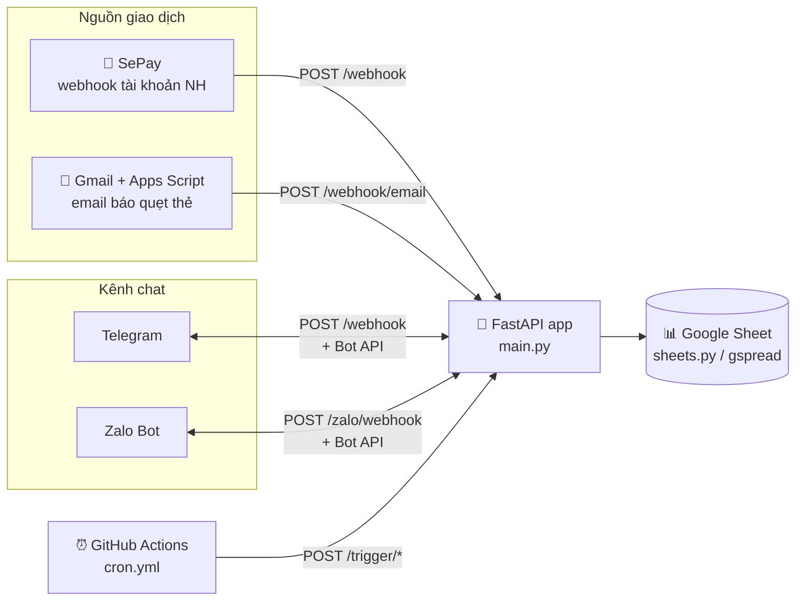
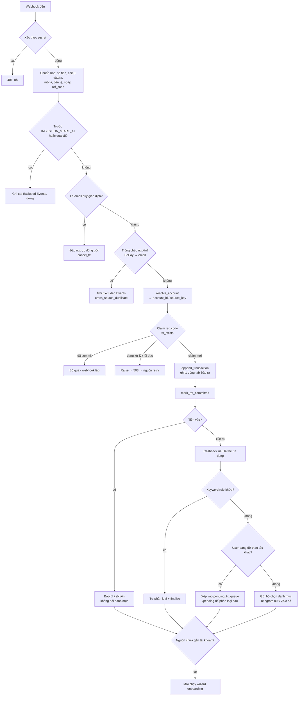

# Kiến trúc My Money Went Bot

Tài liệu này giải thích bot được ghép từ những phần nào và một giao dịch đi
qua hệ thống ra sao, từ lúc ngân hàng báo tiền ra/vào cho tới lúc nó nằm trong
Google Sheet và hiện lên Telegram/Zalo. Nó viết cho người muốn đọc hoặc sửa
code; nếu bạn chỉ cần dựng bot, hãy đọc [README](README.vi.md) và
[wiki](https://github.com/maingocanh1702/my-money-went-bot/wiki).

---

## 1. Tổng quan một câu

Bot là **một ứng dụng FastAPI duy nhất** (một process, một người dùng) nhận
webhook từ **SePay** (tài khoản ngân hàng) và **Google Apps Script** (email báo
giao dịch thẻ), ghi mỗi giao dịch thành một dòng trong **Google Sheet của chính
bạn**, rồi hỏi/nhận phân loại qua **Telegram** (và tuỳ chọn **Zalo**). Không có
database: Google Sheet là toàn bộ backend.



| Thành phần | Công nghệ |
|---|---|
| Ngôn ngữ | Python 3.11 (`.python-version`, `runtime.txt`) |
| Web framework | FastAPI + uvicorn (`requirements.txt`) |
| Lưu trữ | Google Sheets qua `gspread` + service account |
| HTTP ra ngoài | `httpx` (Telegram Bot API, Zalo Bot API) |
| Deploy | Railway, nixpacks, `uvicorn main:app` (`railway.toml`) |
| Lịch chạy định kỳ | GitHub Actions gọi `/trigger/*` (`.github/workflows/cron.yml`) |
| Test | pytest với spreadsheet giả trong bộ nhớ (`tests/conftest.py`) |

**Single-tenant:** mỗi người tự chạy một bot riêng. Mọi thứ được "khoá" vào
một `CHAT_ID` Telegram (và một `ZALO_CHAT_ID`); tin nhắn từ chat khác bị bỏ qua.

---

## 2. Bản đồ mã nguồn

```
main.py                 Điểm vào FastAPI: mọi route, bộ điều phối Telegram,
                        toàn bộ luồng Zalo (state machine dạng text), cron.
config.py               Đọc biến môi trường, kiểm tra fail-fast, tên các tab Sheet.
sheets.py               Lớp dữ liệu: mọi đọc/ghi Google Sheets, cache, lock,
                        sổ chống trùng, state hội thoại, ledger, cashback I/O.
telegram_api.py         Wrapper Telegram Bot API (send/edit/delete, nút inline, menu lệnh).
messenger.py            Lớp gửi tin đa kênh: Telegram giữ Markdown; Zalo bỏ
                        Markdown, biến nút thành danh sách đánh số, chia nhỏ tin dài.
utils.py                Đọc số tiền ("50k", "1tr2", "1.234.567"), md_safe cho text từ ngoài.
handlers/
  sepay.py              ★ Pipeline giao dịch: xác thực → lọc → chống trùng →
                        gán tài khoản → ghi Sheet → cashback → phân loại.
  email_parser.py       Email ngân hàng → payload giống SePay (bản công khai: chỉ Cake).
  account_resolver.py   Giao dịch này thuộc tài khoản/thẻ nào (source_key).
  accounts.py           /accounts, wizard onboarding tài khoản mới, gán ngược lịch sử.
  transaction.py        Chọn danh mục (parent → sub), finalize, ghi ledger, học keyword.
  keywords.py           /keywords — luật tự phân loại theo từ khoá.
  allocation.py         /allocate — ngân sách tháng theo danh mục.
  manage.py             /manage — thêm/sửa/xoá danh mục, hạn mức ngày.
  report.py             /report — 2 góc nhìn (tài khoản × danh mục) × 4 kỳ.
  reports.py            /today, recap cuối ngày.
  cashback.py           /cashback — UI cấu hình thẻ, rule, MCC, kỳ sao kê.
  cashback_engine.py    ★ Toán cashback thuần (không I/O), dễ test.
  cancel_tx.py          /cancel_tx — huỷ giao dịch, hoàn hạn mức + cashback.
  zalo_render.py        Định dạng tin Zalo.
  zalo_queue.py         Hàng đợi giao dịch chờ phân loại bên Zalo.
  lang.py               /lang
i18n/                   Chuỗi vi/en, hàm t(); ngôn ngữ lưu trong Bot State.
card_templates/         YAML định nghĩa thẻ (cake_freedom, example_visa) + schema + validator.
google_apps_script.js   Script chạy trong Google Apps Script: quét Gmail mỗi phút, gửi email về bot.
storage/                Kết nối PostgreSQL (TLS nghiêm ngặt) — CHƯA được dùng, xem §10.
scripts/                Công cụ vận hành: giả lập webhook, kiểm tra dữ liệu cá nhân,
                        so sánh parity với repo private, đối soát cashback, lấy Zalo chat id.
tests/unit/             ~550 test, chạy không cần mạng.
```

Hai file lớn nhất là `main.py` (~3.800 dòng) và `sheets.py` (~3.900 dòng). Nếu
chỉ đọc ba file để hiểu bot, hãy đọc `handlers/sepay.py`, `sheets.py` và
`main.py` theo thứ tự đó.

---

## 3. Các endpoint HTTP

Tất cả nằm trong `main.py`. Trang docs tự sinh của FastAPI bị tắt
(`docs_url=None`) để người lạ không liệt kê được route.

| Route | Ai gọi | Xác thực | Xử lý |
|---|---|---|---|
| `POST /webhook` | Telegram **và** SePay (chung một URL) | Telegram: header `X-Telegram-Bot-Api-Secret-Token` = `TELEGRAM_WEBHOOK_SECRET`. SePay: header `Authorization: Apikey <SEPAY_SECRET>` | Có `update_id` → Telegram, trả 200 ngay và xử lý nền. Không có → SePay, **xử lý xong rồi mới trả lời** |
| `POST /webhook/email` | Google Apps Script | `secret` trong body = `EMAIL_SECRET` | Parse email → cùng pipeline với SePay |
| `POST /zalo/webhook` | Zalo Bot Platform | header `X-Bot-Api-Secret-Token` = `ZALO_SECRET_TOKEN` | Chỉ khi `ZALO_ENABLED`; xử lý nền |
| `POST /trigger/weekly`, `/monthly-report`, `/monthly-allocation`, `/auto-alloc-fallback`, `/daily-recap` | GitHub Actions / crontab | `Authorization: Bearer <CRON_SECRET>` (hoặc `?secret=`) | Chạy job nền, trả 200 ngay |
| `GET /healthz`, `GET /` | Railway healthcheck | — | Trả OK |

So sánh secret luôn dùng `hmac.compare_digest` (chống timing attack).

**Vì sao SePay/email được xử lý đồng bộ còn Telegram thì không?** Với tin chat,
mất một cập nhật chỉ gây phiền. Với tiền, trả 200 trước rồi mới ghi Sheet thì
nếu ghi lỗi giao dịch sẽ biến mất vĩnh viễn (SePay không gửi lại, Apps Script
đánh dấu email đã xử lý). Vì vậy route SePay/email chỉ trả thành công khi dòng
đã được ghi; lỗi tạm thời trả **503** để nguồn tự retry. SePay còn đòi body
`{"success": true}`, nếu không nó retry mãi.

---

## 4. Hành trình của một giao dịch (luồng chính)

Đây là phần quan trọng nhất. Hàm trung tâm là
`handlers/sepay.py::_handle_transaction`, dùng chung cho cả SePay lẫn email.



### 4.1 Hai nguồn, một định dạng

- **SePay**: SePay theo dõi tài khoản ngân hàng đã liên kết và POST JSON cho
  mỗi giao dịch (`transferAmount`, `transferType` in/out, `content`,
  `accountNumber`, `id`…).
- **Email thẻ** (tín dụng hoặc ghi nợ): `google_apps_script.js` chạy trong
  tài khoản Google của bạn, mỗi phút tìm email từ các địa chỉ trong
  `BANK_SENDERS`, gửi từng email tới `/webhook/email`. Nó chống trùng **theo
  message ID** (lưu trong `PropertiesService`) chứ không theo thread, vì Gmail
  gộp hai lần quẹt cùng tiêu đề vào một thread. Chỉ email gửi thành công mới
  được đánh dấu đã xử lý, nên bot trả 503 là email sẽ được gửi lại lần sau.
- `handlers/email_parser.py` nhận diện ngân hàng từ người gửi (kể cả email
  forward), parse và trả về **đúng dạng payload SePay** kèm `_source =
  "email_<bank>"`. Từ đây trở đi mọi bước đều giống nhau. Thêm một ngân hàng =
  thêm sender vào `BANK_SENDERS` + viết một hàm `_parse_<bank>` (xem
  `_parse_cake`). Email "trông giống giao dịch" nhưng parse hỏng sẽ trả 503 để
  không mất giao dịch khi ngân hàng đổi mẫu email.

### 4.2 Danh tính giao dịch (`ref_code`)

Theo thứ tự ưu tiên:

1. SePay có `id` → `ref_code = "sepay:<id>"` (ổn định qua các lần retry).
2. Không có → `referenceCode` của ngân hàng.
3. Không có nữa → md5 của `số tiền|mô tả|ngày` (16 ký tự).

`ref_code` được lưu ở **cột I** của tab `Đầu ra`. Cờ `SEPAY_LEGACY_REF_LOOKUP`
tạm thời kiểm tra cả khoá cũ để một retry vắt qua lần nâng cấp danh tính không
tạo dòng đôi.

### 4.3 Ranh giới thời gian

Khi mới đăng ký webhook, SePay có thể gửi lại lịch sử cũ. Bot chặn bằng:

- `INGESTION_START_AT` (khuyến nghị): giao dịch xảy ra trước mốc này bị loại.
- Nếu không đặt: giao dịch SePay cũ hơn `TX_MAX_AGE_MINUTES` (mặc định 10 phút),
  email cũ hơn `EMAIL_TX_MAX_AGE_MINUTES` (mặc định 7 ngày) bị loại.

Giao dịch bị loại **không bị vứt im lặng**: nó được ghi vào tab
`Excluded Events` kèm lý do. Nếu chính việc ghi này lỗi, bot từ chối trả 200
(`_require_recorded`) để nguồn retry.

### 4.4 Chống trùng: hai lớp

1. **Trùng chéo nguồn** (`sheets.find_recent_duplicate`): cùng một lần quẹt
   thẻ có thể đến cả qua SePay lẫn email. Bot so 50 dòng gần nhất theo số
   tiền, chiều, tiền tệ, thời gian gần nhau và khác nguồn.
2. **Webhook lặp** (`sheets.tx_exists`, tab `Processed Refs`): trước khi ghi,
   bot "claim" `ref_code` với trạng thái `processing`, ghi dòng giao dịch, rồi
   đổi sang `committed`. Nếu ghi Sheet timeout mà không rõ đã ghi hay chưa,
   `_append_claimed_transaction` đọc lại Sheet theo `ref_code` trước khi quyết
   định. Mọi trạng thái không chắc chắn đều **fail-closed**: raise lỗi để nguồn
   retry, không bao giờ đoán.

`tx_write_lock` (một `threading.RLock`) bảo vệ cả claim lẫn append nên hai
webhook đồng thời không ghi đè cùng một dòng.

### 4.5 Gán tài khoản (`account_resolver.py`)

Từ payload bot rút ra một định danh (số tài khoản SePay, hoặc gợi ý như
`cake_cc`/`cake_main` từ email) và tạo `source_key = "<nguồn>:<định danh>"`,
ví dụ `sepay:1903xxxx888` hoặc `email_cake:cake_cc`. Kết quả có ba trạng thái:

| Trạng thái | Nghĩa | Hành vi |
|---|---|---|
| `matched` | Một tài khoản trong tab `Accounts` đã sở hữu `source_key` | Ghi `account_id` vào dòng |
| `new_identifier` | Có định danh nhưng chưa ai sở hữu | Vẫn ghi dòng (account_id rỗng, lưu `source_key` ở cột U), rồi mời onboarding |
| `no_identifier` | Không rút được gì | Ghi dòng, im lặng |

Wizard onboarding (`handlers/accounts.py`): tên → loại (bank / debit / credit /
cash) → xong. Thẻ tín dụng hỏi thêm hạn mức, dư nợ hiện tại, ngày sao kê, ngày
đến hạn. Lời mời được lưu ở tab `Pending Accounts` 24 giờ nên nhiều giao dịch
sau đó cũng không làm mất nút "Setup". Khi hoàn tất, bot **gán ngược** mọi
dòng cũ có cùng `source_key` (`backfill_account_id_by_source_key`) và tính lại
cashback cho chúng.

### 4.6 Ghi dòng giao dịch

`sheets.append_transaction` ghi đúng một dòng A–U vào tab `Đầu ra`:

| Cột | Nội dung | Cột | Nội dung |
|---|---|---|---|
| B | Ngày giờ (ISO, giờ VN) | O | Tháng (`fmt_month`) |
| F | Mô tả | P | Tiền tệ (mặc định VND) |
| G | `Tiền ra` / `Tiền vào` | Q | `account_id` |
| H | Số tiền | R | `expense` / `income` / `transfer` / `cc_payment` |
| I | `ref_code` | S | Dòng liên kết (chuyển khoản, trả thẻ) |
| K, L | Danh mục cha, con | T | Đã ghi ledger chưa |
| M | Là "Daily Spending"? | U | `source_key` gốc |
| N | Đã xác nhận phân loại | V | Thời điểm huỷ (`/cancel_tx`) |

Thứ tự cột A–P là di sản, **không được đổi**; cột mới chỉ được thêm ở cuối.
Dòng không bao giờ bị xoá vì ledger và cashback tham chiếu theo số dòng.

### 4.7 Sau khi ghi

- **Tiền vào**: chỉ báo "💚 +X vừa vào tài khoản", không hỏi danh mục (mục
  tiêu của bot là theo dõi chi).
- **Tiền ra**:
  1. Nếu tài khoản là thẻ tín dụng có cấu hình cashback → tính cashback (§6).
  2. Đảm bảo tháng này có danh mục: copy từ tháng trước, hoặc tạo bộ mặc định
     và gửi lời chào (`_ensure_buckets`, có `bootstrap_lock`).
  3. Mô tả khớp một keyword rule (tab `Keyword Rules`) → tự phân loại, không hỏi.
  4. Không khớp → gửi bộ chọn danh mục. Nếu người dùng đang dở một thao tác
     khác (đang gõ ngân sách, đang chọn danh mục của giao dịch trước…), giao
     dịch được **xếp hàng** vào `pending_tx_queue` thay vì phá thao tác đang dở;
     `/pending` sẽ lấy ra phân loại sau.
- Cuối cùng, nếu nguồn chưa gắn tài khoản → mời onboarding.

### 4.8 Phân loại và finalize (`handlers/transaction.py`)

Người dùng bấm danh mục cha (`p_<row>_…`) → danh mục con (`s_…`) hoặc gõ tự do.
`_finalize` sẽ:

1. Ghi danh mục vào cột K/L, đặt N = TRUE.
2. Ghi một dòng vào `Account Ledger` (idempotent, kiểm tra cột T, bỏ qua nếu
   khác tiền tệ hoặc dòng đã huỷ). Ledger là nguồn sự thật cho số dư; cột
   `running_balance`/`outstanding_balance` trong `Accounts` chỉ là cache.
3. Báo lại tiến độ ngân sách danh mục / hạn mức ngày.
4. Có thể đề nghị "học" từ khoá từ mô tả (`lr_…`) để lần sau tự phân loại.
5. Lấy giao dịch tiếp theo trong hàng đợi, nếu có.

---

## 5. Hội thoại: state machine lưu trong Sheet

Bot không có session trong bộ nhớ đáng tin (Railway có thể restart bất cứ lúc
nào), nên trạng thái hội thoại là một JSON lưu trong tab `Bot State`, một dòng
cho mỗi khoá:

| Khoá | Dùng cho |
|---|---|
| `<CHAT_ID>` | Luồng Telegram: `step`, `row_num`, `amount`, `pending_tx_queue`, `lang`… |
| `zalo:<ZALO_CHAT_ID>` | Luồng Zalo: `step`, `queue`, `buckets` đánh số… |
| khoá "parked" của Zalo (`zalo_queue.py`) | Giao dịch Zalo đỗ lại khi user đang dở thao tác |

`sheets.get_state/set_state` có cache trong process nên luồng "nóng" không đọc
lại cả tab.

**Telegram** (`main.py::_process`):

- `callback_query` (bấm nút) → kiểm tra chat = `CHAT_ID`, `answerCallback`,
  kiểm tra định dạng `callback_data` theo tiền tố (`p`, `s`, `al`, `recat`,
  `mg`, `kw`, `cb`, `acc`, `asg`, `rpt`, `lang`, `lr`, `ctx`) rồi chuyển tới
  handler tương ứng.
- Tin nhắn bắt đầu bằng `/` → xoá state (giữ lại `pending_tx_queue` và
  `lang`) rồi chạy lệnh. Người dùng không bao giờ bị kẹt trong một luồng.
- Tin nhắn thường → chuyển theo `state.step` (`await_alloc_amount`,
  `await_keyword_input`, `cb_setup_*`, `await_credit_limit`…).

**Zalo** (`main.py::_handle_zalo_text` và các hàm `_zalo_*`): Zalo Bot API chỉ
gửi được text thuần, không có nút, không sửa tin. Vì thế mọi bộ nút được
`messenger.py` hiển thị thành danh sách đánh số và người dùng trả lời bằng số.
Mỗi tính năng có một phiên bản state machine dạng text riêng bên Zalo, nhưng
dùng chung phần lõi (sheets, cashback engine, cancel_tx, `_cmd_transfer`,
`_cmd_cc_pay`…) để hai kênh không lệch nhau. Giao dịch mới được gửi song song
tới cả hai kênh; phân loại ở kênh nào cũng ghi cùng một dòng.

Các lệnh (menu `/` được đăng ký lúc khởi động qua `set_my_commands`):
`/report`, `/today`, `/accounts`, `/manage`, `/keywords`, `/allocate`,
`/cashback`, `/recat`, `/cancel_tx`, `/pending`, `/transfer`, `/cc`, `/lang`,
`/cancel`, `/help`.

---

## 6. Cashback thẻ tín dụng

Chia làm hai tầng có chủ đích:

- `handlers/cashback_engine.py` — **toán thuần**, không đọc/ghi gì. Mọi trạng
  thái (đã dùng bao nhiêu cap, hôm nay đã bao nhiêu giao dịch…) được truyền vào.
- `sheets.compute_and_record_cashback` — gom dữ liệu từ Sheet, gọi engine, ghi
  kết quả vào `Cashback Ledger`.

Thứ tự áp dụng cho một giao dịch:

1. **Đoán MCC** từ mô tả qua tab `MCC Map` (tự học: không đoán được thì bot
   hỏi một lần bằng nút là các nhóm MCC của thẻ, rồi nhớ câu trả lời). Không
   có MCC → dòng 0đ lý do `mcc_unknown`.
2. MCC không có rule nào trong `Cashback Rules` → 0đ `mcc_not_eligible`
   (cũng áp dụng khi dưới `min_tx_amount`).
3. Vượt giới hạn số giao dịch/ngày của nhóm → 0đ `daily_limit`.
4. `tỷ lệ × số tiền`, cắt theo **cap mỗi giao dịch** theo bậc số tiền
   (`Cashback Tx Tiers`).
5. Cắt theo **cap mỗi nhóm MCC trong kỳ**; đầy rồi → 0đ `mcc_cap_full`.
6. **Cổng kích hoạt**: tổng chi hợp lệ trong kỳ chưa đạt `min_eligible_spend`
   → trạng thái `pending`; đạt rồi → `eligible` (và các dòng pending của kỳ
   được nâng lên).

Kỳ được tính theo **ngày sao kê** của thẻ (`cap_period: statement_cycle`) hoặc
theo tháng dương lịch. Cấu hình thẻ có thể nạp từ `card_templates/*.yaml`
(`/cashback seed cake_freedom`), tạo bằng wizard (`/cashback setup`) hoặc xuất
ngược thành template (`/cashback export`). Mọi lỗi cashback đều bị nuốt và ghi
log: nó **không bao giờ** được chặn việc ghi giao dịch.

---

## 7. Các tab trong Google Sheet

Tên tab khai báo trong `config.SHEETS`. Tab mới được tự tạo kèm header ở lần
dùng đầu (`_ensure_*_tab`).

| Tab | Vai trò |
|---|---|
| `Đầu ra` | Mỗi giao dịch một dòng (bảng chính, cột A–V ở §4.6) |
| `Budget Config` | Danh mục theo tháng + ngân sách + hạn mức ngày |
| `Sub-category Config` | Danh mục con |
| `Keyword Rules` | Từ khoá → danh mục (tự phân loại) |
| `Accounts` | Tài khoản/thẻ: loại, `source_keys`, hạn mức, ngày sao kê, số dư cache |
| `Account Ledger` | Sổ phát sinh append-only, nguồn sự thật cho số dư |
| `Pending Accounts` | Lời mời onboarding còn hiệu lực 24h |
| `Bot State` | JSON trạng thái hội thoại theo khoá |
| `Processed Refs` | Sổ claim `ref_code` (processing / committed / failed), giữ 7 ngày |
| `Excluded Events` | Giao dịch cố ý không ghi và lý do |
| `Cashback Rules`, `Cashback Tx Tiers`, `Cashback Card Config` | Cấu hình cashback |
| `Cashback Ledger` | Mỗi giao dịch thẻ một dòng cashback (kể cả 0đ, có lý do) |
| `MCC Map` (+ tab loại trừ MCC) | Mẫu mô tả → mã MCC |
| `Monthly Reports`, `Archive` | Tên đã khai báo trong `config.py` nhưng hiện chưa có code nào đọc/ghi |

**Hiệu năng và quota Google:** `sheets.py` cache các dòng giao dịch 30 giây,
cache danh mục/tài khoản/rule cho tới khi có ghi, gộp nhiều ô vào một lệnh
`update`, và bọc gspread bằng `QuotaBackoffHTTPClient` (retry lỗi 429 sau 1, 2,
4, 8 giây rồi bỏ cuộc thay vì treo request mãi).

---

## 8. Các job định kỳ

GitHub Actions (`.github/workflows/cron.yml`) là lịch chính thức cho bản chạy
trên Railway; `crontab.txt` là phiên bản tương đương cho VPS. Giờ tính theo UTC
(ICT = UTC+7).

| Lịch (ICT) | Endpoint | Việc làm |
|---|---|---|
| 09:00 ngày 1 | `/trigger/monthly-allocation` | Mời đặt ngân sách tháng mới |
| 10:00 ngày 1 | `/trigger/auto-alloc-fallback` | Chưa trả lời thì copy ngân sách tháng trước |
| 20:00 Chủ nhật | `/trigger/weekly` | Tóm tắt tuần |
| 21:00 ngày 28–31 | `/trigger/monthly-report` | Báo cáo tháng (handler tự kiểm tra có phải ngày cuối tháng) |
| (tuỳ chọn) 23:00 | `/trigger/daily-recap` | Recap cuối ngày, tự bỏ qua nếu không đặt hạn mức ngày |

Workflow tự bỏ qua khi `BOT_URL` vẫn là placeholder, nên bản fork chưa cấu
hình sẽ không đỏ.

---

## 9. Cấu hình, bảo mật và vận hành

- **Biến môi trường** (`config.py`, `.env.example`): bắt buộc `BOT_TOKEN`,
  `CHAT_ID`, `SHEET_ID`, `GOOGLE_CREDS_JSON` (hoặc `GOOGLE_CREDS`),
  `SEPAY_SECRET`, `TELEGRAM_WEBHOOK_SECRET`, `EMAIL_SECRET`, `CRON_SECRET`;
  thêm `ZALO_BOT_TOKEN`, `ZALO_CHAT_ID`, `ZALO_SECRET_TOKEN` khi `ZALO_ENABLED`.
  Thiếu một biến → app **từ chối khởi động** (credentials Google cũng được
  parse thử lúc khởi động). Chế độ test được nhận diện khi `BOT_TOKEN` bắt đầu
  bằng `test:`.
- **Chỉ chủ bot**: mọi update Telegram/Zalo từ chat khác `CHAT_ID`/`ZALO_CHAT_ID`
  bị bỏ qua.
- **Không log dữ liệu ngân hàng**: log chỉ in trường an toàn (loại, ref), không
  in số tiền hay số tài khoản; lỗi gửi cho người dùng không chứa chi tiết
  exception.
- **Text từ bên ngoài** (mô tả giao dịch, tên người chuyển) đi qua `md_safe`
  trước khi chèn vào Markdown Telegram.
- **CI** (`.github/workflows/ci.yml`): `scripts/check_no_personal_data.py` (chặn
  số tài khoản thật/secret lọt vào repo), `ruff` cho lỗi nghiêm trọng
  (tên chưa định nghĩa, cú pháp), rồi `pytest`.
- **Deploy**: Railway build bằng nixpacks, chạy `uvicorn main:app`,
  healthcheck `/healthz`. Sau deploy cần đăng ký webhook Telegram (kèm
  `secret_token`), webhook SePay và (tuỳ chọn) webhook Zalo trỏ về domain Railway.

---

## 10. Quan hệ với repo `financial-tracking`

`maingocanh1702/financial-tracking` là **repo private, bản chạy thật** của chủ
dự án (deploy trên Railway). `my-money-went-bot` là **bản open-source** được
tách ra từ đó (`scripts/publish_oss_v1.sh` trong repo private ghi lại lần tách)
và giữ cùng kiến trúc, cùng file, cùng test. Hai repo không gọi nhau, không
chia sẻ dữ liệu hay database; mỗi bản deploy có Google Sheet riêng.

Khác biệt có chủ đích, được liệt kê trong `scripts/check_parity.sh`:

- Bản private parse email của các ngân hàng chủ dự án dùng (Techcombank, Hang
  Seng) và có template thẻ `techcombank_visa.yaml`; bản công khai chỉ có Cake
  làm ví dụ và `example_visa.yaml`.
- `google_apps_script.js` bản công khai dùng placeholder.
- Bản công khai có thêm `storage/postgres_connection.py`, test privacy guard
  và biến Postgres trong `.env.example`.

Chạy `scripts/check_parity.sh <đường-dẫn-repo-private>` để thấy mọi khác biệt
ngoài danh sách trên ("drift").

**Về PostgreSQL:** `storage/postgres_connection.py` mới chỉ là lớp kết nối TLS
chặt chẽ (xem `docs/postgres-sot-direct-creator-r25-decision-table.md`).
Chưa có code nào gọi nó; Google Sheets vẫn là nguồn sự thật duy nhất.

---

## 11. Nguyên tắc thiết kế xuyên suốt

Đọc code bạn sẽ gặp đi gặp lại các quy tắc này; hãy giữ chúng khi sửa:

1. **Không mất tiền trong im lặng.** Mọi sự kiện đã xác thực phải hoặc thành
   một dòng giao dịch, hoặc thành một dòng `Excluded Events`, hoặc khiến nguồn
   retry. Không có lựa chọn thứ tư.
2. **Fail-closed khi không chắc.** Không đọc được sổ chống trùng → raise, không
   đoán là "chưa có".
3. **Chỉ append, không xoá.** Huỷ giao dịch đánh dấu cột V và void các dòng
   ledger/cashback; không xoá dòng vì mọi thứ tham chiếu theo số dòng.
4. **Tính năng phụ không được chặn việc ghi giao dịch.** Cashback, thông báo
   Zalo, onboarding đều bọc `try/except`.
5. **Không phá thao tác người dùng đang làm.** Giao dịch mới vào hàng đợi thay
   vì ghi đè state.
6. **Một lõi, hai kênh.** Logic nghiệp vụ viết một lần; kênh chỉ quyết định
   cách hiển thị.

---

## 12. Bắt đầu sửa code ở đâu

| Muốn… | Sửa ở |
|---|---|
| Thêm ngân hàng đọc qua email | `handlers/email_parser.py` (`BANK_SENDERS`, `_parse_<bank>`) + `BANK_SENDERS` trong `google_apps_script.js` |
| Thêm một thẻ cashback | Một file `card_templates/<thẻ>.yaml`, kiểm tra bằng `card_templates/validate.py` |
| Thêm lệnh mới | Handler trong `handlers/`, nối vào `_handle_command` (Telegram) và `_handle_zalo_text` (Zalo) trong `main.py`, thêm vào `set_my_commands` |
| Thêm cột cho giao dịch | Chỉ thêm ở cuối (sau cột V) trong `append_transaction` |
| Thêm chuỗi hiển thị | `i18n/vi.py` và `i18n/en.py`, dùng `t("key")` |
| Thử một webhook không cần ngân hàng | `scripts/sim_webhook.py` |

Chạy test: `pip install -r requirements-dev.txt && pytest tests/unit/ -q`.
Trước khi mở PR: `python3 scripts/check_no_personal_data.py`.
