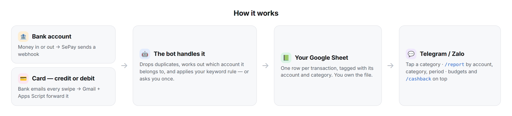
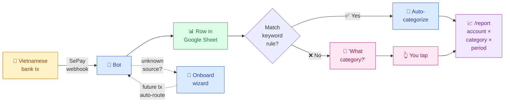
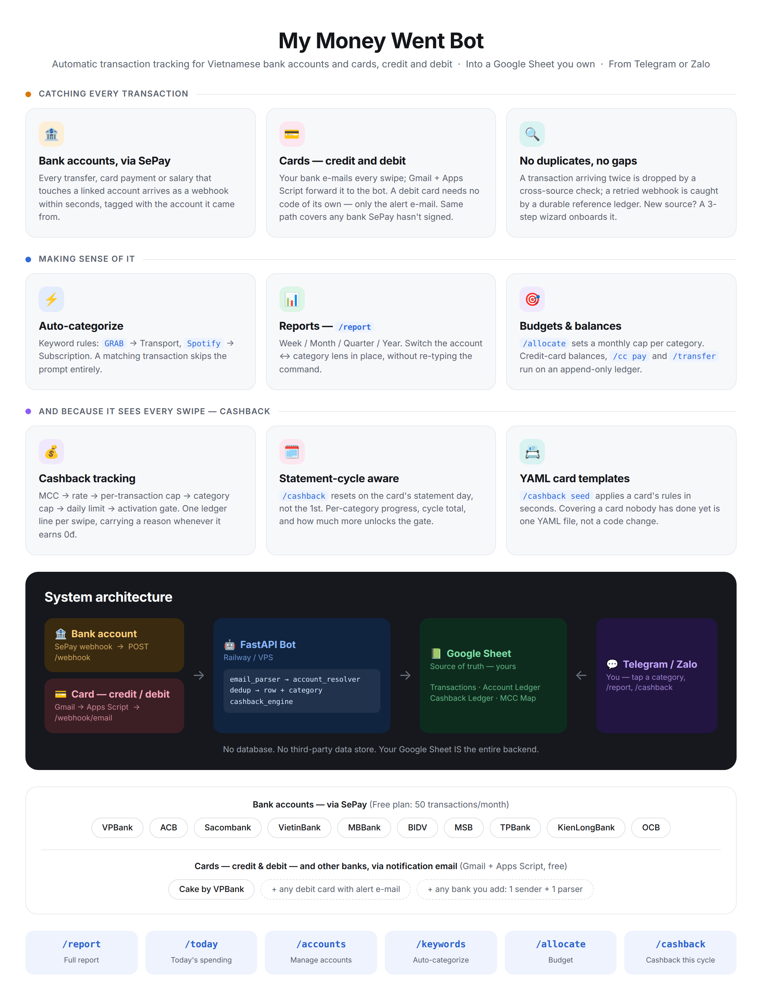
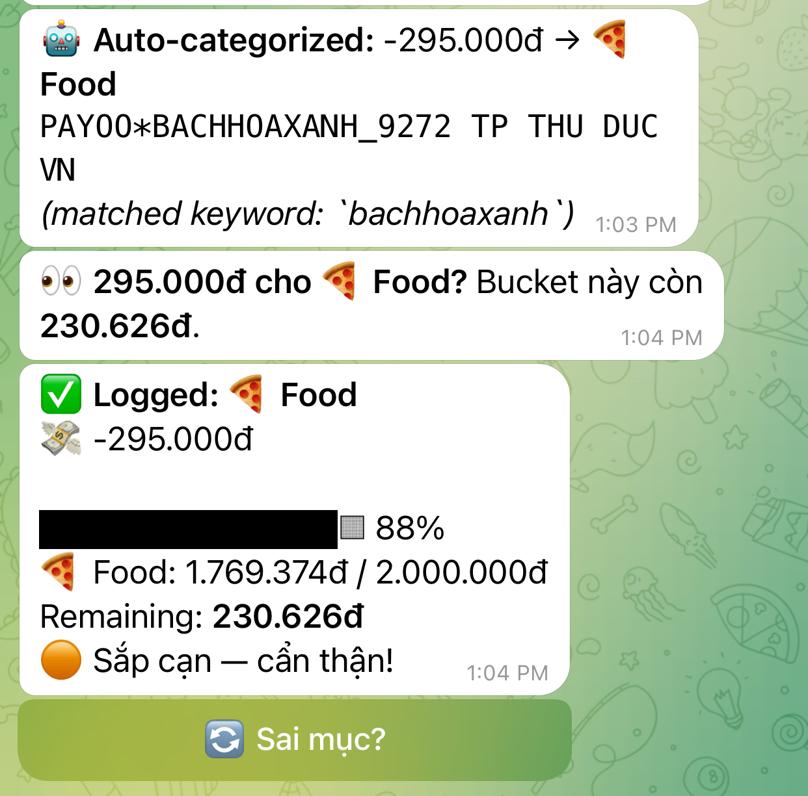
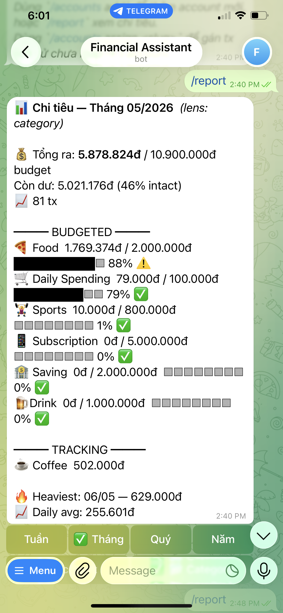
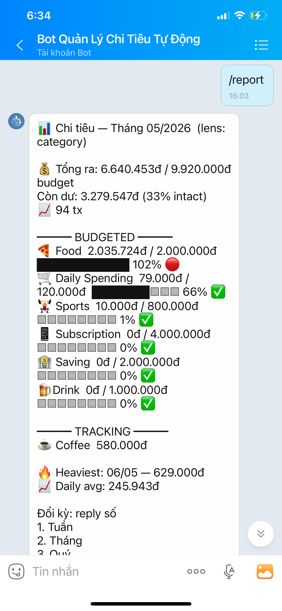
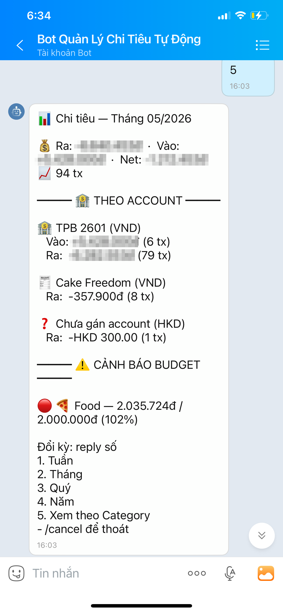
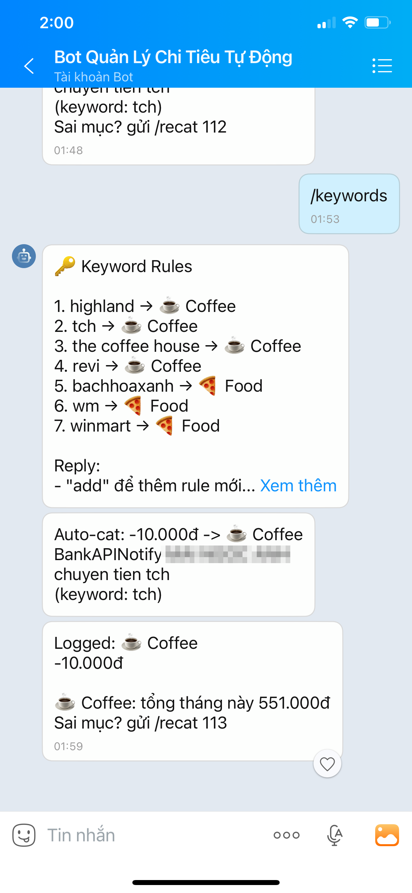

# 💰 My Money Went Bot

[](LICENSE)
[](https://www.python.org/)

[🇻🇳 Tiếng Việt](README.vi.md)


> 🙏 **Credits:** built on top of patterns from [`maddyle8124/spend-less-bot`](https://github.com/maddyle8124/spend-less-bot). Big thanks to Maddy — without that seed this wouldn't exist.

---

## What it does



**My Money Went Bot is a personal expense tracker that lives in your Telegram chat.** Every time a Vietnamese bank sends a transaction notification (via [SePay](https://sepay.vn)), the bot logs it to a Google Sheet *you own* and asks you to tap a category — or skips that step entirely if you've taught it a keyword rule. Type `/report` anytime to see where your money went, sliced by account, category, and time period.

<details>
<summary>📐 Detailed flow (with auto-categorize + onboarding branches)</summary>



</details>

**No database. No third-party data store. Single-tenant — one bot per person.** Your Google Sheet IS the entire backend. Your data, your sheet, your rules.

---

## Why this exists

Most personal finance apps (Money Lover, Misa, MoneyKeeper, ...) want your bank credentials, run on their cloud, and gatekeep your data behind a freemium wall. This bot does the opposite:

- **You own the data.** It lives in your Google Sheet. Export, fork, archive, pivot — your call.
- **You see every line of code.** ~3,000 LOC of Python. Audit, customize, ship.
- **You categorize once.** Auto-categorization via `/keywords` means recurring tx (Spotify, Grab, ...) skip the picker.
- **Reports match your real model** — per-account *and* per-category, across week/month/quarter/year. Not just "monthly category bar chart".

---

## Features



The full feature breakdown:

🏦 **Per-account tracking** — every tx tagged with which bank account it came from. `/report` slices by account (TPB / Vietcombank / cash) and by category.

📊 **Unified `/report` with 2 lenses × 4 periods** — week/month/quarter/year via inline buttons. Toggle account ↔ category lens in-place. No re-typing the command.

🤖 **Smart account onboarding** — first time a tx arrives from an unmapped source, bot asks. 3-step wizard: name → type → done. Future tx auto-route.

⚡ **Auto-categorize** — `/keywords` lets you define patterns ("GRAB" → Daily Spending, "Spotify" → Subscription). Matching tx skip the prompt entirely.

🎯 **Smart budget allocation** — `/allocate` sets monthly caps per category. After setup, returns in *edit mode* — tap one bucket to change its limit, no re-walking the full wizard.

🔁 **Historical backfill** — `/accounts assign <slug>` retroactively links unmapped past txs to a newly-onboarded account. No tx lost between "first webhook" and "wizard complete".

🧾 **Credit cards + cashback engine** — outstanding balance, `/cc pay`, statement-cycle tracking, and a full MCC-based cashback tracker (`/cashback`): rules, per-cycle caps, activation gate, self-learning MCC map.

📧 **Email ingestion** — banks SePay doesn't cover (TCB, Cake, Hang Seng) flow in via a Google Apps Script forwarding notification emails to `/webhook/email` (see `google_apps_script.js`).

💬 **Zalo channel** — the same flows on Zalo Bot Platform via numbered text menus: category picker, `/report`, `/manage`, `/allocate`, `/keywords`, `/cashback`, `/recat`, `/pending`.

🌐 **Bilingual UI** — `/lang` switches the whole bot between Vietnamese and English.

🇻🇳 **Vietnamese banks** — works with anything SePay supports. VND-first; foreign-currency accounts (e.g. HKD via Hang Seng email) are tracked per-account without polluting VND totals.

---

## Screenshots

<table>
  <tr>
    <td></td>
    <td></td>
  </tr>
  <tr>
    <td></td>
    <td></td>
  </tr>
</table>

The same flows on Zalo, as numbered text menus:




[Watch the 54-second demo with audio](https://raw.githubusercontent.com/maingocanh1702/my-money-went-bot/main/docs/media/my-money-went-bot-demo.mp4) — one transaction flowing through Telegram, categorization and reporting.

---

## Supported banks

Whatever [SePay supports](https://sepay.vn/ngan-hang.html), this bot tracks. SePay directly connects to **10 Vietnamese banks** (as of 2026):

| Bank | Code |
|---|---|
| VPBank | VPB |
| ACB | ACB |
| Sacombank | STB |
| VietinBank | ICB |
| MBBank | MBB |
| BIDV | BIDV |
| MSB | MSB |
| TPBank | TPB |
| KienLongBank | KLB |
| OCB | OCB |

A subset (BIDV, MB, VietinBank, ACB, OCB, KienLongBank, MSB) use **direct API integration** for instant webhooks; the rest go through **SMS Banking** which has a slight delay. Either way the bot handles the payload identically — see [SePay pricing](https://sepay.vn/bang-gia.html) for the latest.

---

## What you'll need

| Requirement | Where to get it |
|---|---|
| Telegram account | You probably have one |
| [SePay](https://sepay.vn) account | Connects to your Vietnamese bank |
| Google account | For Google Sheets + Google Cloud |
| Server with public HTTPS | [Railway](https://railway.app) is simplest (free tier OK). Or Ubuntu VPS + [ngrok](https://ngrok.com) for testing. |
| Python 3.11+ | On your server / Railway |

---

## Documentation

- [Quick intro](docs/QUICK_INTRO.md) — what the bot is, in five minutes.
- [AI assistant setup guide](docs/AI_SETUP.md) — paste one prompt into Claude, ChatGPT or Cursor and be walked through the whole setup.
- Not technical? Start with [Setup for non-technical users](https://github.com/maingocanh1702/my-money-went-bot/wiki/Setup-for-Non-Technical-Users).
- Full [wiki](https://github.com/maingocanh1702/my-money-went-bot/wiki): [Google Sheets](https://github.com/maingocanh1702/my-money-went-bot/wiki/Google-Sheets-Setup) · [SePay](https://github.com/maingocanh1702/my-money-went-bot/wiki/SePay-Setup) · [Railway deployment](https://github.com/maingocanh1702/my-money-went-bot/wiki/Railway-Deployment) · [Zalo](https://github.com/maingocanh1702/my-money-went-bot/wiki/Zalo-Setup) · [First transaction test](https://github.com/maingocanh1702/my-money-went-bot/wiki/First-Transaction-Test) · [Command reference](https://github.com/maingocanh1702/my-money-went-bot/wiki/Command-Reference) · [Troubleshooting](https://github.com/maingocanh1702/my-money-went-bot/wiki/Troubleshooting) · [Security and privacy](https://github.com/maingocanh1702/my-money-went-bot/wiki/Security-and-Privacy) · [Developer guide](https://github.com/maingocanh1702/my-money-went-bot/wiki/Developer-Guide)

The wiki pages are versioned in this repo under `docs/wiki/` — edit them there and send a pull request.

---

## Quick start

### Step 1 — Create your Telegram bot

1. Message [@BotFather](https://t.me/BotFather) → `/newbot` → save the token.
2. Message [@userinfobot](https://t.me/userinfobot) → save your chat ID.

### Step 2 — Set up Google Sheets

1. Go to [console.cloud.google.com](https://console.cloud.google.com) → new project.
2. Enable **Google Sheets API** + **Google Drive API**.
3. **IAM & Admin → Service Accounts → Create** → **Keys → Add Key → JSON** → download as `credentials.json`.
4. Create a new Google Sheet. Copy the **SHEET_ID** from the URL.
5. Share the sheet with the service account email (Editor access).

**Sheet tabs auto-create on first webhook** — no manual schema setup. Tabs:

| Tab | Purpose |
|---|---|
| `Đầu ra` | All transactions (one row per tx) |
| `Accounts` | Onboarded accounts (name, type, source_keys) |
| `Account Ledger` | Append-only ledger — source of truth for balances |
| `Pending Accounts` | Onboarding queue (24h TTL) |
| `Budget Config` | Per-month bucket allocations |
| `Sub-category Config` | Optional sub-labels per bucket |
| `Keyword Rules` | Auto-categorize patterns |
| `Bot State` | Wizard / picker state per chat |
| `Monthly Reports` | Archived monthly summaries |
| `Cashback Rules` | MCC-based cashback rules per card |
| `Cashback Tx Tiers` | Per-transaction cap tiers |
| `Cashback Card Config` | Card cashback settings (rate, gate, period) |
| `Cashback Ledger` | Per-MCC cashback earned per cycle |
| `MCC Map` | Keyword → MCC code mapping |

### Step 3 — Set up SePay

1. Sign up at [sepay.vn](https://sepay.vn), connect your bank.
2. **Webhook settings** → URL = `https://<your-domain>/webhook`. Pick which directions to track:
   - **Only spending** → enable **Tiền ra** only.
   - **Spending + income** → enable both **Tiền ra** and **Tiền vào**.

   (Income tx are logged but skip the category picker — see [Why this exists](#why-this-exists).)
3. ⚠️ **Disable SePay's native Google Sheets integration** — this bot writes its own rows; doubling = duplicate transactions.

### Step 4 — Deploy

```bash
git clone https://github.com/maingocanh1702/my-money-went-bot.git
cd my-money-went-bot
cp .env.example .env
# Fill the required values in .env: BOT_TOKEN, CHAT_ID, SHEET_ID,
# GOOGLE_CREDS_JSON (or GOOGLE_CREDS=credentials.json), SEPAY_SECRET,
# TELEGRAM_WEBHOOK_SECRET, CRON_SECRET, EMAIL_SECRET
# (plus ZALO_SECRET_TOKEN when ZALO_ENABLED=true)
```

**Railway** (recommended):

1. Push your fork to GitHub.
2. [railway.app](https://railway.app) → New Project → Deploy from GitHub repo.
3. Add every required env var in the Railway dashboard. For `GOOGLE_CREDS_JSON`, paste the full JSON as one line; generate a distinct long random value for each `*_SECRET` variable. If Zalo is enabled, set `ZALO_SECRET_TOKEN` too.
4. Railway gives you a `*.up.railway.app` URL — use that as your SePay webhook URL.
5. Register the Telegram webhook:
   ```bash
   curl -X POST "https://api.telegram.org/bot<BOT_TOKEN>/setWebhook" \
     -d "url=https://<your-app>.up.railway.app/webhook" \
     -d "secret_token=<TELEGRAM_WEBHOOK_SECRET>"
   ```

**VPS** (Ubuntu 22.04):

```bash
sudo apt install -y python3.11 python3-pip python3-venv
python3 -m venv .venv && source .venv/bin/activate
pip install -r requirements.txt
chmod 600 .env credentials.json

# systemd service
sudo tee /etc/systemd/system/mmwbot.service <<EOF
[Unit]
Description=My Money Went Bot
After=network.target
[Service]
WorkingDirectory=$(pwd)
ExecStart=$(pwd)/.venv/bin/uvicorn main:app --host 0.0.0.0 --port 8000
EnvironmentFile=$(pwd)/.env
Restart=always
[Install]
WantedBy=multi-user.target
EOF

sudo systemctl enable --now mmwbot
journalctl -u mmwbot -f   # watch logs
```

### Step 5 — First run

1. Open a chat with your bot on Telegram, send `/today` — bot should reply.
2. Make a small test transaction through your bank — within a few seconds the bot pings: *"Account chưa map"* + *"Khoản này thuộc mục nào?"*.
3. Tap **✅ Setup** → onboard the account (name → type).
4. Tap a category for the transaction.
5. Type `/report` → see your spending breakdown.

Future tx from the same account auto-route. Set up `/keywords` rules to auto-categorize recurring tx.

---

## Bot commands

| Command | What it does |
|---|---|
| `/today` | Today's spending vs daily cap (Daily Spending bucket). |
| `/report [period]` | Full spending report. Inline buttons for week/month/quarter/year × account/category lens. |
| `/accounts` | List configured accounts. `/accounts add` opens the wizard. `/accounts assign <slug>` bulk-tags historical txs. |
| `/manage` | Add / rename / delete categories. Per-bucket edit-amount. |
| `/keywords` | Manage auto-categorize rules. |
| `/allocate` | Edit budget. Wizard on first run, per-bucket edit-mode after. |
| `/cashback` | Credit-card cashback: rules, MCC map, billing cycle, overview. |
| `/cashback templates` | List available YAML card templates. |
| `/cashback seed <template> [cc]` | Apply a template (Cake Freedom, Techcombank Visa, etc.). |
| `/cashback setup [cc]` | Wizard to create custom cashback rules from scratch. |
| `/cashback export [cc]` | Export card config as YAML template. |
| `/cashback savetemplate [cc]` | Save current config as a reusable template. |
| `/transfer <amount> <from> <to>` | Record an internal transfer between tracked accounts. |
| `/cc pay <amount> [bank] <cc>` | Record a credit-card payment. |
| `/recat [row]` | Re-categorize a past transaction. No argument → pick from the 8 most recent; `/recat <row>` targets a sheet row directly. |
| `/pending` | Categorize transactions queued while you were mid-flow. |
| `/lang` | Switch bot language (vi/en). |
| `/cancel` | Abort the current multi-step flow. |
| `/help` | Command list. |

💡 Wherever the bot asks for an amount, Vietnamese shorthand works: `500k`, `3tr`, `3tr5`, `1m2`, `2 triệu` — all parsed as VND. Most commands also work on Zalo via numbered menus.

---

## Architecture

```
┌──────────┐   webhook    ┌────────────────┐    rows      ┌──────────────┐
│  SePay   │ ───────────► │  FastAPI bot   │ ───────────► │ Google Sheet │
└──────────┘              │  (Railway/VPS) │              │   (yours)    │
                          └──────┬─────────┘              └──────────────┘
                                 │ Telegram Bot API
                                 ▼
                          ┌────────────────┐
                          │   You (chat)   │
                          └────────────────┘
```

**Source of truth = ledger table.** `running_balance` is a cache recomputed from the ledger on every write. See [`handlers/account_resolver.py`](handlers/account_resolver.py) and [`sheets.py`](sheets.py).

### Project layout

```
.
├── main.py                       # FastAPI entry — routes all webhooks (TG + Zalo + email)
├── config.py                     # Reads env vars, sheet tab names
├── sheets.py                     # All Google Sheets read/write logic
├── telegram_api.py               # Telegram Bot API wrapper
├── messenger.py                  # Multi-channel send layer (Telegram + Zalo)
├── i18n/                         # UI strings — vi.py / en.py, /lang switches
├── handlers/
│   ├── sepay.py                  # Incoming SePay webhook handler
│   ├── email_parser.py           # TCB / Cake / Hang Seng notification emails
│   ├── account_resolver.py       # Maps payload → account_id
│   ├── accounts.py               # /accounts wizard + onboarding + backfill
│   ├── transaction.py            # Category picker + confirmation flow
│   ├── allocation.py             # /allocate budget wizard + edit mode
│   ├── manage.py                 # /manage categories (+ daily cap)
│   ├── keywords.py               # /keywords auto-categorize rules
│   ├── cashback.py               # /cashback command (rules, MCC, cycles)
│   ├── cashback_engine.py        # Pure cashback computation (no I/O)
│   ├── report.py                 # Unified /report (account + category lenses)
│   ├── reports.py                # /today snapshot + daily recap
│   ├── zalo_queue.py             # Durable Zalo pending-tx queue (/pending)
│   └── zalo_render.py            # Zalo plain-text summaries
├── card_templates/               # YAML cashback card templates
│   ├── __init__.py               # Loader, validator, exporter, cache
│   ├── schema.py                 # CardTemplate, CardConfig, RuleConfig dataclasses
│   ├── validate.py               # Standalone CLI validator
│   ├── cake_freedom.yaml         # Cake by VPBank Freedom template
│   └── techcombank_visa.yaml     # Techcombank Visa template
├── tests/unit/                   # Unit tests, in-memory FakeSpreadsheet
├── google_apps_script.js         # Gmail → /webhook/email forwarder
├── .env.example                  # Template — copy to .env and fill in
├── crontab.txt                   # Example cron jobs (VPS reference; prod = GitHub Actions)
├── setup.sh                      # VPS bootstrap script
├── railway.toml                  # Railway deploy config
├── requirements.txt        # runtime dependencies
└── requirements-dev.txt    # runtime + test dependencies
```

---

## Security ⚠️

A few things to be careful about — this handles bank notification data:

**1. Protect your `.env` and `credentials.json`.** These are the keys to your bot. Anyone with them reads your spending data.

```bash
chmod 600 .env credentials.json
```

Never commit either to GitHub — `.gitignore` already blocks them.

**2. Webhook authentication is mandatory in production.** The app refuses to start until every secret below is configured. This prevents an accidentally public financial webhook.

| Env var | Protects | Without it |
|---|---|---|
| `SEPAY_SECRET` | `/webhook` (SePay payloads) | App will not start |
| `TELEGRAM_WEBHOOK_SECRET` | `/webhook` (Telegram updates) | App will not start |
| `CRON_SECRET` | `/trigger/*` | App will not start |
| `EMAIL_SECRET` | `/webhook/email` | App will not start |

For `TELEGRAM_WEBHOOK_SECRET`, re-register the webhook with the same value (`setWebhook` + `secret_token` — see `.env.example`). For `CRON_SECRET`, append `?secret=<value>` to the URLs in `crontab.txt`. Keep a WAF such as Cloudflare in front of your Railway app as an additional network layer.

**3. Use SSH keys, not passwords.** If you VPS-deploy, password SSH is brute-forceable:

```bash
ssh-keygen -t ed25519
ssh-copy-id root@your-server
# Then in /etc/ssh/sshd_config:
#   PasswordAuthentication no
```

**4. Bot only talks to your `CHAT_ID`.** Hardcoded check — no one else can interact even if they find the bot name.

**5. No banking credentials touch this code.** The bot receives transaction *notifications* (amount + description) from SePay. Your bank login, card numbers, etc. never pass through.

**6. PII in descriptions.** SePay's payload includes raw transfer descriptions which may contain partner names, account numbers, references. These get written to the `Description` column. Anyone with read access to your Sheet sees this — keep the Sheet private.

---

## Troubleshooting

| Problem | Check |
|---|---|
| No message when transaction happens | Service running? `systemctl status mmwbot` or Railway logs |
| Bot crashed | `journalctl -u mmwbot -n 50` |
| Wrong amounts in sheet | Check logs for `DEBUG append_transaction:` |
| Duplicate rows in sheet | Make sure SePay's native Sheets integration is disabled |
| Daily recap at wrong time | Server in UTC? Shift cron hours by -7 from ICT |
| `/allocate` not saving | Check logs for `[allocate]` messages |
| Bot doesn't auto-route tx from known account | Check that `source_keys` cell in `Accounts` tab has the right SePay account number |

---

## Updating the bot

```bash
# On your server
cd /path/to/my-money-went-bot
git pull
systemctl restart mmwbot
journalctl -u mmwbot -f   # watch logs
```

On Railway: just push to your fork, Railway auto-deploys.

---

## Roadmap (deferred)

Intentionally out of scope for now:

- 💬 **Facebook Messenger bot** — same UX as Telegram, another front-end.
- 🎮 **Discord bot** — for users who live in Discord, not Telegram.

Shipped from the original roadmap: credit cards + cashback, manual `/transfer`,
email ingestion (TCB / Cake / Hang Seng), multi-currency accounts (HKD), and a
Zalo channel.

---

## Development

```bash
pip install -r requirements-dev.txt   # runtime + test dependencies
pytest tests/unit/ -v
```

300+ unit tests use an in-memory `FakeSpreadsheet` — zero Google API calls during tests. Tests with `@freeze_time` need `freezegun` for deterministic period assertions.

---

## Contributing

See **[CONTRIBUTING.md](CONTRIBUTING.md)** for setup and pull-request expectations, and **[SECURITY.md](SECURITY.md)** for how to report a vulnerability and how to keep your own deployment's secrets safe.

The most useful contribution needs no Python: cashback cards are YAML in `card_templates/`, so adding one for a bank nobody has covered is a pull request, not a code change.

Contributions welcome — issue / PR / fork. Be opinionated about scope: this bot is intentionally minimal. Features outside the [Roadmap](#roadmap-deferred) are unlikely to be merged but happy to discuss.

When opening a PR:
- Include tests for new behavior.
- Match existing code style (functional helpers, docstrings, no over-engineering).
- For UX changes, attach a Telegram screenshot.

---

## Acknowledgments

This project started as a fork-and-rewrite of [`maddyle8124/spend-less-bot`](https://github.com/maddyle8124/spend-less-bot). The core idea — Telegram bot + SePay webhook + Google Sheet — comes from there. My Money Went Bot adds per-account tracking, unified multi-period reports, account onboarding wizard, and a number of UX refinements.

---

## License

[MIT](LICENSE) — fork it, ship it, sell it.

If you build something cool on top, a backlink or shoutout is appreciated but not required.
