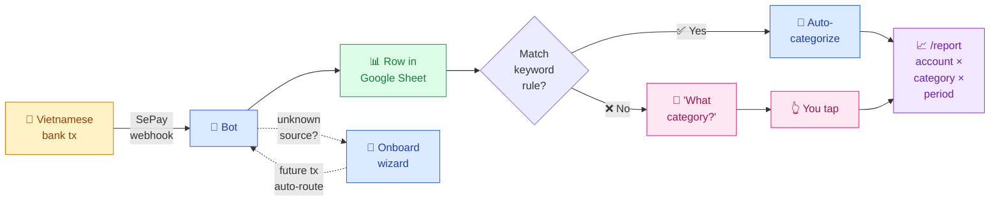

# 💰 My Money Went Bot


[](LICENSE)
[](https://www.python.org/)
[](tests/)

[🇻🇳 Tiếng Việt](README.vi.md)

> 🙏 **Credits:** built on top of patterns from [`maddyle8124/spend-less-bot`](https://github.com/maddyle8124/spend-less-bot). Big thanks to Maddy — without that seed this wouldn't exist.

---

## What it does


**My Money Went Bot is a personal expense tracker that lives in your Telegram chat.** Every time a Vietnamese bank sends a transaction notification (via [SePay](https://sepay.vn)), the bot logs it to a Google Sheet *you own* and asks you to tap a category — or skips that step entirely if you've taught it a keyword rule. Type `/report` anytime to see where your money went, sliced by account, category, and time period.

<details>
<summary>📐 Detailed flow (with auto-categorize + onboarding branches)</summary>



</details>

## Demo


[Watch the 54-second demo with audio](https://raw.githubusercontent.com/maingocanh1702/my-money-went-bot/main/docs/media/my-money-went-bot-demo.mp4) to see a transaction flow through Telegram, categorization, and reporting.

**No database. No third-party data store. Single-tenant — one bot per person.** Your Google Sheet IS the entire backend. Your data, your sheet, your rules.

---

## Documentation

Need step-by-step help beyond the README?

- [Wiki home](https://github.com/maingocanh1702/my-money-went-bot/wiki)
- [Setup for non-technical users](https://github.com/maingocanh1702/my-money-went-bot/wiki/Setup-for-Non-Technical-Users)
- [Vietnamese setup guide](https://github.com/maingocanh1702/my-money-went-bot/wiki/Setup-cho-nguoi-khong-ranh-ky-thuat)
- [Railway deployment](https://github.com/maingocanh1702/my-money-went-bot/wiki/Railway-Deployment)
- [Troubleshooting](https://github.com/maingocanh1702/my-money-went-bot/wiki/Troubleshooting)
- [Security and privacy](https://github.com/maingocanh1702/my-money-went-bot/wiki/Security-and-Privacy)
- [Command reference](https://github.com/maingocanh1702/my-money-went-bot/wiki/Command-Reference)

---

## Why this exists

Most personal finance apps (Money Lover, Misa, MoneyKeeper, ...) want your bank credentials, run on their cloud, and gatekeep your data behind a freemium wall. This bot does the opposite:

- **You own the data.** It lives in your Google Sheet. Export, fork, archive, pivot — your call.
- **You see every line of code.** ~3,000 LOC of Python. Audit, customize, ship.
- **You categorize once.** Auto-categorization via `/keywords` means recurring tx (Spotify, Grab, ...) skip the picker.
- **Reports match your real model** — per-account *and* per-category, across week/month/quarter/year. Not just "monthly category bar chart".

---

## Features


The full feature breakdown:

🏦 **Per-account tracking** — every tx tagged with which bank account it came from. `/report` slices by account (TPB / Vietcombank / cash) and by category.

📊 **Unified `/report` with 2 lenses × 4 periods** — week/month/quarter/year via inline buttons. Toggle account ↔ category lens in-place. No re-typing the command.

🤖 **Smart account onboarding** — first time a tx arrives from an unmapped source, bot asks. 3-step wizard: name → type → done. Future tx auto-route.

⚡ **Auto-categorize** — `/keywords` lets you define patterns ("GRAB" → Daily Spending, "Spotify" → Subscription). Matching tx skip the prompt entirely.

🎯 **Smart budget allocation** — `/allocate` sets monthly caps per category. After setup, returns in *edit mode* — tap one bucket to change its limit, no re-walking the full wizard.

🔁 **Historical backfill** — `/accounts assign <slug>` retroactively links unmapped past txs to a newly-onboarded account. No tx lost between "first webhook" and "wizard complete".

🇻🇳 **Vietnamese banks** — works with anything SePay supports. VND-only in v1.

---

## Screenshots

<table>
  <tr>
    <td width="50%" align="center"><b>🤖 Auto-categorize + log</b></td>
    <td width="50%" align="center"><b>📊 <code>/report</code> — monthly category lens</b></td>
  </tr>
  <tr>
    <td></td>
    <td></td>
  </tr>
  <tr>
    <td>Tx from Bach Hoa Xanh hits a <code>/keywords</code> rule → auto-tagged Food, no prompt. Bot replies with logged amount + bucket progress.</td>
    <td>Tổng spending vs budget, per-bucket budget bars with status emoji, plus a Tracking section for buckets you watch without capping.</td>
  </tr>
</table>

---

## Supported banks

Whatever [SePay supports](https://sepay.vn/ngan-hang.html), this bot tracks. SePay directly connects to **10 Vietnamese banks** (as of 2026):

| Bank | Code |
|---|---|
| VPBank | VPB |
| ACB | ACB |
| Sacombank | STB |
| VietinBank | ICB |
| MBBank | MBB |
| BIDV | BIDV |
| MSB | MSB |
| TPBank | TPB |
| KienLongBank | KLB |
| OCB | OCB |

A subset (BIDV, MB, VietinBank, ACB, OCB, KienLongBank, MSB) use **direct API integration** for instant webhooks; the rest go through **SMS Banking** which has a slight delay. Either way the bot handles the payload identically — see [SePay pricing](https://sepay.vn/bang-gia.html) for the latest.

---

## What you'll need

| Requirement | Where to get it |
|---|---|
| Telegram account | You probably have one |
| [SePay](https://sepay.vn) account | Connects to your Vietnamese bank |
| Google account | For Google Sheets + Google Cloud |
| Server with public HTTPS | [Railway](https://railway.app) is simplest (free tier OK). Or Ubuntu VPS + [ngrok](https://ngrok.com) for testing. |
| Python 3.11+ | On your server / Railway |

---

## Recommended setup: Railway

If you are not comfortable with Linux servers, use this path: **Telegram → Google Sheet → Railway → SePay → first test transaction**. Skip the VPS section; it is for people who already know how to deploy a server.

Need more detail? Use the [project wiki](https://github.com/maingocanh1702/my-money-went-bot/wiki).

Plain-English terms used below:

| Term | Meaning |
|---|---|
| `env vars` | Settings fields in Railway. You paste values there instead of editing code. |
| `webhook` | A URL where Telegram or SePay sends events to your bot. |
| `service account` | A Google robot email that lets the bot write to your Sheet. |
| `secret` | A random password-like string that blocks unknown requests. |

### 1. Setup overview

1. Create a Telegram bot and save `BOT_TOKEN`.
2. Get your Telegram `CHAT_ID`.
3. Create a Google Sheet and copy `SHEET_ID`.
4. Create a Google service account, download `credentials.json`, and share the Sheet with that robot email.
5. Deploy this repo on Railway and fill in the settings.
6. Paste the Railway webhook URL into SePay.
7. Connect the Telegram webhook.
8. Send `/today`, trigger one small transaction, then categorize the first transaction.

### 2. What to copy and where to paste it

The bot needs **7 settings** in Railway. They fall into two groups:

**Core — the bot cannot start without these:**

These connect the bot to Telegram, your Google Sheet, and your bank. `spend-less-bot` has the same 4 settings — any Telegram + SePay + Sheets bot needs them.

| Value | Where to get it | Where to paste it |
|---|---|---|
| `BOT_TOKEN` | Chat with [@BotFather](https://t.me/BotFather), run `/newbot` | Railway → Variables → `BOT_TOKEN` |
| `CHAT_ID` | Chat with [@userinfobot](https://t.me/userinfobot) | Railway → Variables → `CHAT_ID` |
| `SHEET_ID` | The long part of the Google Sheet URL: `/spreadsheets/d/<SHEET_ID>/edit` | Railway → Variables → `SHEET_ID` |
| `GOOGLE_CREDS_JSON` | Contents of the Google service-account `credentials.json` file | Railway → Variables → `GOOGLE_CREDS_JSON` |

**Security — blocks strangers from sending fake data to your bot:**

These are random passwords that prove a request really comes from SePay / Telegram / your cron job, not a stranger who guessed your URL. Without them, anyone who finds your bot's URL could log fake transactions into your Sheet. `spend-less-bot` does not have these — its webhook is open to anyone.

| Value | Where to get it | Where to paste it | What it protects |
|---|---|---|---|
| `SEPAY_SECRET` | A long random string you create | Railway → Variables → `SEPAY_SECRET` **and** SePay → Webhook API Key | Blocks fake bank transactions |
| `TELEGRAM_WEBHOOK_SECRET` | A different long random string | Railway → Variables → `TELEGRAM_WEBHOOK_SECRET` **and** Telegram `setWebhook` | Blocks fake Telegram commands |
| `CRON_SECRET` | Another different long random string | Railway → Variables → `CRON_SECRET` | Blocks fake daily/monthly report triggers |

If you do not use a terminal, generate the three secrets with a password manager or any password-generator website (search "random password generator"). Do not reuse a personal password.

Railway needs `GOOGLE_CREDS_JSON` as **one line**. If you have a terminal:

```bash
cat credentials.json | tr -d '\n'
```

Paste the output into Railway. Without a terminal, open `credentials.json`, copy the whole file, then remove line breaks before pasting.

### 3. Pre-deploy checklist

- [ ] Created the Telegram bot and saved `BOT_TOKEN`.
- [ ] Got your own `CHAT_ID`.
- [ ] Created a new Google Sheet and copied `SHEET_ID`.
- [ ] Enabled Google Sheets API and Google Drive API.
- [ ] Created a service account and downloaded `credentials.json`.
- [ ] Shared the Google Sheet with the `client_email` from `credentials.json` as **Editor**.
- [ ] Added all 7 Railway variables: `BOT_TOKEN`, `CHAT_ID`, `SHEET_ID`, `GOOGLE_CREDS_JSON`, `SEPAY_SECRET`, `TELEGRAM_WEBHOOK_SECRET`, `CRON_SECRET`.
- [ ] Disabled SePay's native Google Sheets integration to avoid duplicate transactions.

### 4. How to know it worked

After Railway deploys, your app has a domain like `https://<your-app>.up.railway.app`.

1. Open `https://<your-app>.up.railway.app/` in a browser. You should see:

   ```json
   {"status":"ok","bot":"Financial Tracking Bot"}
   ```

2. Use that domain to set the Telegram webhook:

   ```bash
   curl -X POST "https://api.telegram.org/bot<BOT_TOKEN>/setWebhook" \
     -d "url=https://<your-app>.up.railway.app/webhook" \
     -d "secret_token=<TELEGRAM_WEBHOOK_SECRET>" \
     -d "drop_pending_updates=true"
   ```

   No terminal? Open this URL in your browser after replacing the placeholders:

   ```text
   https://api.telegram.org/bot<BOT_TOKEN>/setWebhook?url=https://<your-app>.up.railway.app/webhook&secret_token=<TELEGRAM_WEBHOOK_SECRET>&drop_pending_updates=true
   ```

3. Open Telegram and send `/today` to your bot. The bot should reply.
4. In SePay, set the webhook URL to `https://<your-app>.up.railway.app/webhook`.
5. Trigger one small transaction. The bot should message you, ask to set up the account, then ask for a category.
6. Open the Google Sheet. The bot should have created tabs automatically and written the transaction.

### 5. Common setup problems

| What you see | Likely cause | What to do |
|---|---|---|
| Railway deploy failed | Missing required env var or invalid JSON | Check all 7 Railway variables, especially `GOOGLE_CREDS_JSON` as one-line JSON |
| Railway domain does not show `status: ok` | App did not start or crashed | Check Railway logs and env vars |
| Bot does not answer `/today` | Telegram webhook is not set correctly or `TELEGRAM_WEBHOOK_SECRET` does not match | Run `setWebhook` again with the Railway domain and matching secret |
| Transaction arrives but Sheet is empty | Sheet was not shared with the service account | Open `credentials.json`, copy `client_email`, share the Sheet with that email as Editor |
| Transaction appears twice | SePay native Google Sheets integration is still enabled | Disable SePay's Google Sheets integration |
| SePay says it sent the webhook but the bot gets nothing | Wrong webhook URL or wrong API Key | URL must end in `/webhook`; SePay API Key must match `SEPAY_SECRET` |

---

## Detailed setup reference

### Step 1 — Create your Telegram bot

1. Message [@BotFather](https://t.me/BotFather) → `/newbot` → save the token.
2. Message [@userinfobot](https://t.me/userinfobot) → save your chat ID.

### Step 2 — Set up Google Sheets

1. Go to [console.cloud.google.com](https://console.cloud.google.com) → new project.
2. Enable **Google Sheets API** + **Google Drive API**.
3. **IAM & Admin → Service Accounts → Create** → **Keys → Add Key → JSON** → download as `credentials.json`.
4. Create a new Google Sheet. Copy the **SHEET_ID** from the URL.
5. Share the sheet with the service account email (Editor access).

**Sheet tabs auto-create on first webhook** — no manual schema setup. Tabs:

| Tab | Purpose |
|---|---|
| `Đầu ra` | All transactions (one row per tx) |
| `Accounts` | Onboarded accounts (name, type, source_keys) |
| `Account Ledger` | Append-only ledger — source of truth for balances |
| `Pending Accounts` | Onboarding queue (24h TTL) |
| `Budget Config` | Per-month bucket allocations |
| `Sub-category Config` | Optional sub-labels per bucket |
| `Keyword Rules` | Auto-categorize patterns |
| `Bot State` | Wizard / picker state per chat |
| `Monthly Reports` | Archived monthly summaries |

### Step 3 — Set up SePay

1. Sign up at [sepay.vn](https://sepay.vn), connect your bank.
2. **Webhook settings** → URL = `https://<your-domain>/webhook`.
3. Set the SePay **API Key** to the same random value you will use as `SEPAY_SECRET`.
   The bot rejects SePay payloads unless this value is present in the webhook payload.
4. Pick which directions to track:
   - **Only spending** → enable **Tiền ra** only.
   - **Spending + income** → enable both **Tiền ra** and **Tiền vào**.

   (Income tx are logged but skip the category picker — see [Why this exists](#why-this-exists).)
5. ⚠️ **Disable SePay's native Google Sheets integration** — this bot writes its own rows; doubling = duplicate transactions.

### Step 4 — Deploy

```bash
git clone https://github.com/maingocanh1702/my-money-went-bot.git
cd my-money-went-bot
cp .env.example .env
```

Required env vars — **Core** (the bot cannot start without these):

| Env var | What to put there |
|---|---|
| `BOT_TOKEN` | Token from BotFather |
| `CHAT_ID` | Your Telegram chat ID from `@userinfobot` |
| `SHEET_ID` | The long ID in your Google Sheet URL |
| `GOOGLE_CREDS_JSON` | Railway/cloud: one-line service-account JSON |
| `GOOGLE_CREDS` | VPS/local alternative: path to `credentials.json` |

Required env vars — **Security** (authenticates every inbound request — the app refuses to start without them):

| Env var | What to put there | What it protects |
|---|---|---|
| `SEPAY_SECRET` | Same value as the SePay webhook API Key | Rejects fake bank-transaction webhooks |
| `TELEGRAM_WEBHOOK_SECRET` | Random token passed to Telegram `setWebhook` | Rejects fake Telegram updates |
| `CRON_SECRET` | Random token used by `/trigger/*` cron URLs | Rejects unauthorized cron triggers |

Why more variables than `spend-less-bot`? The original repo keeps setup minimal: Telegram token, chat ID, sheet ID, and a Google credentials file on the server. `my-money-went-bot` adds security variables because it is designed to run publicly on Railway/VPS and receive bank-transaction data through webhooks. Without these secrets, anyone who knows the `/webhook` or `/trigger/*` URL could send fake data to the bot or trigger jobs unexpectedly.

Grouped mentally, the list is smaller than it looks: **3 identity values** (`BOT_TOKEN`, `CHAT_ID`, `SHEET_ID`), **1 Google access method** (`GOOGLE_CREDS_JSON` or `GOOGLE_CREDS`), and **3 random production security secrets** (`SEPAY_SECRET`, `TELEGRAM_WEBHOOK_SECRET`, `CRON_SECRET`).

Generate secrets:

```bash
openssl rand -hex 32   # use once for SEPAY_SECRET
openssl rand -hex 32   # use once for TELEGRAM_WEBHOOK_SECRET
openssl rand -hex 32   # use once for CRON_SECRET
```

For Railway, convert Google credentials to one line:

```bash
cat credentials.json | tr -d '\n'
```

Paste that output into `GOOGLE_CREDS_JSON`. For VPS/local, keep `credentials.json` on disk and set `GOOGLE_CREDS=credentials.json` instead.

**Railway** (recommended):

1. Push your fork to GitHub.
2. [railway.app](https://railway.app) → New Project → Deploy from GitHub repo.
3. Add env vars in Railway dashboard. For `GOOGLE_CREDS_JSON`, paste the full JSON as one line. Production startup fails closed unless `SEPAY_SECRET`, `TELEGRAM_WEBHOOK_SECRET`, and `CRON_SECRET` are all set.
4. Railway gives you a `*.up.railway.app` URL. Check health first:
   ```bash
   curl https://<your-app>.up.railway.app/
   ```
   You should see `{"status":"ok","bot":"Financial Tracking Bot"}`.
5. Use `https://<your-app>.up.railway.app/webhook` as your SePay webhook URL.
6. Register the Telegram webhook with the same secret token as `TELEGRAM_WEBHOOK_SECRET`:
   ```bash
   curl -X POST "https://api.telegram.org/bot<BOT_TOKEN>/setWebhook" \
     -d "url=https://<your-app>.up.railway.app/webhook" \
     -d "secret_token=<TELEGRAM_WEBHOOK_SECRET>" \
     -d "drop_pending_updates=true"
   ```
7. Verify Telegram accepted it:
   ```bash
   curl "https://api.telegram.org/bot<BOT_TOKEN>/getWebhookInfo"
   ```

**Docker / GitHub Packages** (for a VPS or your own server):

This repo can publish a Docker image to GitHub Packages / GHCR. After the workflow runs, the image is available at:

```text
ghcr.io/maingocanh1702/my-money-went-bot:latest
```

Run the bot from the image:

```bash
cp .env.example .env
# fill BOT_TOKEN, CHAT_ID, SHEET_ID, GOOGLE_CREDS_JSON, SEPAY_SECRET,
# TELEGRAM_WEBHOOK_SECRET, and CRON_SECRET
docker run -d \
  --name my-money-went-bot \
  --env-file .env \
  -p 8000:8000 \
  --restart unless-stopped \
  ghcr.io/maingocanh1702/my-money-went-bot:latest
```

Check health:

```bash
curl http://localhost:8000/
```

If you fork the repo, the image name becomes `ghcr.io/<github-username>/my-money-went-bot:latest`. The Docker image only removes the need to install Python/dependencies yourself; you still need env vars, public HTTPS, the Telegram webhook, and the SePay webhook.

**VPS** (Ubuntu 22.04):

```bash
sudo apt install -y python3.11 python3-pip python3-venv
python3 -m venv .venv && source .venv/bin/activate
pip install -r requirements.txt
chmod 600 .env credentials.json

# systemd service
sudo tee /etc/systemd/system/mmwbot.service <<EOF
[Unit]
Description=My Money Went Bot
After=network.target
[Service]
WorkingDirectory=$(pwd)
ExecStart=$(pwd)/.venv/bin/uvicorn main:app --host 0.0.0.0 --port 8000
EnvironmentFile=$(pwd)/.env
Restart=always
[Install]
WantedBy=multi-user.target
EOF

sudo systemctl enable --now mmwbot
journalctl -u mmwbot -f   # watch logs
```

For VPS, put the app behind HTTPS before registering webhooks. Use nginx + Let's Encrypt, or run `setup.sh your-domain.com` after copying the repo and `.env` to the server. Then register Telegram with:

```bash
curl -X POST "https://api.telegram.org/bot<BOT_TOKEN>/setWebhook" \
  -d "url=https://<your-domain>/webhook" \
  -d "secret_token=<TELEGRAM_WEBHOOK_SECRET>" \
  -d "drop_pending_updates=true"
```

### Step 5 — First run

1. Open a chat with your bot on Telegram, send `/today` — bot should reply. If not, check Railway/VPS logs and `getWebhookInfo`.
2. Confirm SePay is using the same API Key as `SEPAY_SECRET`.
3. Make a small test transaction through your bank — within a few seconds the bot pings: *"Account chưa map"* + *"Khoản này thuộc mục nào?"*.
4. Tap **✅ Setup** → onboard the account (name → type).
5. Tap a category for the transaction.
6. Type `/report` → see your spending breakdown.

Future tx from the same account auto-route. Set up `/keywords` rules to auto-categorize recurring tx.

---

## Bot commands

| Command | What it does |
|---|---|
| `/today` | Today's spending vs daily cap (Daily Spending bucket). |
| `/report [period]` | Full spending report. Inline buttons for week/month/quarter/year × account/category lens. |
| `/accounts` | List configured accounts. `/accounts add` opens the wizard. `/accounts assign <slug>` bulk-tags historical txs. |
| `/manage` | Add / rename / delete categories. Per-bucket edit-amount. |
| `/keywords` | Manage auto-categorize rules. |
| `/allocate` | Edit budget. Wizard on first run, per-bucket edit-mode after. |

---

## Architecture

```
┌──────────┐   webhook    ┌────────────────┐    rows      ┌──────────────┐
│  SePay   │ ───────────► │  FastAPI bot   │ ───────────► │ Google Sheet │
└──────────┘              │  (Railway/VPS) │              │   (yours)    │
                          └──────┬─────────┘              └──────────────┘
                                 │ Telegram Bot API
                                 ▼
                          ┌────────────────┐
                          │   You (chat)   │
                          └────────────────┘
```

**Source of truth = ledger table.** `running_balance` is a cache recomputed from the ledger on every write. See [`handlers/account_resolver.py`](handlers/account_resolver.py) and [`sheets.py`](sheets.py).

### Project layout

```
.
├── main.py                       # FastAPI entry — routes all webhooks
├── config.py                     # Reads env vars, sheet tab names
├── sheets.py                     # All Google Sheets read/write logic
├── telegram_api.py               # Telegram Bot API wrapper
├── handlers/
│   ├── sepay.py                  # Incoming SePay webhook handler
│   ├── account_resolver.py       # Maps payload → account_id
│   ├── accounts.py               # /accounts wizard + onboarding + backfill
│   ├── transaction.py            # Category picker + confirmation flow
│   ├── allocation.py             # /allocate budget wizard + edit mode
│   ├── manage.py                 # /manage categories
│   ├── keywords.py               # /keywords auto-categorize rules
│   ├── report.py                 # Unified /report (account + category lenses)
│   └── reports.py                # /today snapshot + daily recap
├── tests/unit/                   # 120 unit tests, in-memory FakeSpreadsheet
├── .env.example                  # Template — copy to .env and fill in
├── crontab.txt                   # Example cron jobs (daily recap, monthly)
├── setup.sh                      # VPS bootstrap script
├── railway.toml                  # Railway deploy config
└── requirements.txt
```

---

## Security ⚠️

A few things to be careful about — this handles bank notification data:

**1. Protect your `.env` and `credentials.json`.** These are the keys to your bot. Anyone with them reads your spending data.

```bash
chmod 600 .env credentials.json
```

Never commit either to GitHub — `.gitignore` already blocks them.

**2. Webhook and trigger secrets are mandatory in production.** The app refuses to start unless `SEPAY_SECRET`, `TELEGRAM_WEBHOOK_SECRET`, and `CRON_SECRET` are configured. SePay payloads must include the matching SePay API key, Telegram updates must arrive with `X-Telegram-Bot-Api-Secret-Token`, and `/trigger/*` callers must include the cron secret.

**3. Register Telegram with `secret_token`.** The Telegram webhook secret header is only sent after you register it:

```bash
curl -X POST "https://api.telegram.org/bot<BOT_TOKEN>/setWebhook" \
  -d "url=https://<your-domain>/webhook" \
  -d "secret_token=<TELEGRAM_WEBHOOK_SECRET>"
```

Use a random value such as `openssl rand -hex 32`, store it as `TELEGRAM_WEBHOOK_SECRET`, and pass the same value in `secret_token`.

**4. Use SSH keys, not passwords.** If you VPS-deploy, password SSH is brute-forceable:

```bash
ssh-keygen -t ed25519
ssh-copy-id root@your-server
# Then in /etc/ssh/sshd_config:
#   PasswordAuthentication no
```

**5. Bot only talks to your `CHAT_ID`.** Hardcoded check — no one else can interact even if they find the bot name.

**6. No banking credentials touch this code.** The bot receives transaction *notifications* (amount + description) from SePay. Your bank login, card numbers, etc. never pass through.

**7. PII in descriptions.** SePay's payload includes raw transfer descriptions which may contain partner names, account numbers, references. These get written to the `Description` column. Anyone with read access to your Sheet sees this — keep the Sheet private.

---

## Troubleshooting

| Problem | Check |
|---|---|
| No message when transaction happens | Service running? `systemctl status mmwbot` or Railway logs |
| Bot crashed | `journalctl -u mmwbot -n 50` |
| Wrong amounts in sheet | Check logs for `DEBUG append_transaction:` |
| Duplicate rows in sheet | Make sure SePay's native Sheets integration is disabled |
| Daily recap at wrong time | Server in UTC? Shift cron hours by -7 from ICT |
| `/allocate` not saving | Check logs for `[allocate]` messages |
| Bot doesn't auto-route tx from known account | Check that `source_keys` cell in `Accounts` tab has the right SePay account number |

---

## Updating the bot

```bash
# On your server
cd /path/to/my-money-went-bot
git pull
systemctl restart mmwbot
journalctl -u mmwbot -f   # watch logs
```

On Railway: just push to your fork, Railway auto-deploys.

---

## Roadmap (deferred)

Intentionally out of v1 scope:

- 💬 **Facebook Messenger bot** — same UX as Telegram, second front-end.
- 🎮 **Discord bot** — for users who live in Discord, not Telegram.
- 🧾 **Credit card support** — outstanding balance, utilization %, `/cc pay`, statement-cycle tracking.
- 🔄 **Manual `/transfer`** between tracked accounts.
- 📧 **Email ingestion** for banks not on SePay (TCB, Cake, HSBC notification emails).
- 💱 **Multi-currency** accounts (HKD, USD, ...).

---

## Development

TL;DR for developers:

```bash
python3.11 -m venv .venv
source .venv/bin/activate
pip install -r requirements.txt
pytest tests/unit/ -v
```

120 unit tests use an in-memory `FakeSpreadsheet` — zero Google API calls during tests. Tests with `@freeze_time` need `freezegun` for deterministic period assertions.

---

## Contributing

Contributions welcome — issue / PR / fork. Be opinionated about scope: this bot is intentionally minimal. Features outside the [Roadmap](#roadmap-deferred) are unlikely to be merged but happy to discuss.

When opening a PR:
- Include tests for new behavior.
- Match existing code style (functional helpers, docstrings, no over-engineering).
- For UX changes, attach a Telegram screenshot.

---

## Acknowledgments

This project started as a fork-and-rewrite of [`maddyle8124/spend-less-bot`](https://github.com/maddyle8124/spend-less-bot). The core idea — Telegram bot + SePay webhook + Google Sheet — comes from there. My Money Went Bot adds per-account tracking, unified multi-period reports, account onboarding wizard, and a number of UX refinements.

---

## License

[MIT](LICENSE) — fork it, ship it, sell it.

If you build something cool on top, a backlink or shoutout is appreciated but not required.
