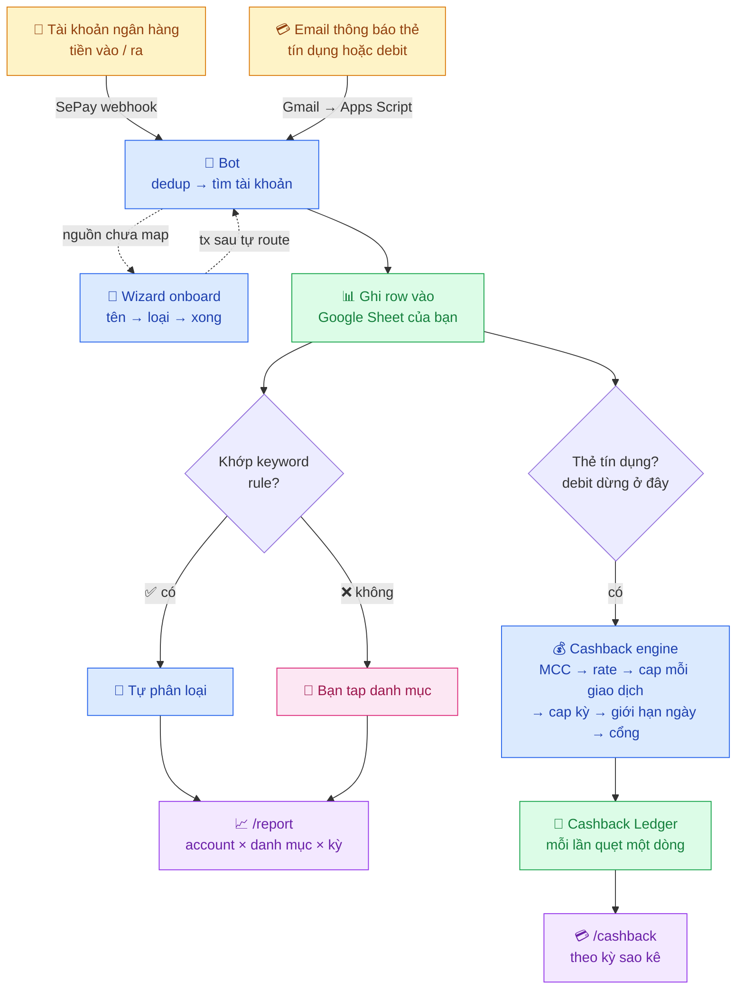

# 💰 My Money Went Bot


[](LICENSE)
[](https://www.python.org/)

[🇬🇧 English](README.md)


**Tự động theo dõi giao dịch thẻ — tín dụng lẫn ghi nợ — và tài khoản ngân hàng Việt Nam.** Mỗi giao dịch tự vào Google Sheet của bạn và được phân loại ngay trong **Telegram** — hoặc **Zalo**, nếu đó là chỗ bạn ở. Không nhập tay, không đưa login ngân hàng, không lưu data ở bên thứ ba.

> 🙏 **Credits:** xây dựng dựa trên các pattern từ [`maddyle8124/spend-less-bot`](https://github.com/maddyle8124/spend-less-bot). Cảm ơn Maddy rất nhiều — không có repo gốc này thì My Money Went cũng không có.

---

## 🤖 Setup bằng AI

Bạn không cần là dev mới chạy được cái này. Setup thực chất chỉ là đi lấy một nắm giá trị
từ Telegram, Google và SePay rồi dán vào một dashboard — đúng loại việc mà một trợ lý AI
dắt bạn qua từng bước rất tốt, không phải đụng vào một dòng code nào.

Mở **Claude**, **ChatGPT**, **Gemini**, **Copilot** hoặc **Cursor**, rồi dán đoạn này:

```text
Hãy giúp tôi setup repo này:
https://github.com/maingocanh1702/my-money-went-bot

Tôi không rành kỹ thuật. Hãy hướng dẫn từng bước đơn giản nhất bằng Railway.
Đừng yêu cầu tôi sửa code. Hỏi tôi từng thứ một và chờ tôi trả lời rồi mới đi tiếp.

Hãy giúp tôi lấy đủ các biến cấu hình:
BOT_TOKEN, CHAT_ID, SHEET_ID, GOOGLE_CREDS_JSON, SEPAY_SECRET,
TELEGRAM_WEBHOOK_SECRET, EMAIL_SECRET, và CRON_SECRET.
Tất cả đều bắt buộc — thiếu một biến là bot không khởi động.

Sau đó hướng dẫn tôi set Telegram webhook, set SePay webhook, thêm Google Apps
Script để chuyển email thông báo thẻ, và test bot.

Tôi có dùng Zalo. Khi Telegram chạy được rồi, hướng dẫn tôi thêm Zalo làm kênh
thứ hai: tạo bot trong Zalo Bot Manager, lấy ZALO_CHAT_ID bằng
scripts/zalo_get_updates.py, set ZALO_ENABLED, ZALO_BOT_TOKEN, ZALO_CHAT_ID và
ZALO_SECRET_TOKEN, rồi đăng ký webhook Zalo.
(Bỏ qua phần này nếu tôi nói tôi không dùng Zalo.)

Lưu ý: đừng yêu cầu tôi paste secret thật vào chat công khai.
```

<details>
<summary>🇬🇧 English prompt</summary>

```text
Help me set up this repo:
https://github.com/maingocanh1702/my-money-went-bot

I am not technical. Please guide me step by step using the simplest Railway path.
Do not ask me to edit source code. Ask me for one thing at a time and wait for
my answer before moving on.

Help me collect the required settings:
BOT_TOKEN, CHAT_ID, SHEET_ID, GOOGLE_CREDS_JSON, SEPAY_SECRET,
TELEGRAM_WEBHOOK_SECRET, EMAIL_SECRET, and CRON_SECRET.
All of them are mandatory — the bot refuses to start if any is missing.

Then help me set the Telegram webhook, set the SePay webhook, add the Google
Apps Script that forwards my card notification emails, and test the bot.

I also use Zalo. After Telegram works, walk me through adding Zalo as a second
channel: creating the bot in Zalo Bot Manager, finding my ZALO_CHAT_ID with
scripts/zalo_get_updates.py, and setting ZALO_ENABLED, ZALO_BOT_TOKEN,
ZALO_CHAT_ID and ZALO_SECRET_TOKEN, then registering the Zalo webhook.
(Skip this if I say I do not use Zalo.)

Important: do not ask me to paste real secrets into a public chat.
```

</details>

**Một nguyên tắc, dùng trợ lý nào cũng vậy: đừng bao giờ dán secret thật vào chat.**
Bot token, file credentials JSON của Google và các giá trị `*_SECRET` đi thẳng từ chỗ bạn
tạo ra chúng vào dashboard Railway, không qua đâu khác. Trợ lý chỉ cần biết bạn phải bấm
vào *đâu*, không cần biết giá trị của bạn là gì.

[Hướng dẫn setup bằng AI đầy đủ →](docs/AI_SETUP.md) · [Setup cho người không rành kỹ thuật →](https://github.com/maingocanh1702/my-money-went-bot/wiki/Setup-cho-nguoi-khong-ranh-ky-thuat)

---

## Bot làm gì


**My Money Went Bot là bot theo dõi chi tiêu cá nhân sống trong chat Telegram — hoặc Zalo — của bạn.** Nó bắt giao dịch ngay khi vừa phát sinh, từ hai nguồn cùng lúc:

- **Tài khoản ngân hàng Việt Nam** — link với [SePay](https://sepay.vn), mọi khoản chuyển khoản, thanh toán thẻ hay nhận lương đều về dưới dạng webhook trong vài giây. Gói Free của SePay đủ 50 giao dịch/tháng — xem [SePay tính phí thế nào](#sepay-tính-phí-thế-nào).
- **Thẻ — tín dụng và ghi nợ (debit)** — ngân hàng gửi email cho mỗi lần quẹt, và một Google Apps Script nhỏ chuyển email đó tới bot. Hai loại thẻ đi chung một đường; thẻ debit không cần code riêng, chỉ cần ngân hàng có gửi email báo giao dịch. Cách này cũng phủ luôn các ngân hàng SePay chưa ký. Không tốn phí.

Dù đến bằng đường nào, giao dịch đều được ghi vào Google Sheet *của bạn*, gắn đúng tài khoản gốc, và phân loại bằng một cú tap — hoặc không cần tap, khi bạn đã dạy bot một keyword rule. `/report` sau đó cắt theo tài khoản, theo danh mục, theo tuần / tháng / quý / năm.

Trên nền tracking đó là những thứ bạn vốn phải tự làm: ngân sách hàng tháng theo danh mục, dư nợ và thanh toán thẻ tín dụng, và **theo dõi cashback** cho biết mỗi lần quẹt được hoàn bao nhiêu trước khi ngân hàng chốt sao kê. (Thẻ debit tiêu tiền đã có sẵn trong tài khoản, nên nó bỏ qua toàn bộ phần sao kê — chỉ được track, mà với thẻ debit thì đó cũng là tất cả những gì người ta cần.)

<details>
<summary>📐 Flow chi tiết — hai nguồn giao dịch, phân loại, và nhánh cashback</summary>



</details>

**Không database. Không lưu data ở bên thứ 3. Single-tenant — 1 bot / 1 người.** Google Sheet của bạn LÀ backend. Data của bạn, sheet của bạn, luật của bạn.

---

## Tại sao có project này

Các app tài chính cá nhân (Money Lover, Misa, MoneyKeeper, ...) thường đòi credentials ngân hàng của bạn, chạy trên cloud của họ, và đẩy data của bạn sau bức tường freemium. Bot này làm ngược lại:

- **Bạn sở hữu data.** Tất cả nằm trong Google Sheet của bạn. Export, fork, archive, pivot — quyền bạn.
- **Bạn đọc được mọi dòng code.** ~16k dòng Python, 440+ test, không obfuscate, không có service nào đứng giữa. Đọc, sửa, chạy.
- **Bạn phân loại 1 lần.** Auto-categorize qua `/keywords` giúp tx định kỳ (Spotify, Grab, ...) skip luôn picker.
- **Report khớp với mô hình thực tế** — per-account *và* per-category, theo week/month/quarter/year. Không chỉ là "biểu đồ category theo tháng".
- **Không phải nhập tay khoản nào.** Cả chuyển khoản ngân hàng lẫn lần quẹt thẻ đều tự vào sheet, nên sổ sách đầy đủ chứ không phải chỉ những gì bạn nhớ để gõ.

---

## Tính năng


Chi tiết từng tính năng.

### Bắt mọi giao dịch

🏦 **Tài khoản ngân hàng, qua SePay** — mọi khoản chuyển khoản, thanh toán thẻ hay nhận lương chạm vào tài khoản đã link đều về dưới dạng webhook trong vài giây và được gắn đúng tài khoản gốc. Chỉ bật *Tiền ra* nếu chỉ cần chi tiêu, bật cả hai chiều để thấy cả thu nhập.

📧 **Thẻ tín dụng và ngân hàng khác, qua email thông báo** — `google_apps_script.js` quét Gmail mỗi phút, chuyển mỗi email đúng một lần (dedup theo message id, không theo thread) tới `/webhook/email`, và `handlers/email_parser.py` biến nó thành đúng payload mà SePay lẽ ra đã gửi. Mọi thứ phía sau — tài khoản, danh mục, báo cáo, cashback — giống hệt nhau dù giao dịch đến bằng đường nào.

🔍 **Không trùng, không sót** — giao dịch đến hai lần (một từ SePay, một từ email) bị loại bởi bước dedup mờ giữa các nguồn; còn webhook mà SePay gửi lại thì bị chặn bởi sổ tham chiếu bền.

🤖 **Onboarding tài khoản thông minh** — lần đầu có giao dịch từ nguồn chưa map, bot hỏi. Wizard 3 bước: tên → loại (bank / debit / credit / cash) → xong (thẻ tín dụng hỏi thêm hạn mức, ngày sao kê, ngày đến hạn; thẻ debit không cần). Giao dịch sau tự route.

🔁 **Backfill lịch sử** — `/accounts assign <slug>` gán ngược các giao dịch cũ chưa map vào tài khoản vừa onboard, nên không mất gì giữa "webhook đầu tiên" và "xong wizard".

### Hiểu được số liệu

⚡ **Auto-categorize** — `/keywords` cho phép định nghĩa pattern ("GRAB" → Daily Spending, "Spotify" → Subscription). Giao dịch khớp rule bỏ qua bước hỏi.

📊 **`/report` thống nhất, 2 lens × 4 period** — tuần/tháng/quý/năm qua inline button. Toggle account ↔ category lens tại chỗ. Không cần gõ lại command.

🎯 **Budget allocation thông minh** — `/allocate` đặt cap hàng tháng theo category. Lần sau quay lại là *edit mode* — tap 1 bucket để đổi cap, không phải walk lại wizard.

🧾 **Số dư và chuyển khoản** — dư nợ từng thẻ tín dụng, `/cc pay` ghi nhận trả thẻ, `/transfer` cho các khoản chuyển giữa tài khoản của chính bạn, tất cả trên một ledger append-only.

### Cashback thẻ tín dụng

💳 **Theo dõi cashback** — vì bot đã thấy mọi lần quẹt, nó tính luôn được mỗi lần được hoàn bao nhiêu. Bot phân loại merchant vào MCC bằng bảng keyword → MCC tự học (không nhận ra thì hỏi một lần, đưa các danh mục của thẻ làm nút bấm, và nhớ câu trả lời), rồi áp rate của thẻ, cap theo bậc từng giao dịch, cap danh mục trong kỳ, giới hạn số giao dịch mỗi ngày và cổng kích hoạt (vd "tiêu đủ 5.000.000đ trong kỳ mới được hoàn"). Cashback ở trạng thái *pending* cho đến khi qua cổng, và mỗi dòng 0đ đều ghi lý do (`mcc_unknown`, `mcc_not_eligible`, `daily_limit`, `mcc_cap_full`) nên ledger soi lại được. Sai? Tap **Sai CB** để hủy.

🗓 **Theo kỳ sao kê** — cap và cổng reset đúng ngày sao kê của thẻ, không phải mùng 1 (`cap_period: statement_cycle` hoặc `calendar_month`, tùy thẻ). `/cashback` cho thấy kỳ hiện tại: progress bar từng danh mục, tổng kỳ, chi tiêu so với cổng, và "cần thêm X để kích hoạt".

📇 **Template thẻ bằng YAML** — `card_templates/cake_freedom.yaml` cho thẻ thật, `card_templates/example_visa.yaml` minh họa các field còn lại. `/cashback seed cake_freedom` áp template trong vài giây; `/cashback setup` dắt bạn qua từng bước cho thẻ chưa có template; `/cashback export` biến config đã chỉnh thành template để chia sẻ. Thêm thẻ của một ngân hàng chưa ai làm là một pull request, không phải sửa code.

### Ở mọi kênh

💬 **Hai kênh — Telegram là chính, Zalo chạy song song.** Mọi flow đều có ở cả hai: category picker, `/report`, `/manage`, `/allocate`, `/keywords`, `/cashback`, `/recat`, `/pending`. Nhưng trải nghiệm không giống nhau, và lý do nằm ở nền tảng chứ không phải ở bot.

| | Telegram | Zalo Bot Platform |
|---|---|---|
| Chọn danh mục | tap nút inline | reply một con số (`1`, `2`, `0`) |
| Cập nhật tin nhắn | sửa tại chỗ | mỗi lần một tin mới |
| Định dạng | in đậm, in nghiêng, `code` | bị lược về text thuần |
| Menu lệnh | danh sách `/` hiện sẵn trong app | tự nhớ mà gõ |
| Báo cáo dài | gửi nguyên | cắt theo `ZALO_TEXT_LIMIT` (2000 ký tự) |

API của Zalo Bot chỉ gửi được text thuần, không hơn — không inline keyboard, không sửa tin nhắn, không callback — nên bot render mọi bộ nút thành danh sách đánh số và bảo bạn reply con số. Vẫn chạy tốt, vẫn có người dùng hằng ngày. Chỉ là gõ nhiều hơn.

**Nên Telegram là kênh nhận được nhiều nhất từ bot này, và là kênh nên chọn nếu bạn không nghiêng hẳn về bên nào.** Telegram cũng bắt buộc dù thế nào: `BOT_TOKEN`, `CHAT_ID` và `TELEGRAM_WEBHOOK_SECRET` là bắt buộc, thiếu là bot không khởi động — nên Zalo là thứ bạn bật **thêm**, không phải bật **thay**. Sau này có gì phong phú hơn text — biểu đồ chi tiêu, ảnh, file export — cũng chỉ về được Telegram, cho tới khi API Zalo đủ sức chở.

🌐 **Song ngữ** — `/lang` đổi toàn bộ bot giữa Tiếng Việt và English.

🇻🇳 **Ngân hàng VN, VND-first** — hoạt động với bất kỳ bank nào SePay support, cộng bất kỳ ngân hàng nào bạn tự thêm parser email. Account ngoại tệ (HKD, USD, ...) được track riêng theo account, không lẫn vào tổng VND cũng như daily cap.

---

## Screenshots

**Tracking và báo cáo.** Một giao dịch được auto-categorize từ keyword rule, và cùng tháng đó báo cáo theo danh mục và theo tài khoản:

<table>
  <tr>
    <td></td>
    <td></td>
  </tr>
  <tr>
    <td></td>
    <td></td>
  </tr>
</table>

**Cashback.** Một cuốc Grab trên thẻ Cake Freedom: giao dịch được ghi, dòng cashback cho biết được hoàn bao nhiêu và vẫn đang pending, thanh cổng cho biết kỳ này còn cách kích hoạt bao xa. `/cashback` cho thấy cả kỳ sao kê:

<table>
  <tr>
    <td></td>
    <td></td>
  </tr>
</table>

Cùng các flow đó trên Zalo — keyword rule và một giao dịch được auto-categorize:


[Xem demo 54 giây có tiếng](https://raw.githubusercontent.com/maingocanh1702/my-money-went-bot/main/docs/media/my-money-went-bot-demo.mp4) — một giao dịch đi qua Telegram, phân loại và báo cáo.

---

## Ngân hàng và thẻ được hỗ trợ

### Tài khoản ngân hàng — qua SePay

Bất cứ bank nào [SePay support](https://sepay.vn/ngan-hang.html) là bot này track được. SePay kết nối trực tiếp với **10 ngân hàng VN** (tính đến 2026):

| Ngân hàng | Code |
|---|---|
| VPBank | VPB |
| ACB | ACB |
| Sacombank | STB |
| VietinBank | ICB |
| MBBank | MBB |
| BIDV | BIDV |
| MSB | MSB |
| TPBank | TPB |
| KienLongBank | KLB |
| OCB | OCB |

Một số bank (BIDV, MB, VietinBank, ACB, OCB, KienLongBank, MSB) dùng **API trực tiếp** — webhook tức thì khi có tx. Số còn lại đi qua **SMS Banking** nên có chút độ trễ. Dù sao bot cũng xử lý payload giống hệt nhau.

#### SePay tính phí thế nào

Gói **Free** của SePay là 0đ/tháng, gồm **50 giao dịch/tháng**. Vượt quota vẫn được — phần vượt tính phí sau theo số giao dịch (pay-as-you-go) — hoặc lên gói trả phí: **Startup** từ 120.000đ/tháng với quota lớn hơn nhiều, hoặc **Shop** 70.000đ/cửa hàng/tháng không giới hạn giao dịch. FAQ của SePay ghi quota đếm theo giao dịch *tiền vào*. Với bot dùng cho một người thì gói Free thường là đủ — quota chỉ đếm giao dịch *tiền vào*, mà bot này chủ yếu ghi tiền đi ra. Xem [Chi phí vận hành](#chi-phí-vận-hành) để có bức tranh đầy đủ; xem [bảng giá](https://sepay.vn/bang-gia.html) và [FAQ](https://sepay.vn/faq.html) để biết điều khoản hiện tại, vì họ có thay đổi.

### Thẻ và ngân hàng khác — qua email thông báo

| Ngân hàng / thẻ | Đến bằng | Template cashback |
|---|---|---|
| Cake by VPBank — thẻ Freedom (tín dụng) | email thông báo | [`card_templates/cake_freedom.yaml`](card_templates/cake_freedom.yaml) |
| Thẻ debit bất kỳ có email báo từng giao dịch | email thông báo | — (debit chỉ track, không tính cashback) |

Cake là ví dụ có sẵn. **Thẻ nào — tín dụng hay debit — và ngân hàng nào gửi email cho từng giao dịch đều thêm được**, và cố tình giữ nhỏ: một dòng sender trong `google_apps_script.js`, một hàm `_parse_<bank>` trong `handlers/email_parser.py` trả về đúng dict mà `_parse_cake` trả về, và — với thẻ tín dụng muốn tính cashback — một template YAML ([`example_visa.yaml`](card_templates/example_visa.yaml) minh họa các field template Cake không dùng). Thẻ debit dừng sớm hơn một bước: onboard với loại `debit` là track được luôn, không cần template. Không phải sửa gì thêm: tìm tài khoản, dedup, phân loại, báo cáo và cashback engine đều dùng chung. Đường email cũng không tốn phí — Gmail và Google Apps Script đều miễn phí — nên đây là cách rẻ nhất để phủ ngân hàng SePay chưa ký.

---

## Cần chuẩn bị

| Yêu cầu | Lấy ở đâu |
|---|---|
| Tài khoản Telegram | Chắc bạn có rồi |
| Tài khoản [SePay](https://sepay.vn) | Kết nối tài khoản bank VN của bạn (gói Free: 50 tx/tháng) |
| Tài khoản Google | Cho Google Sheets + Google Cloud — và Gmail + Apps Script nếu dùng đường email |
| Server có HTTPS public | [Railway](https://railway.app) đơn giản nhất. Hoặc Ubuntu VPS + [ngrok](https://ngrok.com) cho test. |
| Python 3.11+ | Trên server / Railway |

---

## Chi phí vận hành

Hosting là khoản duy nhất phải trả. Mọi dịch vụ khác bot đụng tới đều có gói free
mà một người dùng cá nhân không cách nào xài hết.

| Chạy ở đâu | Mỗi tháng | Mỗi năm |
|---|---|---|
| **Railway Hobby** | **~131.000đ** ($5) | ~1,58 triệu |
| VPS Việt Nam rẻ nhất + domain `.id.vn` | ~68.000đ | ~813.000đ |
| VPS Việt Nam phổ biến + domain | ~108.000đ | ~1,29 triệu |
| Hetzner CX22 + domain | ~140.000đ ($5,5) | ~1,68 triệu |
| Oracle Cloud Always Free + domain | ~8.750đ *(chỉ tiền domain)* | ~105.000đ |

Railway không cần domain — bạn được sẵn subdomain `*.up.railway.app` có HTTPS. Mọi
đường VPS đều cần domain, vì SePay, Telegram và Apps Script đều từ chối HTTP thường,
mà Let's Encrypt thì phải có domain mới cấp cert; `.id.vn` khoảng 105.000đ/năm.

**Gói Free của Railway không chạy được bot này.** Nó chỉ cho $1 credit/tháng, riêng
RAM đã tốn ~$2,2 — muốn always-on là phải Hobby. Còn trên Hobby thì $5 đã bao hết:
tính theo biểu giá Railway công bố ($10,01/GB RAM/tháng, $20,01/vCPU/tháng), bot này
rơi vào khoảng **$2,2–$4,5/tháng** — một tiến trình uvicorn, không database, nằm im
giữa các webhook. Bạn trả đúng mức tối thiểu $5, không hơn.

Oracle Always Free đúng là 0đ, nhưng năm 2026 Oracle âm thầm cắt một nửa hạn mức ARM
và không grandfather instance cũ. Với thứ đang giữ lịch sử chi tiêu thật của bạn, cân
nhắc điều đó so với ~130.000đ/tháng tiết kiệm được.

### Còn lại đều free, và còn dư nhiều

| Dịch vụ | Gói free | 150 giao dịch/tháng dùng hết bao nhiêu |
|---|---|---|
| **SePay** | 50 giao dịch/tháng | Chỉ đếm **tiền vào** — xem bên dưới |
| **Telegram Bot API** | không giới hạn | — |
| **Zalo Bot Platform** | 3.000 tin/tháng ([kiểm tra điều khoản hiện tại](https://bot.zapps.me/docs/)) | ~300–440 tin (10–15%) |
| **Google Sheets API** | quota rộng | còn xa mới chạm |
| **Google Apps Script** | 90 phút trigger/ngày, 20.000 URL fetch/ngày | ~40–50% runtime, ~0% fetch |
| **GitHub Actions** (cron) | không giới hạn với public repo | vài lần chạy mỗi tháng |

**Con số SePay là chỗ đáng đọc kỹ.** FAQ của họ định nghĩa hạn mức là *"tổng số lượng
giao dịch tiền vào"* — **chỉ tiền vào**. Mà bot này chủ yếu track tiền **ra**, còn giao
dịch thẻ thì vào bằng email, không đụng SePay chút nào. Một người nhận lương cộng vài
khoản hoàn tiền chỉ rơi vào 5–15 giao dịch bị đếm mỗi tháng, trên hạn mức 50. SePay
không công bố đơn giá vượt gói, nên nếu bạn dự là sẽ sát vạch thì hỏi họ trước khi
trông cậy vào đó.

<details>
<summary>📐 Tự tính theo khối lượng của bạn</summary>

**Số tin Zalo cho mỗi giao dịch** (Telegram không có giới hạn này):

| Tình huống | Số tin |
|---|---|
| Khớp keyword rule → tự phân loại | 1 |
| Không khớp rule nào | 2 (danh sách đánh số + xác nhận sau khi bạn reply) |
| Tiền vào | 1 |
| Thẻ tín dụng chưa nhận diện MCC | +1 |

Tức là `số tin ≈ số giao dịch × (2 − tỷ lệ auto) + số lệnh bạn gõ`. Với 0% tự phân
loại, bạn cần **~1.450 giao dịch/tháng** — khoảng 48 giao dịch mỗi ngày — mới chạm
3.000. Mỗi rule `/keywords` thêm vào đưa một giao dịch từ 2 tin xuống 1 tin, nên dùng
càng lâu kênh này càng rẻ.

**Apps Script** là quota duy nhất **không** tăng theo số giao dịch: trigger quét Gmail
mỗi phút tốn 1.440 lần chạy/ngày dù bạn có tiêu tiền hay không. Mỗi lần chạy yên tĩnh
~1,5 giây → ~36 phút/ngày trên hạn mức 90 phút/ngày. Nếu trigger tự dưng ngừng chạy
không báo, hạ xuống mỗi 5 phút — đổi lại tối đa 5 phút trễ cho giao dịch thẻ, còn giao
dịch SePay không ảnh hưởng vì đó là webhook đẩy tới, không phải polling.

**Google Sheets** thì tăng theo số giao dịch nhưng vẫn không đáng kể: vài nghìn API
call mỗi tháng, trong khi hạn mức tính theo phút.

</details>

*Giá kiểm tra tháng 9/2026, quy đổi ~26.250đ/$: [Railway](https://railway.com/pricing) ·
[SePay](https://sepay.vn/bang-gia.html) · [khảo sát VPS Việt Nam](https://azdigi.com/blog/kien-thuc-vps/bang-gia-thue-vps-viet-nam) ·
[quota Apps Script](https://developers.google.com/apps-script/guides/services/quotas).
Giá có thay đổi — coi đây là ước tính ban đầu, không phải báo giá.*

---

## Tài liệu

- [Giới thiệu nhanh](docs/QUICK_INTRO.md) — bot làm gì, đọc trong 5 phút.
- [Hướng dẫn setup bằng AI](docs/AI_SETUP.md) — copy một prompt vào Claude, ChatGPT hoặc Cursor để được dắt qua từng bước.
- Không rành kỹ thuật? Bắt đầu ở [Setup cho người không rành kỹ thuật](https://github.com/maingocanh1702/my-money-went-bot/wiki/Setup-cho-nguoi-khong-ranh-ky-thuat).
- [Wiki](https://github.com/maingocanh1702/my-money-went-bot/wiki) đầy đủ: [Google Sheets](https://github.com/maingocanh1702/my-money-went-bot/wiki/Google-Sheets-Setup) · [SePay](https://github.com/maingocanh1702/my-money-went-bot/wiki/SePay-Setup) · [Deploy Railway](https://github.com/maingocanh1702/my-money-went-bot/wiki/Railway-Deployment) · [Zalo](https://github.com/maingocanh1702/my-money-went-bot/wiki/Zalo-Setup) · [Test giao dịch đầu tiên](https://github.com/maingocanh1702/my-money-went-bot/wiki/First-Transaction-Test) · [Danh sách lệnh](https://github.com/maingocanh1702/my-money-went-bot/wiki/Command-Reference) · [Troubleshooting](https://github.com/maingocanh1702/my-money-went-bot/wiki/Troubleshooting) · [Bảo mật và quyền riêng tư](https://github.com/maingocanh1702/my-money-went-bot/wiki/Security-and-Privacy) · [Developer guide](https://github.com/maingocanh1702/my-money-went-bot/wiki/Developer-Guide)

Nội dung wiki được version trong repo ở `docs/wiki/` — sửa ở đó rồi gửi pull request.

---

## Quick start

### Bước 1 — Tạo Telegram bot

1. Nhắn [@BotFather](https://t.me/BotFather) → `/newbot` → lưu token.
2. Nhắn [@userinfobot](https://t.me/userinfobot) → lưu chat ID của bạn.

### Bước 2 — Setup Google Sheets

1. Vào [console.cloud.google.com](https://console.cloud.google.com) → tạo project mới.
2. Enable **Google Sheets API** + **Google Drive API**.
3. **IAM & Admin → Service Accounts → Create** → **Keys → Add Key → JSON** → download là `credentials.json`.
4. Tạo Google Sheet mới. Copy **SHEET_ID** từ URL.
5. Share sheet với email service account (quyền Editor).

**Các tab tự tạo lần đầu webhook về** — không cần setup schema tay. Các tab:

| Tab | Mục đích |
|---|---|
| `Đầu ra` | Tất cả transactions (1 row / tx) |
| `Accounts` | Account đã onboard (name, type, source_keys) |
| `Account Ledger` | Ledger append-only — source of truth cho balance |
| `Pending Accounts` | Queue onboarding (TTL 24h) |
| `Budget Config` | Allocate per-month per-bucket |
| `Sub-category Config` | Sub-label per bucket (optional) |
| `Keyword Rules` | Pattern auto-categorize |
| `Bot State` | State wizard / picker per chat |
| `Monthly Reports` | Archive báo cáo tháng |
| `Cashback Rules` | Rule cashback theo MCC cho từng thẻ |
| `Cashback Tx Tiers` | Bậc cap theo từng giao dịch |
| `Cashback Card Config` | Cấu hình cashback của thẻ (rate, cổng, kỳ) |
| `Cashback Ledger` | Cashback đã tính, một dòng / giao dịch, theo kỳ |
| `MCC Map` | Map keyword → mã MCC |
| `Processed Refs` | Sổ claim idempotency — mỗi định danh giao dịch một dòng |
| `Archive` | Dòng đã chuyển ra khỏi sheet đang dùng |
| `Excluded Events` | Mọi sự kiện bị loại, kèm lý do |

### Bước 3 — Setup SePay

1. Đăng ký tại [sepay.vn](https://sepay.vn), kết nối tài khoản bank. Gói Free (50 giao dịch/tháng) đủ để bắt đầu — xem [SePay tính phí thế nào](#sepay-tính-phí-thế-nào).
2. **Webhook settings** → URL = `https://<your-domain>/webhook`, xác thực = **API Key** với giá trị `SEPAY_SECRET` của bạn. Chọn hướng tx muốn track:
   - **Chỉ track chi tiêu** → chỉ bật **Tiền ra**.
   - **Track cả thu nhập + chi tiêu** → bật cả **Tiền ra** và **Tiền vào**.

   (Tx Tiền vào được ghi log nhưng skip category picker — xem [Tại sao có project này](#tại-sao-có-project-này).)
3. ⚠️ **Tắt SePay native Google Sheets integration** — bot này tự ghi rows; bật cả 2 = tx duplicate.

Thẻ — tín dụng lẫn debit — và ngân hàng SePay chưa hỗ trợ đi vào bằng email: xem [Bước 6](#bước-6--track-luôn-thẻ-tín-dụng-và-debit-tùy-chọn).

### Bước 4 — Deploy

```bash
git clone https://github.com/maingocanh1702/my-money-went-bot.git
cd my-money-went-bot
cp .env.example .env
# Điền các biến bắt buộc: BOT_TOKEN, CHAT_ID, SHEET_ID, GOOGLE_CREDS_JSON
# (hoặc GOOGLE_CREDS=credentials.json), SEPAY_SECRET,
# TELEGRAM_WEBHOOK_SECRET, CRON_SECRET, EMAIL_SECRET
# (và ZALO_SECRET_TOKEN nếu ZALO_ENABLED=true)
```

Đó là những biến thiếu thì bot không khởi động. Còn lại đều có default chạy được —
`.env.example` mô tả đầy đủ từng biến, đây là những cái hay phải đụng nhất:

| Tùy chọn | Mặc định | Đặt khi |
|---|---|---|
| `INGESTION_START_AT` | trống | Muốn có mốc bắt đầu sạch. Giao dịch trước mốc bị loại (có ghi lại); sau mốc, giao dịch đến muộn được ghi chứ không bị vứt. Nên đặt khi cài mới. |
| `MERCHANT_NOISE_WORDS` | rỗng | Chuyển khoản VN luôn kèm tên người gửi — thêm tên bạn để bot không học thành tên merchant. |
| `TX_MAX_AGE_MINUTES` | `10` | Chỉ có tác dụng khi `INGESTION_START_AT` trống. Tăng nếu bot có thể down lâu hơn 10 phút. |
| `EMAIL_TX_MAX_AGE_MINUTES` | `10080` | Tương tự, cho đường email — Gmail poll làm trễ thêm. |
| `SEPAY_LEGACY_REF_LOOKUP` | `true` | Cứ để bật. Tắt sau khi đã qua cửa sổ retry của SePay kể từ lần deploy nâng cấp định danh. |
| `ZALO_TEXT_LIMIT` | `2000` | Zalo cắt tin nhắn dài khác với tài liệu. |


**Railway** (khuyến nghị):

1. Push fork của bạn lên GitHub.
2. [railway.app](https://railway.app) → New Project → Deploy from GitHub repo.
3. Add tất cả env var bắt buộc trong Railway dashboard. Với `GOOGLE_CREDS_JSON`, paste toàn bộ JSON thành 1 dòng; tạo một chuỗi random dài, riêng biệt cho từng biến `*_SECRET`. Nếu bật Zalo, thêm `ZALO_SECRET_TOKEN`.
4. Railway cấp URL `*.up.railway.app` — dùng URL này làm SePay webhook URL.
5. Đăng ký Telegram webhook:
   ```bash
   curl -X POST "https://api.telegram.org/bot<BOT_TOKEN>/setWebhook" \
     -d "url=https://<your-app>.up.railway.app/webhook" \
     -d "secret_token=<TELEGRAM_WEBHOOK_SECRET>"
   ```

**VPS** (Ubuntu 22.04). Webhook bắt buộc phải chạy **HTTPS** — SePay, Telegram và
Apps Script đều từ chối HTTP thường — nên `setup.sh` làm trọn gói: virtualenv,
systemd unit `mmwbot` có đọc `.env`, nginx reverse proxy, và chứng chỉ Let's Encrypt.

```bash
# trên máy bạn
scp -r ./my-money-went-bot ubuntu@<vps-ip>:~/

# trên VPS, khi .env và credentials.json đã nằm sẵn ở đó
cd ~/my-money-went-bot
sudo bash setup.sh your-domain.com

systemctl status mmwbot
journalctl -u mmwbot -f          # xem log
curl https://your-domain.com/healthz
```

Trỏ DNS A record về VPS trước khi chạy — certbot xác thực domain qua HTTP, không có
thì fail.

### Bước 5 — Lần đầu chạy

1. Mở chat với bot trên Telegram, gửi `/today` — bot phải reply.
2. Trigger 1 tx ngân hàng nhỏ — trong vài giây bot sẽ ping: *"Account chưa map"* + *"Khoản này thuộc mục nào?"*.
3. Tap **✅ Setup** → onboard account (tên → loại).
4. Tap category cho tx.
5. Type `/report` → xem breakdown chi tiêu.

Tx sau từ cùng account auto-route. Setup `/keywords` rules để auto-categorize tx định kỳ.

### Bước 5b — Bật báo cáo định kỳ (2 phút, rất dễ quên)

Recap tuần, báo cáo tháng và nhắc allocate đầu tháng do GitHub Actions bắn, không phải
do bot tự chạy. Fork mới có sẵn lịch nhưng chưa có địa chỉ, nên **không có gì chạy cho
tới khi bạn làm bước này**:

1. Sửa `.github/workflows/cron.yml`, thay `BOT_URL: https://YOUR-APP.up.railway.app` bằng URL deploy của bạn.
2. Trong repo: **Settings → Secrets and variables → Actions → New repository secret** → tên `CRON_SECRET`, giá trị trùng với biến môi trường `CRON_SECRET`.
3. Commit. Bắn thử một cái: **Actions → Scheduled triggers → Run workflow → `weekly`**.

GitHub tạm dừng scheduled workflow sau ~60 ngày repo không có hoạt động; push bất kỳ commit nào là bật lại.

### Bước 6 — Track luôn thẻ tín dụng và debit (tùy chọn)

SePay phủ tài khoản ngân hàng. Thẻ — và bất kỳ ngân hàng nào SePay chưa ký — vào bot bằng email thông báo, được một Google Apps Script chuyển tiếp. Thẻ debit chạy y hệt thẻ tín dụng ở đây: ngân hàng có gửi email mỗi lần bạn tiêu là đủ. Khác nhau duy nhất là lúc onboard bạn chọn loại tài khoản — thẻ tín dụng thì có thêm cashback tracking, thẻ debit thì chỉ track.

1. Tạo `EMAIL_SECRET` (`openssl rand -hex 16`) và set trên Railway.
2. Vào [script.google.com](https://script.google.com) → New project → paste [`google_apps_script.js`](google_apps_script.js).
3. Thay 2 placeholder ở đầu file: `WEBHOOK_URL` = `https://<your-domain>/webhook/email`, `WEBHOOK_SECRET` = `EMAIL_SECRET` của bạn.
4. Chạy `checkBankEmails` một lần để cấp quyền Gmail, rồi chạy `bootstrapProcessed` một lần để bot không xử lý lại cả hộp thư cũ.
5. **Triggers → Add trigger** → `checkBankEmails` → time-driven → mỗi phút.
6. Quẹt thẻ một khoản nhỏ. Bot ping; onboard nguồn này là **🧾 Credit** (bot hỏi hạn mức, ngày sao kê, ngày đến hạn).

Từ đây mỗi lần quẹt được track như mọi giao dịch khác. Muốn thêm cashback thì chạy `/cashback templates` → `/cashback seed cake_freedom <slug-thẻ>` (hoặc `/cashback setup <slug-thẻ>` với thẻ chưa có template); sau đó mỗi lần quẹt bot trả lời kèm số tiền hoàn và `/cashback` cho thấy kỳ sao kê hiện tại.

### Bước 7 — Thêm Zalo bên cạnh Telegram (tùy chọn)

Nếu Zalo mới là chỗ bạn thật sự đọc tin nhắn, bot chạy được ở đó luôn — **thêm vào**, không phải thay cho Telegram. Telegram vẫn bắt buộc (`BOT_TOKEN`, `CHAT_ID`, `TELEGRAM_WEBHOOK_SECRET`); bước này thêm một chỗ nữa để cùng con bot đó nói chuyện với bạn. Đọc [Zalo làm được gì và không làm được gì](#ở-mọi-kênh) trước — tóm tắt: reply số thay vì tap nút.

1. **Tạo bot.** Mở Zalo → tìm OA **Zalo Bot Manager** → tạo bot. Tên bắt buộc bắt đầu bằng `Bot` (VD `Bot ChiTieu`). Zalo nhắn lại **bot token** — copy nó.
2. **Lấy chat id.** Nhắn cho bot vừa tạo một tin bất kỳ ("hi" là được), rồi chạy:

   ```bash
   ZALO_BOT_TOKEN=<token-của-bạn> python3 scripts/zalo_get_updates.py
   ```

   Script kiểm tra token trước, rồi in ra id của người vừa nhắn cho bot. Id đó là `ZALO_CHAT_ID` — và cũng là người gửi *duy nhất* bot chấp nhận; ai khác đều bị bỏ qua.
3. **Tạo webhook secret:** `openssl rand -hex 32` → đây là `ZALO_SECRET_TOKEN`.
4. **Set bốn biến trên Railway** rồi redeploy:

   | Biến | Giá trị |
   |---|---|
   | `ZALO_ENABLED` | `true` |
   | `ZALO_BOT_TOKEN` | từ bước 1 |
   | `ZALO_CHAT_ID` | từ bước 2 |
   | `ZALO_SECRET_TOKEN` | từ bước 3 |

   `ZALO_SECRET_TOKEN` là **bắt buộc** một khi `ZALO_ENABLED=true` — thiếu nó bot không khởi động, vì `/zalo/webhook` là endpoint công khai.

5. **Đăng ký webhook** để Zalo gọi được tới bot:

   ```bash
   curl -X POST "https://bot-api.zaloplatforms.com/bot<ZALO_BOT_TOKEN>/setWebhook" \
     -H "Content-Type: application/json" \
     -d '{"url":"https://<domain-của-bạn>/zalo/webhook","secret_token":"<ZALO_SECRET_TOKEN>"}'
   ```

6. **Test.** Gửi `/today` trên Zalo — bot phải trả lời. Rồi tạo một giao dịch nhỏ: nó về cả Telegram *và* Zalo, và nếu không khớp keyword rule nào thì Zalo hiện danh sách category đánh số để bạn reply.

Tắt đi cũng chỉ một biến: `ZALO_ENABLED=false` rồi redeploy. Nếu API Zalo lỗi giữa chừng thì giao dịch vẫn được ghi vào Sheet và Telegram vẫn nhận tin — gửi Zalo là best-effort, không bao giờ chặn thứ gì.

Chi tiết đầy đủ kèm troubleshooting: [Zalo setup](docs/ZALO_BOT_SETUP.md) · [trang wiki](https://github.com/maingocanh1702/my-money-went-bot/wiki/Zalo-Setup).

---

## Commands

| Command | Tác dụng |
|---|---|
| `/today` | Chi tiêu hôm nay vs daily cap (bucket Daily Spending). |
| `/report [period]` | Báo cáo tổng. Inline button cho tuần/tháng/quý/năm × lens account/category. |
| `/accounts` | List account đã setup. `/accounts add` mở wizard. `/accounts assign <slug>` bulk-tag tx lịch sử. |
| `/manage` | Thêm / rename / xóa categories. Edit-amount per bucket. |
| `/keywords` | Quản lý rules auto-categorize. |
| `/allocate` | Sửa budget. Lần đầu = wizard, sau đó = edit-mode per bucket. |
| `/cashback` | Cashback thẻ tín dụng: overview kỳ hiện tại, rules, MCC map, kỳ sao kê. |
| `/cashback templates` | Liệt kê các template thẻ YAML có sẵn. |
| `/cashback seed <template> [cc]` | Áp template cho một thẻ — `cake_freedom`, hoặc template của bạn. |
| `/cashback setup [cc]` | Wizard tạo rule cashback từ đầu cho thẻ chưa có template. |
| `/cashback export [cc]` | Xuất config của thẻ ra YAML template. |
| `/cashback savetemplate [cc]` | Lưu config hiện tại thành template dùng lại được. |
| `/transfer <số tiền> <from> <to>` | Ghi nhận chuyển tiền nội bộ giữa các account. |
| `/cc pay <số tiền> [bank] <cc>` | Ghi nhận trả thẻ tín dụng. |
| `/recat [row]` | Phân loại lại giao dịch cũ. Không có tham số → chọn từ 8 giao dịch gần nhất; `/recat <row>` nhắm thẳng số dòng. |
| `/cancel_tx [row]` | Huỷ một giao dịch cũ: hoàn lại hạn mức và thu hồi cashback đã ghi. Không tham số → chọn từ 3 giao dịch gần nhất, lật ngược tới 30 ngày. Khôi phục lại được. |
| `/pending` | Phân loại các giao dịch bị xếp hàng khi bạn đang dở thao tác khác. |
| `/lang` | Đổi ngôn ngữ bot (vi/en). |
| `/cancel` | Hủy flow nhiều bước đang làm dở. |
| `/help` | Danh sách lệnh. |

💡 Chỗ nào bot hỏi số tiền đều nhập tắt được: `500k`, `3tr`, `3tr5`, `1m2`, `2 triệu` — bot tự hiểu là VND. Mọi lệnh đều chạy trên Zalo; chỗ nào Telegram hiện nút thì Zalo hiện danh sách đánh số để bạn reply.

---

## Architecture

Hai đầu vào, một pipeline, một spreadsheet.

```
 tài khoản ngân hàng                    thẻ (tín dụng + debit) / ngân hàng khác
┌──────────────┐                        ┌──────────────┐   ┌─────────────────┐
│ Bank VN      │  tiền vào / ra         │ Email thông  │   │ Google Apps     │
│ (qua SePay)  │ ──── webhook ───┐      │ báo ngân hàng│──►│ Script (Gmail,  │
└──────────────┘  POST /webhook  │      │              │   │ mỗi phút)       │
                                 │      └──────────────┘   └────────┬────────┘
                                 ▼                                  │ POST /webhook/email
                    ┌────────────────────────────┐◄─────────────────┘
                    │  FastAPI bot (Railway/VPS) │
                    │  ├ email_parser  → cùng shape payload với SePay
                    │  ├ account_resolver → account / thẻ nào
                    │  ├ dedup (ref + fuzzy giữa các nguồn)
                    │  ├ ghi row + category (rule hoặc tap)
                    │  └ cashback_engine → MCC · rate · tiers · cap · cổng
                    └──────────────┬─────────────┘
                                   │ rows                 ┌────────────────┐
                                   ▼                      │ Bạn            │
                    ┌────────────────────────────┐        │ Telegram / Zalo│
                    │ Google Sheet (của bạn)     │◄──────►│ tap category,  │
                    │ Đầu ra · Accounts · Ledger │ Bot API│ /report,       │
                    │ Cashback Ledger · MCC Map  │        │ /cashback      │
                    └────────────────────────────┘        └────────────────┘
```

**Source of truth = các bảng ledger.** `running_balance` là cache được recompute từ `Account Ledger` mỗi lần write, và cashback là một dòng `Cashback Ledger` cho mỗi giao dịch — `/cashback` chỉ đọc ledger đó cho kỳ sao kê hiện tại, không lưu tổng riêng ở đâu. Xem [`handlers/account_resolver.py`](handlers/account_resolver.py), [`handlers/cashback_engine.py`](handlers/cashback_engine.py) và [`sheets.py`](sheets.py).

**Pipeline cashback cho mỗi giao dịch:** `email_parser` (hoặc SePay) → `account_resolver` chọn thẻ → ghi row → `cashback_engine` phân loại merchant qua `MCC Map` (hỏi bạn một lần nếu không nhận ra) → tìm rule của thẻ cho MCC đó → áp rate của rule (hoặc rate mặc định của thẻ) → cap theo bậc từng giao dịch → cap theo phần còn lại của danh mục trong kỳ → kiểm tra giới hạn số giao dịch mỗi ngày → đánh dấu *pending* cho đến khi chi tiêu trong kỳ qua cổng kích hoạt. Kết quả được append vào `Cashback Ledger` và tóm tắt trong câu trả lời. Engine là hàm thuần (không I/O) nên toàn bộ phần này được unit-test trên sheet in-memory.

### Cấu trúc project

```
.
├── main.py                       # FastAPI entry — route tất cả webhook (TG + Zalo + email)
├── config.py                     # Đọc env vars, sheet tab names
├── sheets.py                     # Toàn bộ logic read/write Google Sheets
├── telegram_api.py               # Wrapper Telegram Bot API
├── messenger.py                  # Lớp gửi đa kênh (Telegram + Zalo)
├── i18n/                         # UI strings — vi.py / en.py, đổi bằng /lang
├── handlers/
│   ├── sepay.py                  # Handler SePay webhook
│   ├── email_parser.py           # Email thông báo NH → payload dạng SePay
│   ├── account_resolver.py       # Map payload → account_id
│   ├── accounts.py               # /accounts wizard + onboarding + backfill
│   ├── transaction.py            # Category picker + confirmation flow
│   ├── allocation.py             # /allocate budget wizard + edit mode
│   ├── manage.py                 # /manage categories (+ daily cap)
│   ├── keywords.py               # /keywords auto-categorize rules
│   ├── cashback.py               # /cashback (rules, MCC, kỳ sao kê)
│   ├── cashback_engine.py        # Tính cashback thuần (không I/O)
│   ├── report.py                 # /report thống nhất (account + category lenses)
│   ├── reports.py                # /today snapshot + daily recap
│   ├── zalo_queue.py             # Hàng đợi tx Zalo bền (/pending)
│   └── zalo_render.py            # Render summary plain-text cho Zalo
├── card_templates/               # Template thẻ cashback bằng YAML
│   ├── __init__.py               # Loader, validator, exporter, cache
│   ├── schema.py                 # Dataclass CardTemplate, CardConfig, RuleConfig
│   ├── validate.py               # CLI validator độc lập
│   ├── cake_freedom.yaml         # Cake by VPBank Freedom — thẻ thật
│   └── example_visa.yaml         # Template mẫu: rate theo rule, cap theo tháng
├── scripts/
│   ├── sim_webhook.py            # POST payload giả SePay / Cake vào bot local
│   ├── zalo_get_updates.py       # In ra sender id Zalo đã nhắn cho bot
│   ├── cashback_reconcile.py     # Cuối kỳ: ledger ước tính vs ngân hàng thực trả
│   ├── check_no_personal_data.py # CI guard: không để lọt số tài khoản thật / secret
│   └── check_parity.sh           # Diff repo này với một fork private
├── tests/unit/                   # 440+ unit tests, in-memory FakeSpreadsheet
├── google_apps_script.js         # Forwarder Gmail → /webhook/email (đường email)
├── .env.example                  # Template — copy thành .env và điền
├── crontab.txt                   # Cron jobs mẫu (tham chiếu VPS; prod = GitHub Actions)
├── setup.sh                      # VPS bootstrap script
├── railway.toml                  # Railway deploy config
├── requirements.txt        # dependency runtime
└── requirements-dev.txt    # runtime + test
```

---

## Bảo mật ⚠️

Vài điều cần cẩn thận — bot này xử lý data thông báo ngân hàng:

**1. Bảo vệ `.env` và `credentials.json`.** Đây là chìa khóa bot của bạn. Ai có sẽ đọc được chi tiêu.

```bash
chmod 600 .env credentials.json
```

Không bao giờ commit lên GitHub — `.gitignore` đã block sẵn.

**2. Webhook authentication là bắt buộc ở production.** App sẽ từ chối khởi động nếu thiếu bất kỳ secret nào bên dưới, để không vô tình public webhook tài chính.

| Env var | Bảo vệ | Không set thì sao |
|---|---|---|
| `SEPAY_SECRET` | `/webhook` (payload SePay) | App không khởi động |
| `TELEGRAM_WEBHOOK_SECRET` | `/webhook` (update Telegram) | App không khởi động |
| `CRON_SECRET` | `/trigger/*` | App không khởi động |
| `EMAIL_SECRET` | `/webhook/email` | App không khởi động |

Với `TELEGRAM_WEBHOOK_SECRET`, đăng ký lại webhook với cùng giá trị (`setWebhook` + `secret_token` — xem `.env.example`). Với `CRON_SECRET`, thêm `?secret=<value>` vào URL trong `crontab.txt`. Giữ Cloudflare (hoặc WAF) trước Railway app như một lớp bảo vệ mạng bổ sung.

**3. Dùng SSH key, không dùng password.** Nếu deploy VPS, password SSH có thể brute-force:

```bash
ssh-keygen -t ed25519
ssh-copy-id root@your-server
# Sau đó trong /etc/ssh/sshd_config:
#   PasswordAuthentication no
```

**4. Bot chỉ nói chuyện với `CHAT_ID` của bạn.** Hardcoded check — không ai khác tương tác được kể cả khi biết tên bot.

**5. Không có banking credentials nào chạy qua code này.** Bot chỉ nhận *thông báo* tx (số tiền + description) từ SePay. Login bank, số thẻ, v.v. không bao giờ đi qua.

**6. PII trong description.** Payload SePay chứa description giao dịch thô, có thể có tên đối tác, số tài khoản, references. Những thứ này được ghi vào cột `Description`. Ai có quyền đọc Sheet đều thấy — giữ Sheet private.

---

## Troubleshooting

| Vấn đề | Kiểm tra |
|---|---|
| Không nhắn gì khi có tx | Service đang chạy? `systemctl status mmwbot` hoặc Railway logs |
| Bot crash | `journalctl -u mmwbot -n 50` |
| Số tiền sai trong sheet | Check log `DEBUG append_transaction:` |
| Row duplicate trong sheet | Đảm bảo SePay native Sheets integration đã tắt |
| Daily recap sai giờ | Server có ở UTC? Shift cron hours -7 từ ICT |
| `/allocate` không lưu | Check log `[allocate]` messages |
| Bot không auto-route tx từ account đã biết | Check cell `source_keys` trong tab `Accounts` có đúng số tài khoản SePay không |

---

## Update bot

```bash
# Trên server
cd /path/to/my-money-went-bot
git pull
systemctl restart mmwbot
journalctl -u mmwbot -f   # xem log
```

Trên Railway: chỉ cần push lên fork của bạn, Railway tự deploy.

---

## Roadmap (deferred)

Cố tình để ngoài scope (hiện tại):

- 💬 **Bot Facebook Messenger** — cùng UX với Telegram, thêm 1 front-end.
- 🎮 **Bot Discord** — cho user dùng Discord thay vì Telegram.

Đã ship từ roadmap cũ: credit card + cashback, `/transfer` manual, email
ingestion cho ngân hàng ngoài SePay, account ngoại tệ, và kênh Zalo.

---

## Development

```bash
pip install -r requirements-dev.txt   # runtime + test dependencies
pytest tests/unit/ -v
```

440+ unit tests dùng `FakeSpreadsheet` in-memory — zero gọi Google API trong test. Cashback engine là hàm thuần nên phần tính tiền được test từng dòng (cap, tiers, giới hạn ngày, cổng, ranh giới kỳ). Tests có `@freeze_time` cần `freezegun` để period assertion deterministic. CI còn chạy `scripts/check_no_personal_data.py` — build fail nếu một số tài khoản thật hay secret lọt vào tree.

Muốn thử bot local mà không cần ngân hàng: `python scripts/sim_webhook.py sepay --amount 50000 --type out --desc "highland"` hoặc `... email-cake --amount 50000 --type out --desc "PAYOO BHX"`.

---

## Contributing

Xem **[CONTRIBUTING.md](CONTRIBUTING.md)** để biết cách setup và kỳ vọng khi mở PR, và **[SECURITY.md](SECURITY.md)** để biết cách báo lỗ hổng cũng như cách tự giữ secret cho deployment của bạn.

Đóng góp hữu ích nhất lại không cần biết Python: thẻ cashback là file YAML trong `card_templates/`, nên thêm thẻ cho một ngân hàng chưa ai làm là một pull request chứ không phải sửa code.

Welcome contributions — issue / PR / fork. Hãy có quan điểm rõ ràng về scope: bot này cố tình giữ minimal. Tính năng ngoài [Roadmap](#roadmap-deferred) khó có khả năng được merge nhưng vẫn vui vẻ thảo luận.

Khi mở PR:
- Có test cho behavior mới.
- Match code style hiện tại (functional helpers, docstrings, không over-engineering).
- Với UX change, đính screenshot Telegram.

---

## Acknowledgments

Project này khởi đầu là fork-and-rewrite của [`maddyle8124/spend-less-bot`](https://github.com/maddyle8124/spend-less-bot). Ý tưởng cốt lõi — Telegram bot + SePay webhook + Google Sheet — đến từ repo đó. My Money Went Bot bổ sung cashback engine cho thẻ tín dụng cùng template thẻ YAML, đường email cho thẻ và ngân hàng ngoài SePay, tracking per-account trên ledger append-only, report thống nhất multi-period, wizard onboarding account, kênh Zalo, và nhiều UX refinement khác.

---

## License

[MIT](LICENSE) — fork, ship, sell.

Nếu bạn build gì đó hay ho dựa trên đây, 1 backlink hay shoutout sẽ được trân trọng nhưng không bắt buộc.
