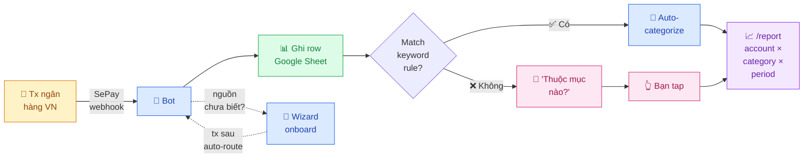

# 💰 My Money Went Bot


[](LICENSE)
[](https://www.python.org/)
[](tests/)

[🇬🇧 English](README.md)

> 🙏 **Credits:** xây dựng dựa trên các pattern từ [`maddyle8124/spend-less-bot`](https://github.com/maddyle8124/spend-less-bot). Cảm ơn Maddy rất nhiều — không có repo gốc này thì My Money Went cũng không có.

---

## Bot làm gì


**My Money Went Bot là 1 bot Telegram theo dõi chi tiêu cá nhân.** Mỗi lần ngân hàng VN gửi thông báo giao dịch (qua [SePay](https://sepay.vn)), bot ghi vào Google Sheet *của bạn* và hỏi bạn tap phân loại — hoặc skip luôn nếu bạn đã dạy nó 1 keyword rule. Gõ `/report` bất cứ lúc nào để xem tiền đã đi đâu, slice theo account, category, và khoảng thời gian.

<details>
<summary>📐 Flow chi tiết (có nhánh auto-categorize + onboarding)</summary>



</details>

## Demo


[Xem video demo 54 giây có âm thanh](https://raw.githubusercontent.com/maingocanh1702/my-money-went-bot/main/docs/media/my-money-went-bot-demo.mp4) để thấy luồng giao dịch đi qua Telegram, phân loại, và báo cáo.

**Không database. Không lưu data ở bên thứ 3. Single-tenant — 1 bot / 1 người.** Google Sheet của bạn LÀ backend. Data của bạn, sheet của bạn, luật của bạn.

---

## Tại sao có project này

Các app tài chính cá nhân (Money Lover, Misa, MoneyKeeper, ...) thường đòi credentials ngân hàng của bạn, chạy trên cloud của họ, và đẩy data của bạn sau bức tường freemium. Bot này làm ngược lại:

- **Bạn sở hữu data.** Tất cả nằm trong Google Sheet của bạn. Export, fork, archive, pivot — quyền bạn.
- **Bạn đọc được mọi dòng code.** ~3,000 LOC Python. Audit, custom, ship.
- **Bạn phân loại 1 lần.** Auto-categorize qua `/keywords` giúp tx định kỳ (Spotify, Grab, ...) skip luôn picker.
- **Report khớp với mô hình thực tế** — per-account *và* per-category, theo week/month/quarter/year. Không chỉ là "biểu đồ category theo tháng".

---

## Tính năng


Chi tiết từng tính năng:

🏦 **Tracking per-account** — mỗi tx được tag theo bank account gốc. `/report` slice theo account (TPB / Vietcombank / cash) và theo category.

📊 **`/report` thống nhất, 2 lens × 4 period** — tuần/tháng/quý/năm qua inline button. Toggle account ↔ category lens tại chỗ. Không cần gõ lại command.

🤖 **Onboarding account thông minh** — lần đầu tx đến từ nguồn chưa map, bot hỏi. Wizard 3 bước: tên → loại → xong. Tx sau auto-route.

⚡ **Auto-categorize** — `/keywords` cho phép định nghĩa pattern ("GRAB" → Daily Spending, "Spotify" → Subscription). Tx match sẽ skip prompt.

🎯 **Budget allocation thông minh** — `/allocate` đặt cap hàng tháng theo category. Lần sau quay lại là *edit mode* — tap 1 bucket để đổi cap, không phải walk lại wizard.

🔁 **Backfill tx lịch sử** — `/accounts assign <slug>` gán retroactive tx cũ chưa map vào account vừa onboard. Không mất tx nào giữa "first webhook" và "wizard complete".

🇻🇳 **Ngân hàng VN** — hoạt động với bất kỳ bank nào SePay support. VND-only ở v1.

---

## Screenshots

<table>
  <tr>
    <td width="50%" align="center"><b>🤖 Auto-categorize + log</b></td>
    <td width="50%" align="center"><b>📊 <code>/report</code> — lens category theo tháng</b></td>
  </tr>
  <tr>
    <td></td>
    <td></td>
  </tr>
  <tr>
    <td>Tx từ Bách Hóa Xanh match rule <code>/keywords</code> → auto-tag Food, không hỏi. Bot reply lại số tiền đã log + progress của bucket.</td>
    <td>Tổng spending vs budget, budget bar từng bucket với emoji trạng thái, có thêm section Tracking cho bucket bạn theo dõi mà không đặt cap.</td>
  </tr>
</table>

---

## Ngân hàng được hỗ trợ

Bất cứ bank nào [SePay support](https://sepay.vn/ngan-hang.html) là bot này track được. SePay kết nối trực tiếp với **10 ngân hàng VN** (tính đến 2026):

| Ngân hàng | Code |
|---|---|
| VPBank | VPB |
| ACB | ACB |
| Sacombank | STB |
| VietinBank | ICB |
| MBBank | MBB |
| BIDV | BIDV |
| MSB | MSB |
| TPBank | TPB |
| KienLongBank | KLB |
| OCB | OCB |

Một số bank (BIDV, MB, VietinBank, ACB, OCB, KienLongBank, MSB) dùng **API trực tiếp** — webhook tức thì khi có tx. Số còn lại đi qua **SMS Banking** nên có chút độ trễ. Dù sao bot cũng xử lý payload giống hệt nhau — xem [bảng giá SePay](https://sepay.vn/bang-gia.html) để biết list mới nhất.

---

## Cần chuẩn bị

| Yêu cầu | Lấy ở đâu |
|---|---|
| Tài khoản Telegram | Chắc bạn có rồi |
| Tài khoản [SePay](https://sepay.vn) | Kết nối bank VN của bạn |
| Tài khoản Google | Cho Google Sheets + Google Cloud |
| Server có HTTPS public | [Railway](https://railway.app) đơn giản nhất (free tier OK). Hoặc Ubuntu VPS + [ngrok](https://ngrok.com) cho test. |
| Python 3.11+ | Trên server / Railway |

---

## Khuyến nghị: Setup bằng Railway

Nếu bạn không quen server Linux, hãy đi theo flow này: **Telegram → Google Sheet → Railway → SePay → test giao dịch đầu tiên**. Bỏ qua phần VPS; phần đó chỉ dành cho người đã quen deploy server.

Một vài từ kỹ thuật trong guide này:

| Từ | Hiểu đơn giản là |
|---|---|
| `env vars` | Các ô cấu hình trong Railway. Bạn copy giá trị vào đó, không cần sửa code. |
| `webhook` | Một đường link để Telegram hoặc SePay gửi thông báo vào bot. |
| `service account` | Một email robot của Google để bot ghi dữ liệu vào Sheet của bạn. |
| `secret` | Chuỗi random giống mật khẩu, dùng để chặn request lạ. |

### 1. Tổng quan các bước

1. Tạo bot Telegram và lấy `BOT_TOKEN`.
2. Lấy `CHAT_ID` Telegram của bạn.
3. Tạo Google Sheet và lấy `SHEET_ID`.
4. Tạo Google service account, tải file `credentials.json`, rồi share Sheet cho email robot đó.
5. Deploy repo lên Railway và điền các biến cấu hình.
6. Dán Railway webhook URL vào SePay.
7. Kết nối Telegram webhook.
8. Gửi `/today`, thử 1 giao dịch nhỏ, rồi phân loại giao dịch đầu tiên.

### 2. Copy gì, dán vào đâu

Bot cần **7 biến** trong Railway, chia thành 2 nhóm:

**Nhóm Core — bot không chạy được nếu thiếu:**

Đây là 4 biến kết nối bot với Telegram, Google Sheet, và ngân hàng. `spend-less-bot` cũng cần đúng 4 biến này — bất kỳ bot nào dùng Telegram + SePay + Sheets đều cần.

| Giá trị | Lấy ở đâu | Dán vào đâu |
|---|---|---|
| `BOT_TOKEN` | Chat với [@BotFather](https://t.me/BotFather), chạy `/newbot` | Railway → Variables → `BOT_TOKEN` |
| `CHAT_ID` | Chat với [@userinfobot](https://t.me/userinfobot) | Railway → Variables → `CHAT_ID` |
| `SHEET_ID` | Phần dài trong URL Google Sheet: `/spreadsheets/d/<SHEET_ID>/edit` | Railway → Variables → `SHEET_ID` |
| `GOOGLE_CREDS_JSON` | Nội dung file `credentials.json` của Google service account | Railway → Variables → `GOOGLE_CREDS_JSON` |

**Nhóm Security — chặn người lạ gửi dữ liệu giả vào bot:**

Đây là 3 "mật khẩu" chứng minh request thật sự đến từ SePay / Telegram / cron job của bạn, không phải ai đó đoán được URL. Nếu thiếu, bất kỳ ai biết URL bot đều có thể ghi giao dịch giả vào Sheet của bạn. `spend-less-bot` không có nhóm này — webhook của nó mở cho ai gọi cũng được.

| Giá trị | Lấy ở đâu | Dán vào đâu | Bảo vệ cái gì |
|---|---|---|---|
| `SEPAY_SECRET` | Tự tạo một chuỗi random dài | Railway → Variables → `SEPAY_SECRET` **và** SePay → Webhook API Key | Chặn giao dịch ngân hàng giả |
| `TELEGRAM_WEBHOOK_SECRET` | Tự tạo một chuỗi random dài khác | Railway → Variables → `TELEGRAM_WEBHOOK_SECRET` **và** lệnh Telegram `setWebhook` | Chặn lệnh Telegram giả |
| `CRON_SECRET` | Tự tạo một chuỗi random dài khác | Railway → Variables → `CRON_SECRET` | Chặn trigger báo cáo ngày/tháng giả |

Nếu bạn không biết dùng terminal để generate secret, có thể dùng password manager hoặc website password generator bất kỳ (search "random password generator") để tạo 3 chuỗi random dài. Đừng dùng lại password cá nhân.

Với `GOOGLE_CREDS_JSON`, Railway cần toàn bộ JSON nằm trên **một dòng**. Nếu bạn có terminal:

```bash
cat credentials.json | tr -d '\n'
```

Copy output đó vào Railway. Nếu không dùng terminal, mở `credentials.json`, copy toàn bộ nội dung, rồi xóa các dòng xuống dòng để thành một dòng trước khi paste.

### 3. Checklist trước khi bấm deploy

- [ ] Đã tạo Telegram bot và lưu `BOT_TOKEN`.
- [ ] Đã lấy đúng `CHAT_ID` của chính bạn.
- [ ] Đã tạo Google Sheet mới và copy `SHEET_ID`.
- [ ] Đã bật Google Sheets API và Google Drive API.
- [ ] Đã tạo service account, tải `credentials.json`.
- [ ] Đã share Google Sheet cho email trong `credentials.json` với quyền **Editor**.
- [ ] Đã thêm đủ 7 biến trong Railway: `BOT_TOKEN`, `CHAT_ID`, `SHEET_ID`, `GOOGLE_CREDS_JSON`, `SEPAY_SECRET`, `TELEGRAM_WEBHOOK_SECRET`, `CRON_SECRET`.
- [ ] Đã tắt SePay native Google Sheets integration để tránh duplicate giao dịch.

### 4. Làm sao biết setup đã đúng

Sau khi deploy xong trên Railway, app sẽ có domain dạng `https://<your-app>.up.railway.app`.

1. Mở `https://<your-app>.up.railway.app/` trên trình duyệt. Nếu đúng, bạn sẽ thấy:

   ```json
   {"status":"ok","bot":"Financial Tracking Bot"}
   ```

2. Dùng domain đó để set Telegram webhook:

   ```bash
   curl -X POST "https://api.telegram.org/bot<BOT_TOKEN>/setWebhook" \
     -d "url=https://<your-app>.up.railway.app/webhook" \
     -d "secret_token=<TELEGRAM_WEBHOOK_SECRET>" \
     -d "drop_pending_updates=true"
   ```

3. Mở Telegram, chat với bot, gửi `/today`. Bot phải trả lời.
4. Trong SePay, set webhook URL là `https://<your-app>.up.railway.app/webhook`.
5. Thử một giao dịch nhỏ. Nếu đúng, bot sẽ báo giao dịch mới, hỏi setup account, rồi hỏi category.
6. Mở Google Sheet. Bạn sẽ thấy các tab được tạo tự động và giao dịch được ghi vào Sheet.

### 5. Lỗi thường gặp

| Bạn thấy gì | Thường do đâu | Làm gì |
|---|---|---|
| Railway deploy failed | Thiếu env var bắt buộc hoặc JSON sai format | Kiểm tra đủ 7 biến trong Railway, đặc biệt `GOOGLE_CREDS_JSON` phải là JSON một dòng |
| Mở domain Railway không thấy `status: ok` | App chưa start hoặc crash | Xem Railway logs, kiểm tra biến môi trường |
| Bot không trả lời `/today` | Telegram webhook chưa set đúng hoặc sai `TELEGRAM_WEBHOOK_SECRET` | Chạy lại lệnh `setWebhook`, dùng đúng Railway domain và đúng secret |
| Có giao dịch nhưng Sheet trống | Chưa share Sheet cho service account | Mở `credentials.json`, lấy email `client_email`, share Sheet cho email đó quyền Editor |
| Giao dịch bị ghi 2 lần | SePay native Google Sheets integration vẫn bật | Tắt integration Google Sheets trong SePay |
| SePay báo đã gửi nhưng bot không nhận | Sai webhook URL hoặc sai API Key | URL phải là `/webhook`; SePay API Key phải giống `SEPAY_SECRET` |

---

## Hướng dẫn setup chi tiết

### Bước 1 — Tạo Telegram bot

1. Nhắn [@BotFather](https://t.me/BotFather) → `/newbot` → lưu token.
2. Nhắn [@userinfobot](https://t.me/userinfobot) → lưu chat ID của bạn.

### Bước 2 — Setup Google Sheets

1. Vào [console.cloud.google.com](https://console.cloud.google.com) → tạo project mới.
2. Enable **Google Sheets API** + **Google Drive API**.
3. **IAM & Admin → Service Accounts → Create** → **Keys → Add Key → JSON** → download là `credentials.json`.
4. Tạo Google Sheet mới. Copy **SHEET_ID** từ URL.
5. Share sheet với email service account (quyền Editor).

**Các tab tự tạo lần đầu webhook về** — không cần setup schema tay. Các tab:

| Tab | Mục đích |
|---|---|
| `Đầu ra` | Tất cả transactions (1 row / tx) |
| `Accounts` | Account đã onboard (name, type, source_keys) |
| `Account Ledger` | Ledger append-only — source of truth cho balance |
| `Pending Accounts` | Queue onboarding (TTL 24h) |
| `Budget Config` | Allocate per-month per-bucket |
| `Sub-category Config` | Sub-label per bucket (optional) |
| `Keyword Rules` | Pattern auto-categorize |
| `Bot State` | State wizard / picker per chat |
| `Monthly Reports` | Archive báo cáo tháng |

### Bước 3 — Setup SePay

1. Đăng ký tại [sepay.vn](https://sepay.vn), kết nối bank.
2. **Webhook settings** → URL = `https://<your-domain>/webhook`.
3. Set **API Key** của SePay bằng đúng random value bạn sẽ dùng cho `SEPAY_SECRET`.
   Bot sẽ reject webhook SePay nếu payload không có giá trị này.
4. Chọn hướng tx muốn track:
   - **Chỉ track chi tiêu** → chỉ bật **Tiền ra**.
   - **Track cả thu nhập + chi tiêu** → bật cả **Tiền ra** và **Tiền vào**.

   (Tx Tiền vào được ghi log nhưng skip category picker — xem [Tại sao có project này](#tại-sao-có-project-này).)
5. ⚠️ **Tắt SePay native Google Sheets integration** — bot này tự ghi rows; bật cả 2 = tx duplicate.

### Bước 4 — Deploy

```bash
git clone https://github.com/maingocanh1702/my-money-went-bot.git
cd my-money-went-bot
cp .env.example .env
```

Env vars bắt buộc — **Core** (bot không start được nếu thiếu):

| Env var | Điền gì |
|---|---|
| `BOT_TOKEN` | Token từ BotFather |
| `CHAT_ID` | Telegram chat ID của bạn từ `@userinfobot` |
| `SHEET_ID` | ID dài trong URL Google Sheet |
| `GOOGLE_CREDS_JSON` | Railway/cloud: service-account JSON dạng 1 dòng |
| `GOOGLE_CREDS` | VPS/local alternative: đường dẫn `credentials.json` |

Env vars bắt buộc — **Security** (xác thực mọi request từ bên ngoài — app từ chối start nếu thiếu):

| Env var | Điền gì | Bảo vệ cái gì |
|---|---|---|
| `SEPAY_SECRET` | Cùng giá trị với SePay webhook API Key | Chặn webhook giao dịch giả |
| `TELEGRAM_WEBHOOK_SECRET` | Random token truyền vào Telegram `setWebhook` | Chặn Telegram update giả |
| `CRON_SECRET` | Random token dùng cho URL `/trigger/*` của cron | Chặn trigger cron giả |

Vì sao nhiều biến hơn `spend-less-bot`? Repo gốc giữ setup tối giản: token Telegram, chat ID, sheet ID, và file Google credentials trên server. `my-money-went-bot` thêm các biến security vì app được thiết kế để deploy public trên Railway/VPS và nhận dữ liệu giao dịch ngân hàng qua webhook. Nếu không có các secret này, người lạ biết URL `/webhook` hoặc `/trigger/*` có thể gửi dữ liệu giả vào bot hoặc kích hoạt job không mong muốn.

Nhìn theo nhóm thì không quá nhiều: **3 biến định danh** (`BOT_TOKEN`, `CHAT_ID`, `SHEET_ID`), **1 cách cấp quyền Google** (`GOOGLE_CREDS_JSON` hoặc `GOOGLE_CREDS`), và **3 chuỗi random để bảo mật production** (`SEPAY_SECRET`, `TELEGRAM_WEBHOOK_SECRET`, `CRON_SECRET`).

Generate secrets:

```bash
openssl rand -hex 32   # dùng một lần cho SEPAY_SECRET
openssl rand -hex 32   # dùng một lần cho TELEGRAM_WEBHOOK_SECRET
openssl rand -hex 32   # dùng một lần cho CRON_SECRET
```

Với Railway, convert Google credentials thành 1 dòng:

```bash
cat credentials.json | tr -d '\n'
```

Paste output đó vào `GOOGLE_CREDS_JSON`. Với VPS/local, giữ `credentials.json` trên disk và set `GOOGLE_CREDS=credentials.json`.

**Railway** (khuyến nghị):

1. Push fork của bạn lên GitHub.
2. [railway.app](https://railway.app) → New Project → Deploy from GitHub repo.
3. Add env vars trong Railway dashboard. Với `GOOGLE_CREDS_JSON`, paste toàn bộ JSON thành 1 dòng. Production sẽ fail closed nếu thiếu `SEPAY_SECRET`, `TELEGRAM_WEBHOOK_SECRET`, hoặc `CRON_SECRET`.
4. Railway cấp URL `*.up.railway.app`. Check health trước:
   ```bash
   curl https://<your-app>.up.railway.app/
   ```
   Kết quả nên là `{"status":"ok","bot":"Financial Tracking Bot"}`.
5. Dùng `https://<your-app>.up.railway.app/webhook` làm SePay webhook URL.
6. Đăng ký Telegram webhook với cùng secret token như `TELEGRAM_WEBHOOK_SECRET`:
   ```bash
   curl -X POST "https://api.telegram.org/bot<BOT_TOKEN>/setWebhook" \
     -d "url=https://<your-app>.up.railway.app/webhook" \
     -d "secret_token=<TELEGRAM_WEBHOOK_SECRET>" \
     -d "drop_pending_updates=true"
   ```
7. Verify Telegram đã nhận webhook:
   ```bash
   curl "https://api.telegram.org/bot<BOT_TOKEN>/getWebhookInfo"
   ```

**VPS** (Ubuntu 22.04):

```bash
sudo apt install -y python3.11 python3-pip python3-venv
python3 -m venv .venv && source .venv/bin/activate
pip install -r requirements.txt
chmod 600 .env credentials.json

# systemd service
sudo tee /etc/systemd/system/mmwbot.service <<EOF
[Unit]
Description=My Money Went Bot
After=network.target
[Service]
WorkingDirectory=$(pwd)
ExecStart=$(pwd)/.venv/bin/uvicorn main:app --host 0.0.0.0 --port 8000
EnvironmentFile=$(pwd)/.env
Restart=always
[Install]
WantedBy=multi-user.target
EOF

sudo systemctl enable --now mmwbot
journalctl -u mmwbot -f   # xem log
```

Với VPS, cần đặt app sau HTTPS trước khi register webhook. Dùng nginx + Let's Encrypt, hoặc chạy `setup.sh your-domain.com` sau khi copy repo và `.env` lên server. Sau đó register Telegram:

```bash
curl -X POST "https://api.telegram.org/bot<BOT_TOKEN>/setWebhook" \
  -d "url=https://<your-domain>/webhook" \
  -d "secret_token=<TELEGRAM_WEBHOOK_SECRET>" \
  -d "drop_pending_updates=true"
```

### Bước 5 — Lần đầu chạy

1. Mở chat với bot trên Telegram, gửi `/today` — bot phải reply. Nếu không, check Railway/VPS logs và `getWebhookInfo`.
2. Confirm SePay đang dùng đúng API Key giống `SEPAY_SECRET`.
3. Trigger 1 tx ngân hàng nhỏ — trong vài giây bot sẽ ping: *"Account chưa map"* + *"Khoản này thuộc mục nào?"*.
4. Tap **✅ Setup** → onboard account (tên → loại).
5. Tap category cho tx.
6. Type `/report` → xem breakdown chi tiêu.

Tx sau từ cùng account auto-route. Setup `/keywords` rules để auto-categorize tx định kỳ.

---

## Commands

| Command | Tác dụng |
|---|---|
| `/today` | Chi tiêu hôm nay vs daily cap (bucket Daily Spending). |
| `/report [period]` | Báo cáo tổng. Inline button cho tuần/tháng/quý/năm × lens account/category. |
| `/accounts` | List account đã setup. `/accounts add` mở wizard. `/accounts assign <slug>` bulk-tag tx lịch sử. |
| `/manage` | Thêm / rename / xóa categories. Edit-amount per bucket. |
| `/keywords` | Quản lý rules auto-categorize. |
| `/allocate` | Sửa budget. Lần đầu = wizard, sau đó = edit-mode per bucket. |

---

## Architecture

```
┌──────────┐   webhook    ┌────────────────┐    rows      ┌──────────────┐
│  SePay   │ ───────────► │  FastAPI bot   │ ───────────► │ Google Sheet │
└──────────┘              │  (Railway/VPS) │              │   (của bạn)  │
                          └──────┬─────────┘              └──────────────┘
                                 │ Telegram Bot API
                                 ▼
                          ┌────────────────┐
                          │   Bạn (chat)   │
                          └────────────────┘
```

**Source of truth = ledger table.** `running_balance` là cache được recompute từ ledger mỗi lần write. Xem [`handlers/account_resolver.py`](handlers/account_resolver.py) và [`sheets.py`](sheets.py).

### Cấu trúc project

```
.
├── main.py                       # FastAPI entry — route tất cả webhook
├── config.py                     # Đọc env vars, sheet tab names
├── sheets.py                     # Toàn bộ logic read/write Google Sheets
├── telegram_api.py               # Wrapper Telegram Bot API
├── handlers/
│   ├── sepay.py                  # Handler SePay webhook
│   ├── account_resolver.py       # Map payload → account_id
│   ├── accounts.py               # /accounts wizard + onboarding + backfill
│   ├── transaction.py            # Category picker + confirmation flow
│   ├── allocation.py             # /allocate budget wizard + edit mode
│   ├── manage.py                 # /manage categories
│   ├── keywords.py               # /keywords auto-categorize rules
│   ├── report.py                 # /report thống nhất (account + category lenses)
│   └── reports.py                # /today snapshot + daily recap
├── tests/unit/                   # 98 unit tests, in-memory FakeSpreadsheet
├── .env.example                  # Template — copy thành .env và điền
├── crontab.txt                   # Cron jobs mẫu (daily recap, monthly)
├── setup.sh                      # VPS bootstrap script
├── railway.toml                  # Railway deploy config
└── requirements.txt
```

---

## Bảo mật ⚠️

Vài điều cần cẩn thận — bot này xử lý data thông báo ngân hàng:

**1. Bảo vệ `.env` và `credentials.json`.** Đây là chìa khóa bot của bạn. Ai có sẽ đọc được chi tiêu.

```bash
chmod 600 .env credentials.json
```

Không bao giờ commit lên GitHub — `.gitignore` đã block sẵn.

**2. Webhook và trigger secrets là bắt buộc ở production.** App sẽ không start nếu thiếu `SEPAY_SECRET`, `TELEGRAM_WEBHOOK_SECRET`, hoặc `CRON_SECRET`. Payload SePay phải có API key khớp, Telegram update phải có header `X-Telegram-Bot-Api-Secret-Token`, và caller của `/trigger/*` phải gửi cron secret.

**3. Đăng ký Telegram với `secret_token`.** Telegram chỉ gửi secret header sau khi bạn set webhook với token đó:

```bash
curl -X POST "https://api.telegram.org/bot<BOT_TOKEN>/setWebhook" \
  -d "url=https://<your-domain>/webhook" \
  -d "secret_token=<TELEGRAM_WEBHOOK_SECRET>"
```

Dùng chuỗi random như `openssl rand -hex 32`, lưu vào `TELEGRAM_WEBHOOK_SECRET`, rồi dùng đúng chuỗi đó cho `secret_token`.

**4. Dùng SSH key, không dùng password.** Nếu deploy VPS, password SSH có thể brute-force:

```bash
ssh-keygen -t ed25519
ssh-copy-id root@your-server
# Sau đó trong /etc/ssh/sshd_config:
#   PasswordAuthentication no
```

**5. Bot chỉ nói chuyện với `CHAT_ID` của bạn.** Hardcoded check — không ai khác tương tác được kể cả khi biết tên bot.

**6. Không có banking credentials nào chạy qua code này.** Bot chỉ nhận *thông báo* tx (số tiền + description) từ SePay. Login bank, số thẻ, v.v. không bao giờ đi qua.

**7. PII trong description.** Payload SePay chứa description giao dịch thô, có thể có tên đối tác, số tài khoản, references. Những thứ này được ghi vào cột `Description`. Ai có quyền đọc Sheet đều thấy — giữ Sheet private.

---

## Troubleshooting

| Vấn đề | Kiểm tra |
|---|---|
| Không nhắn gì khi có tx | Service đang chạy? `systemctl status mmwbot` hoặc Railway logs |
| Bot crash | `journalctl -u mmwbot -n 50` |
| Số tiền sai trong sheet | Check log `DEBUG append_transaction:` |
| Row duplicate trong sheet | Đảm bảo SePay native Sheets integration đã tắt |
| Daily recap sai giờ | Server có ở UTC? Shift cron hours -7 từ ICT |
| `/allocate` không lưu | Check log `[allocate]` messages |
| Bot không auto-route tx từ account đã biết | Check cell `source_keys` trong tab `Accounts` có đúng số tài khoản SePay không |

---

## Update bot

```bash
# Trên server
cd /path/to/my-money-went-bot
git pull
systemctl restart mmwbot
journalctl -u mmwbot -f   # xem log
```

Trên Railway: chỉ cần push lên fork của bạn, Railway tự deploy.

---

## Roadmap (deferred)

Cố tình để ngoài scope v1:

- 💬 **Bot Facebook Messenger** — cùng UX với Telegram, front-end thứ 2.
- 🎮 **Bot Discord** — cho user dùng Discord thay vì Telegram.
- 🧾 **Credit card support** — outstanding balance, % utilization, `/cc pay`, statement-cycle tracking.
- 🔄 **`/transfer` manual** giữa các account đã track.
- 📧 **Email ingestion** cho bank không support SePay (TCB, Cake, HSBC email).
- 💱 **Multi-currency** accounts (HKD, USD, ...).

---

## Development

```bash
pip install -r requirements.txt
pytest tests/unit/ -v
```

98 unit tests dùng `FakeSpreadsheet` in-memory — zero gọi Google API trong test. Tests có `@freeze_time` cần `freezegun` để period assertion deterministic.

---

## Contributing

Welcome contributions — issue / PR / fork. Hãy có quan điểm rõ ràng về scope: bot này cố tình giữ minimal. Tính năng ngoài [Roadmap](#roadmap-deferred) khó có khả năng được merge nhưng vẫn vui vẻ thảo luận.

Khi mở PR:
- Có test cho behavior mới.
- Match code style hiện tại (functional helpers, docstrings, không over-engineering).
- Với UX change, đính screenshot Telegram.

---

## Acknowledgments

Project này khởi đầu là fork-and-rewrite của [`maddyle8124/spend-less-bot`](https://github.com/maddyle8124/spend-less-bot). Ý tưởng cốt lõi — Telegram bot + SePay webhook + Google Sheet — đến từ repo đó. My Money Went Bot bổ sung tracking per-account, report thống nhất multi-period, wizard onboarding account, và nhiều UX refinement khác.

---

## License

[MIT](LICENSE) — fork, ship, sell.

Nếu bạn build gì đó hay ho dựa trên đây, 1 backlink hay shoutout sẽ được trân trọng nhưng không bắt buộc.
