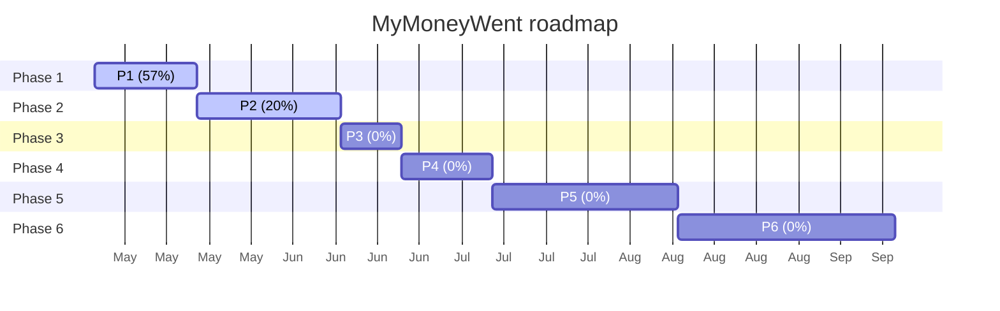

# MyMoneyWent — Progress Dashboard

> **Auto-generated** từ [`implementation-tracker.md`](implementation-tracker.md) bằng `scripts/build-dashboard.py`.
> KHÔNG edit trực tiếp — sửa tracker rồi rebuild.
> **Cập nhật:** 2026-05-21 01:18 · **Branch hiện tại:** `feat/MYM-4-work-state-engine-1b-projection`

Để xem dashboard HTML đẹp hơn: mở [`dashboard.html`](dashboard.html) bằng browser.

---

## Tổng quan

- **MVP progress:** **17%** (6/36 PR merged)
- **In flight:** 1 PR · **Blocked:** 0 · **Deferred:** 0
- **Target launch:** Tháng 9/2026 (~16 weeks runway)

## Phase progress

| Phase | Merged / Total | % | Progress |
|-------|:--------------:|:-:|:---------|
| Phase 1 | 4 / 7 | 57% | `█████░░░░░` |
| Phase 2 | 2 / 10 | 20% | `██░░░░░░░░` |
| Phase 3 | 0 / 1 | 0% | `░░░░░░░░░░` |
| Phase 4 | 0 / 2 | 0% | `░░░░░░░░░░` |
| Phase 5 | 0 / 6 | 0% | `░░░░░░░░░░` |
| Phase 6 | 0 / 10 | 0% | `░░░░░░░░░░` |

## Phase breakdown — features & tasks

### Phase 1 — 4/7 · 57% `█████░░░░░`

| PR | Feature | Status | Branch |
|----|---------|:------:|--------|
| `W0.7` | Public `request_id` helpers + F02 xfail contract pin | ✅ Merged | `chore/W0.7-tenant-context-public-api` |
| `W0.8` | Webhook `display_suffix VARCHAR(8)` migration (G3 option b) | ✅ Merged | `feat/webhook-display-suffix-migration` |
| `W0.9` | Dashboard realtime — auto-rebuild + git-state detect + reconcile | ✅ Merged | `feat/dashboard-realtime` |
| `W0.10` | Dashboard v3 rich UI + click-through + Chart.js | ✅ Merged | `feat/dashboard-v3-rich-v2` |
| `work-state-engine-1a` | Work-State Engine — Phase 1a (skeleton + filesystem + git) | ✅ Merged | `feat/MYM-1-work-state-engine-1a` |
| `work-state-engine-1b` | Work-State Engine — Phase 1b (github + ci + railway collectors) | ⬜ Not started | `feat/MYM-3-work-state-engine-1b` |
| `work-state-engine-1b'` | Work-State Engine — Phase 1b' (dashboard projection follow-up) | ⬜ In review | `feat/MYM-4-work-state-engine-1b-projection` |
| `W1.1` | Docker Compose dev + prod | ⬜ Not started | `infra/W1.1-docker-compose` |
| `W1.2` | Discord adapter (`core/messenger/discord.py`) | ⬜ Not started | `feat/W1.2-discord-adapter` |
| `W1.3` | Phase 1 integration smoke | ⬜ Not started | `chore/W1.3-phase1-smoke` |

### Phase 2 — 2/10 · 20% `██░░░░░░░░`

| PR | Feature | Status | Branch |
|----|---------|:------:|--------|
| `onboarding-start` | `/start` + user create + trial assign | ✅ Merged | `feat/F01-onboarding-start` |
| `funding-sources` | Funding sources resolver + handlers | ⬜ Not started | `feat/funding-sources` |
| `transaction-capture` | Transaction capture EXPANDED (inherit W0.6 legacy cutover) | ⬜ Not started | `feat/transaction-capture` |
| `manual-transaction-entry` | Manual transaction entry — Channel 3 of transaction-capture | ⬜ Not started | `feat/manual-transaction-entry` |
| `category-management` | Category management (`/manage`) | ⬜ Not started | `feat/category-management` |
| `categorization` | Categorization auto-rules + manual | ⬜ Not started | `feat/categorization` |
| `reports` | Reports `/status`, `/today`, `/weekly` | ⬜ Not started | `feat/reports` |
| `settings` | Settings `/settings` | ✅ Merged | `feat/F07-settings` |
| `admin-auth` | Admin auth framework only (commands defer Phase 6) | ⬜ Not started | `feat/admin-auth` |
| `i18n-locale-switcher` | VI/EN locale switcher | ⬜ Not started | `feat/i18n-locale-switcher` |

### Phase 3 — 0/1 · 0% `░░░░░░░░░░`

| PR | Feature | Status | Branch |
|----|---------|:------:|--------|
| `pricing-tiers` | Tier limits + 14d trial + gating middleware | ⬜ Not started | `feat/pricing-tiers` |

### Phase 4 — 0/2 · 0% `░░░░░░░░░░`

| PR | Feature | Status | Branch |
|----|---------|:------:|--------|
| `sepay-onboarding-paths` | Path A (Quick connect) + Path B (Wizard) | ⬜ Not started | `feat/sepay-onboarding-paths` |
| `first-tx-celebration` | First-tx celebration flow | ⬜ Not started | `feat/first-tx-celebration` |

### Phase 5 — 0/6 · 0% `░░░░░░░░░░`

| PR | Feature | Status | Branch |
|----|---------|:------:|--------|
| `W5.1` | Postmark inbound + `/inbound/{token}` route | ⬜ Not started | `infra/W5.1-postmark-inbound` |
| `email-forwarding-onboarding` | Path C onboarding (email forwarding guides) | ⬜ Not started | `feat/email-forwarding-onboarding` |
| `parser-techcombank` | Parser: Techcombank full extraction | ⬜ Not started | `feat/parser-techcombank` |
| `parser-cake-vpbank` | Parser: Cake (VPBank) | ⬜ Not started | `feat/parser-cake-vpbank` |
| `parser-mbbank` | Parser: MB Bank | ⬜ Not started | `feat/parser-mbbank` |
| `parser-acb` | Parser: ACB (deferred to Phase 5b) | ⏸️ Deferred | `feat/parser-acb` |
| `parser-sacombank` | Parser: Sacombank (deferred to Phase 5b) | ⏸️ Deferred | `feat/parser-sacombank` |
| `parser-bidv` | Parser: BIDV (deferred to Phase 5b) | ⏸️ Deferred | `feat/parser-bidv` |
| `cross-source-dedup` | Cross-source dedup (SePay + Email) | ⬜ Not started | `feat/cross-source-dedup` |

### Phase 6 — 0/10 · 0% `░░░░░░░░░░`

| PR | Feature | Status | Branch |
|----|---------|:------:|--------|
| `scheduled-jobs` | Scheduled jobs (APScheduler, TZ jitter ±5min) | ⬜ Not started | `feat/scheduled-jobs` |
| `payment-vietqr` | Payment VietQR + SePay auto-detect (4-layer fuzzy) | ⬜ Not started | `feat/payment-vietqr` |
| `payment-email-backup` | Email backup detect (Techcombank email path) | ⬜ Not started | `feat/payment-email-backup` |
| `payment-recurring` | Manual review fallback + recurring billing | ⬜ Not started | `feat/payment-recurring` |
| `admin-commands` | Admin commands (`/admin_stats`, `/admin_cost`, `/admin_user`, `/admin_resolve`) | ⬜ Not started | `feat/admin-commands` |
| `W6.1` | Sentry alerts — 7 critical (per observability-plan.md) | ⬜ Not started | `infra/W6.1-sentry-alerts` |
| `messenger-channel` | Messenger adapter (feature-flagged `ENABLE_MESSENGER_CHANNEL=false`) | ⬜ Not started | `feat/messenger-channel` |
| `W6.2` | Railway deploy + custom domain (tienvenoidau.com) | ⬜ Not started | `infra/W6.2-railway-deploy` |
| `W6.3` | Backup automation (B2 + pg_dump daily, SSE-B2) | ⬜ Not started | `infra/W6.3-backup-b2` |
| `W6.4` | DR runbook full validation (test restore) | ⬜ Not started | `chore/W6.4-dr-restore-test` |
| `(to be created when Phase W enters implementation planning)` | — | ⏸️ Deferred | `—` |
| `parser-evolver` | GEPA-style auto-tune cho email parsers (POC: ACB) | ⏸️ Deferred | `feat/MYM-XXX-parser-evolver-poc` |

## Timeline

## Đang làm

### work-state-engine-1b' — Work-State Engine — Phase 1b' (dashboard projection follow-up)

- **Status:** ⬜ In review · 🌿 đang trên branch này
- **Branch:** `feat/MYM-4-work-state-engine-1b-projection`
- **Wave:** Wave 0 follow-up
- **Gates:** 🔒X
- **Phase:** Phase 1
- **Notes:** **Ready to kickoff post MYM-3 merge.** **Linear:** [MYM-4](https://linear.app/maingocanh/issue/MYM-4) — project `Work-State Engine`, P1 manual_only. **Spec:** `docs/operations/dashboard-engine/dashboard-plan-state-split.md` v1.2.1 §10 + §11.1 + §13 (AC1g + AC5 + AC6 + AC10 + AC11a). **Prereq:** MYM-3 merged ✓ at `3e654cf` (2026-05-20) — Signals dataclass extensions stable, github+ci+railway active. **Prompt:** `docs/autopilot/prompts/work-state-engine-1b-projection-autopilot.md` (drafted 2026-05-21: 7 Steps + 2 Checkpoints + 12 circuit breakers; pure read-only consumer of `.dashboard/current_state.json`). **Scope:** Single module `scripts/work_state/projections/dashboard.py` — enrich `docs/dashboard.json` rows với `state` block (computed_status + human_status + pr_state + ci_state + deploy_state + review_state + overlays + last_event_ts). Side-by-side rendering (manual `status` từ tracker giữ UNCHANGED, additive `state` từ engine). CLI entry point. Idempotent. `--no-network` mode supported. ~0.5-1 work-day. Codex 2× consecutive clean required. Out of scope: multi-branch agg projection (Phase 1c), build-dashboard.py auto-wiring (Phase 1c), runtime urgency AC11b (Phase 1d), foundation_change milestones AC11c (post-shadow ticket), manual status removal (Phase 3 cutover). **Scope reconcile rationale:** A+ option lock 2026-05-20 — projection split out of spec §10's canonical 1b để align Linear milestone 1:1 với prompt scope.

## Up next

| PR | Feature | Phase | Status |
|----|---------|-------|--------|
| `work-state-engine-1b` | Work-State Engine — Phase 1b (github + ci + railway collectors) | Phase 1 | ⬜ Not started |
| `W1.1` | Docker Compose dev + prod | Phase 1 | ⬜ Not started |
| `W1.2` | Discord adapter (`core/messenger/discord.py`) | Phase 1 | ⬜ Not started |
| `W1.3` | Phase 1 integration smoke | Phase 1 | ⬜ Not started |
| `funding-sources` | Funding sources resolver + handlers | Phase 2 | ⬜ Not started |

---

**Rebuild:** chạy `python scripts/build-dashboard.py` sau mỗi PR merge (theo Step 10 của [development-workflow.md](operations/development-workflow.md) §2.7 Post-merge updates).
