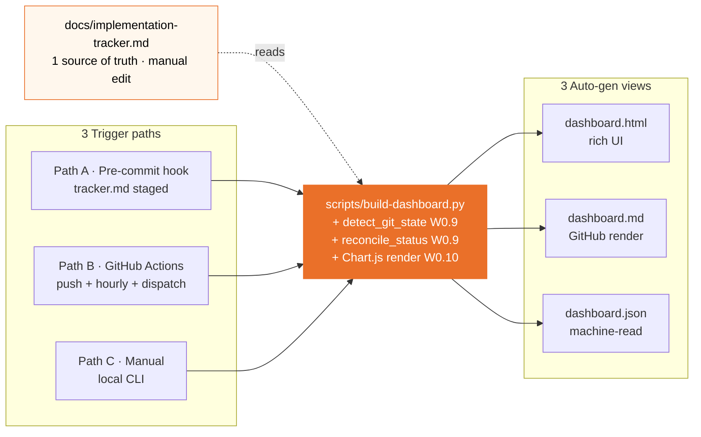
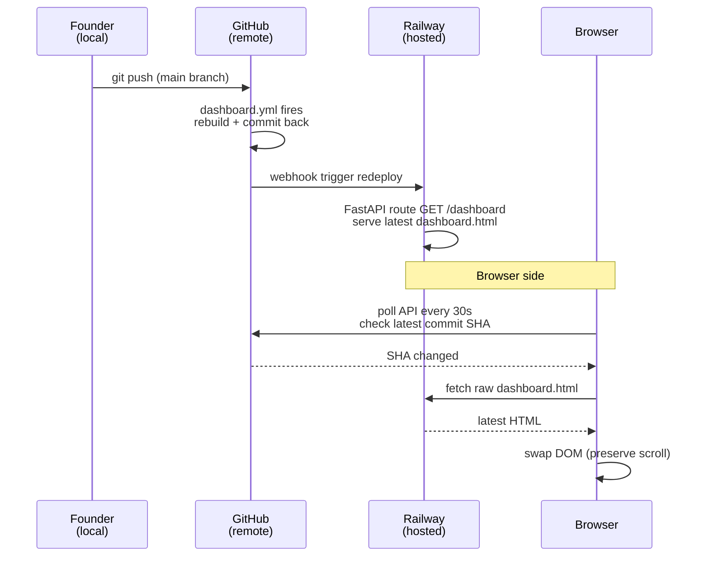
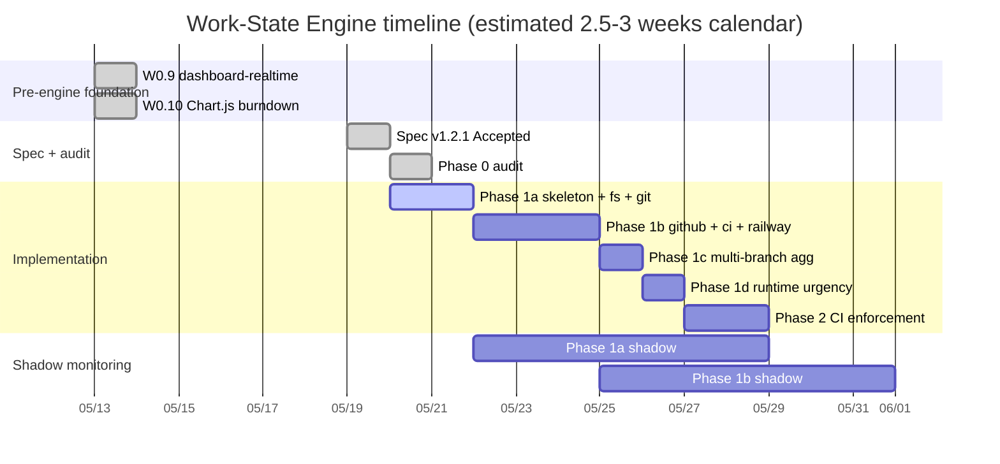
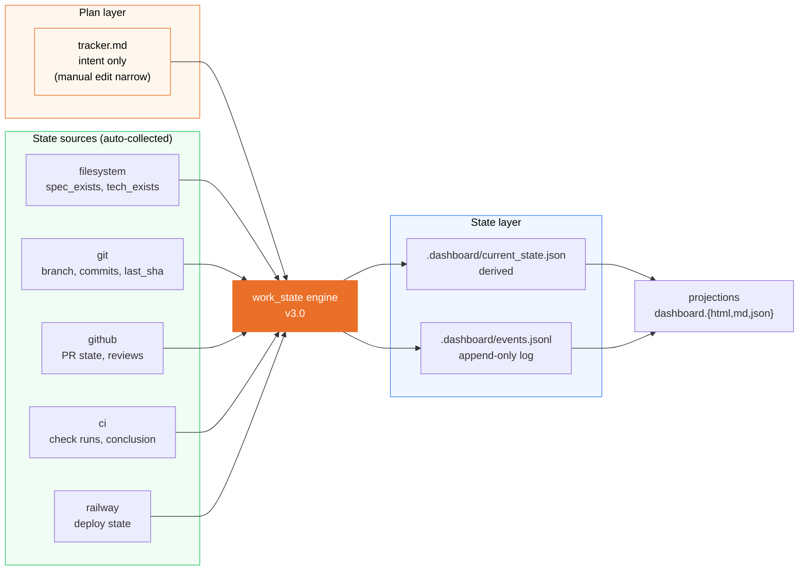

# Dashboard Architecture Snapshot — 2026-05-20

> **Mục đích:** Bức ảnh chụp kiến trúc dashboard auto-update **tại thời điểm 2026-05-20** + roadmap progress của Work-State Engine. File này là **single entry point** để hiểu vị trí hiện tại trong journey từ "tracker view rendering" → "artifact-derived state engine".
>
> **Khi nào update doc này:** Sau mỗi phase milestone (1a/1b/1c/1d/2 complete). Mỗi update bump version + giữ history snapshot trong section "Changelog" ở cuối.

---

## TL;DR

| Aspect | State 2026-05-20 |
|--------|------------------|
| Current source of truth | `docs/implementation-tracker.md` mixes plan + manual state (manual edit) |
| Build script | `scripts/build-dashboard.py` v2.2 (W0.9 reconcile + W0.10 Chart.js) |
| Trigger paths | 3 (pre-commit, GitHub Actions, manual) |
| Output views | 3 (`dashboard.html`, `dashboard.md`, `dashboard.json`) |
| End-to-end latency | ~2-3 phút (`git push` → browser auto-refresh) |
| Work-State Engine | Phase 0 ✅ done · Phase 1a 🟠 running · Phase 1b/1c/1d/2 ⬜ pending |
| Target architecture | Engine derives **artifact-derived authoritative state** từ artifacts (Git/GitHub/CI/Railway) — tracker = Plan only |
| Trigger model | Current: 3 paths (pre-commit, GH Actions, manual). Target: adds PR/review/check/deploy events. |

---

## 1. Auto-sync flow diagram (current state)



**Reconcile logic:** build-dashboard.py không chỉ "render tracker view" — còn:

1. `detect_git_state(branch_name)` query git/GH local: branch existed?, commits ahead/behind, last commit, PR state
2. `reconcile_status(tracker_status, git_state)` merge — phát hiện drift (vd tracker says ⬜ nhưng branch có 5 commits)
3. Render section "Local↔origin sync (N entries)" trong dashboard hiển thị drift cho founder

Drift NOT auto-corrected — chỉ surfaced. Quyết định fix tracker hay rebase branch là của founder.

---

## 2. Three trigger paths chi tiết

### Path A — Pre-commit hook (LOCAL, W0.9)

```bash
git add docs/implementation-tracker.md
git commit -m "..."

  ↓ pre-commit hook fires (.pre-commit-config.yaml)
  ↓ runs python scripts/build-dashboard.py
  ↓ auto-stages regenerated dashboard.{html,md,json}
  ↓ commit includes both tracker + fresh dashboard
```

**Effect:** Dashboard luôn sync với tracker tại mọi commit local. Founder không bao giờ commit tracker mà quên rebuild dashboard.

**Trigger condition:** `tracker.md` HOẶC `build-dashboard.py` staged.

### Path B — GitHub Actions (REMOTE, W0.9)

File: `.github/workflows/dashboard.yml`

| Trigger | Behavior |
|---------|----------|
| **Push** to `main`, `feat/**`, `infra/**`, `chore/**`, `fix/**` | Rebuild + auto-commit "chore(dashboard): auto-rebuild — push" |
| **Hourly schedule** (cron) | Pickup drift từ external sources (vd CI status, PR state) |
| **workflow_dispatch** | Founder manual trigger từ GH Actions UI |

**Effect:** Dashboard sync với git state remote ngay cả khi founder không touch tracker. Tự handle case "PR merged trên GitHub UI nhưng founder chưa pull main local".

**Side effect / guardrail:** Scheduled job should commit only when generated outputs actually change. Repeated no-op schedule commits are noise and should be treated as a pipeline/config issue, not desired behavior.

### Path C — Manual local rebuild

```bash
python scripts/build-dashboard.py
```

**When to use:**
- Preview local trước commit
- Force-regenerate khi dashboard bị drift
- Debug build pipeline

---

## 3. End-to-end serve pipeline

Dashboard không chỉ là file static — có browser auto-refresh layer (Phase 3 work, đã ship). Chi tiết trong `docs/operations/ops-tracker-dashboard-explained.md`.



**Total latency:** ~2-3 phút từ `git push` đến browser auto-refresh.

---

## 4. Limitations hiện tại

Reconcile logic W0.9 là **1-shot snapshot** — không phải continuous state engine. Limitations:

| Vấn đề | Current (v2.2) | Sau Work-State Engine |
|--------|---------------|----------------------|
| Source of truth | tracker.md manual edit (intent + state mixed) | tracker = Plan only · State = artifact-derived authoritative state |
| Status drift | Reconcile 1-shot/trigger, không continuous | Trigger/event-driven recompute; manual status drift eliminated; artifact mapping drift surfaced via overlays/warnings |
| Event history | Không có | `events.jsonl` append-only log |
| Multi-PR features | Single status field per row | Multi-branch aggregation matrix (§4.1) |
| Runtime urgency | Không có | Deterministic 4-level model (§9.4) |
| Plan/State boundary | Convention only | Phase 2: import-linter-style CI check |
| External integrations | Manual (Railway via redeploy, Linear via close-on-merge) | Engine-driven projection; optional one-way Engine → Linear sync later |

**Lý do Work-State Engine quan trọng:** Khi anh ship nhiều features parallel (Phase 2-6 sắp tới, 30+ PRs), tracker manual edit + 1-shot reconcile không scale. Engine làm dashboard reflect artifact reality bằng trigger/event-driven recompute — anh không phải lo manual status stale làm dashboard "lừa" mình.

Important boundary: target engine **does not mutate tracker plan fields automatically**. Current v2.2 only surfaces drift; target v3.0 makes artifact-derived state win in dashboard projection while keeping tracker as plan source.

---

## 5. Work-State Engine roadmap

> **Note on sub-phase numbering:** Snapshot dưới đây dùng **operational sub-phases 1a/1b/1c/1d** để
> phản ánh tracker row + Linear milestones thực tế. Spec `dashboard-plan-state-split.md` v1.2.1 §10
> dùng granularity thô hơn (1a/1b/1c không tách runtime urgency). Sub-phase 1c (multi-branch
> aggregation) + 1d (runtime urgency) là **operational refinement nội bộ Phase 1**, không thay đổi
> tổng scope/timeline so với spec (vẫn 5-7 work-days Phase 1 + 7-day shadow monitoring per spec exit
> criteria). Tracker = working source of truth cho per-feature scheduling.



### Phase breakdown

| # | Phase | Scope | Effort | Linear |
|---|-------|-------|--------|--------|
| 0 | ✅ Audit | Defaults strategy, `.dashboard/` gitignore, schema gap mapped | done | — |
| 1a | 🟠 Skeleton + filesystem + git | 6 core modules + 2 cheapest collectors | ~2 days | [MYM-1](https://linear.app/maingocanh/team/MYM/issue/MYM-1) |
| 1b | ⬜ GitHub + CI + Railway collectors | 3 more collectors, PR identity resolution | ~3 days | Milestone Phase 1b |
| 1c | ⬜ Multi-branch aggregation | MIN-progressed lattice + UNION overlays + MAX urgency (§4.1) | ~1 day | Milestone Phase 1c |
| 1d | ⬜ Runtime urgency | 4-level deterministic algorithm (§9.4) | ~1 day | Milestone Phase 1d |
| 2 | ⬜ CI enforcement | Plan/State boundary check via import-linter-style | ~2 days | Milestone Phase 2 |

**Total:** ~9 work-days · 2.5-3 weeks calendar (shadow monitoring 7 days per phase per spec §10 exit criteria ≥95% terminal accuracy).

### Foundation Lane gates (per CLAUDE.md hard rule #5 + #6 + #8)

- Cross-model review: Claude writes → Codex reviews (2× consecutive clean for P1)
- Manual squash-merge với founder sign-off PR body
- Review cap: max 8 rounds (founder approval gate after round 5)
- Risk tier sub-classified P1 **only while Phase 1a remains shadow-mode/no-cutover/no enforcement**. Any promotion, tracker schema change, CI enforcement, or source-of-truth cutover becomes P0/Foundation.

---

## 6. Target state — Sau Phase 2

Architecture chuyển từ **v2.2 (tracker view rendering)** → **v3.0 (artifact-derived state engine)**:



**Key guarantees post-engine:**

- **Manual status drift eliminated** — engine recomputes on triggers/events from artifacts. Artifact mapping drift (wrong branch, stale PR cache, GitHub/Railway unknown) is surfaced via overlays/warnings. Dashboard projection uses artifact-derived state; tracker plan fields are not auto-mutated.
- **Multi-PR features đúng** — compound state (1 PR deployed + 1 PR blocked) deterministic via aggregation matrix
- **Runtime urgency tự suy luận** — 4 levels (normal/warning/elevated/critical) deterministic algorithm, không phải judgment call
- **CI enforce Plan/State boundary** — import-linter-style check Phase 2 ngăn future code mixing Plan field vs State signal
- **Audit trail** — `events.jsonl` ghi nhận mọi transition (spec_created, ci_failed, deploy_passed, etc.) với dedup theo event type table §7.2.1

---

## 7. Reference map

Khi nào đọc file nào:

| Cần hiểu... | Đọc file |
|-------------|----------|
| Cơ chế dashboard auto-update hiện tại (v2.2) | `docs/operations/dashboard-engine/ops-tracker-dashboard-explained.md` |
| Spec target architecture của engine | `docs/operations/dashboard-engine/dashboard-plan-state-split.md` v1.2.1 |
| Linear ↔ dashboard 2-view layering | `docs/operations/dashboard-engine/linear-and-dashboard-workflow.md` v1.1.0 |
| Audit kết quả + defaults strategy | `docs/operations/dashboard-engine/phase-0-audit-report-2026-05-20.md` |
| Foundation Lane workflow gates | `docs/operations/dashboard-engine/walkthrough-foundation-lane-example.md` v1.0.1 |
| Cross-model review prompt template | `docs/operations/dashboard-engine/codex-review-prompt-work-state-engine-v1.2.0.md` (historical artifact) |
| Master status board | `docs/implementation-tracker.md` |
| 3-lane risk-based workflow | *(reference `fast-quality-workflow.md` đã bị move/rename — pending repo-wide cleanup; xem CLAUDE.md + 5 docs khác đang cite path cũ)* |

---

## 8. Changelog

### v1.0.1 — 2026-05-20

- Consistency patch after architecture review
- Replaced over-strong “drift impossible/continuous compute” wording with trigger/event-driven recompute + manual drift eliminated + artifact mapping drift surfaced
- Removed 2-way sync wording; aligned with optional one-way Engine → Linear projection
- Clarified current v2.2 drift is surfaced-only; target v3.0 dashboard projection uses artifact-derived state without mutating tracker plan fields
- Reworded scheduled auto-commit noise as guardrail/pipeline issue, not desired behavior
- Added Phase 1a P1 caveat: shadow/no-cutover only; promotion/cutover/enforcement is P0/Foundation
- Softened “Accepted with founder sign-off” to “ready for implementation planning; sign-off required before cutover/enforcement”

### v1.0.0 — 2026-05-20

- Initial snapshot doc created
- Captures state sau Phase 0 audit complete, Phase 1a autopilot starting
- W0.9 (dashboard-realtime) + W0.10 (Chart.js burndown) đã ship
- Spec v1.2.1 ready for implementation planning; founder sign-off required before cutover/enforcement

### Future updates

Bump version + add changelog entry sau mỗi phase milestone:

- v1.1.0 — Phase 1a complete (autopilot done, 7-day shadow monitoring start)
- v1.2.0 — Phase 1b complete (full artifact-derived state from 5 collectors)
- v1.3.0 — Phase 1c+1d complete (multi-branch + urgency)
- v2.0.0 — Phase 2 complete (CI enforcement → architecture v3.0 active)
