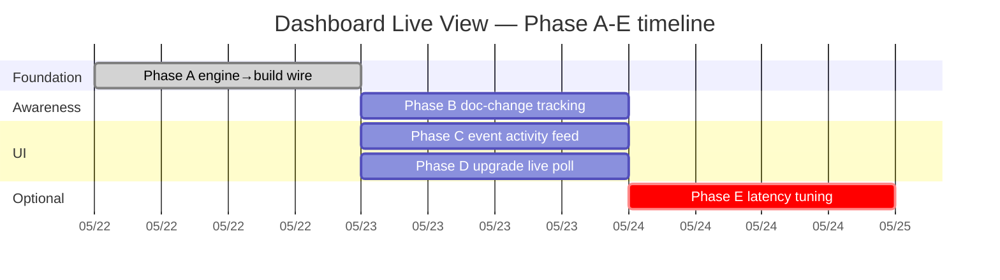

# Dashboard Live View — Realtime auto-update from docs + features

> **Status:** Draft v0.2.1 (incorporates founder review 2026-05-21, awaits sign-off)
> **Version:** v0.2.1 (see Changelog §10 for revisions from v0.1.0)
> **Mục đích:** Sau khi engine 1a-1c shipped (driver + collectors + aggregation + projection + workflow triggers), close gap còn lại để dashboard **tự động update theo docs + feature lifecycle realtime** — wire engine output vào HTML rendering, upgrade existing client-side polling sang state-aware diff patch, add doc-drift awareness + event activity feed.

---

## TL;DR

Foundation đã đặt (W0.9 + W0.10 + Work-State Engine MYM-1→MYM-5). Dashboard hiện auto-rebuild trên 6 trigger types với multi-branch aggregation + state projection, **và đã có client-side live polling từ W0.9** (HTML-SHA poll + container swap). Còn 4 gaps để đạt "realtime auto-update tinh hơn":

1. **Engine output chưa wire vào dashboard pipeline** — projection có CLI nhưng `build-dashboard.py` không invoke nó. State block không xuất hiện trong rendered HTML/MD.
2. **Existing client-side live update còn coarse** — HTML-SHA full container swap, không row-level diff, không state-aware dùng dashboard.json.
3. **Không doc-change awareness** — spec/tracker thay đổi sau khi engine collect → dashboard không surface drift; founder không biết khi spec đã update mà chưa rerun engine.
4. **events.jsonl đã write nhưng UI không expose** — engine ghi event log (spec_modified, pr_opened, ci_failed, deployed) nhưng người dùng không nhìn được timeline per feature.

Plan này split công việc thành **5 phases (A-E)** independent + sequenceable, total ~4-5 work-days. Phase E (latency tuning) marked **OPTIONAL, no default change** — escalate only nếu measured staleness >5%. Phase 1d (urgency) chạy parallel — không block plan này.

---

## 1. Motivation

### 1.1 Hiện trạng (sau MYM-5 ship)

**Backend pipeline:**
```
flow:
  user push to main
    → push event (anti-loop guard checks head_commit.message)
    → workflow_run CI completes (anti-loop guard checks workflow_run.head_commit.message)
    → schedule cron daily 6AM UTC
    → manual workflow_dispatch
    → pull_request opened/closed/labeled/...
    → pull_request_review submitted/dismissed
  ALL TRIGGER:
    .github/workflows/dashboard.yml
      → actions/cache@v4.2.0 restore .dashboard/
      → python scripts/build-dashboard.py
        → reads tracker.md (Plan source)
        → reads git state (current branch, recent commits)
        → renders dashboard.{html, md, json}
      → diff outputs → if changed commit back + push
```

**Client-side live polling (W0.9 shipped):**
```
dashboard.html embeds JS that:
  → polls GitHub commits API every 30s (with PAT) / 120s (unauth)
  → checks latest commit SHA for docs/dashboard.html
  → if changed: fetch raw dashboard.html from GH
  → swap .container DOM element
  → preserve scroll position
  → indicator states: live / syncing / error / rate-limit / paused
```

**Engine output `.dashboard/current_state.json` exists** (Phase 1c driver writes it) but:
- `build-dashboard.py` **không read it** — dashboard.html rendered from tracker.md only
- Projection CLI `python -m scripts.work_state.projections.dashboard` enriches `docs/dashboard.json` separately, **không tự động chạy trong CI**

**Latency profile (current):**
- Push event → dashboard rebuild commit back: ~30s-2min (GH Actions cold start + build + commit)
- Client polls every 30s (PAT) / 120s (unauth) → swap container when SHA changes
- Schedule cron: daily 6AM UTC — gap ≤24h for changes không trigger workflow_run/PR events
- **Perceived "live" latency cho user with PAT: ~30s + GH Actions cycle = ~1-3 min worst case**

### 1.2 4 vấn đề quan sát được

**Problem 1: State block invisible trong HTML rendering**
Engine compute state (computed_status, human_status, pr_state, ci_state, deploy_state, overlays, last_event_ts) per feature. Projection CLI enriches `dashboard.json` features[].state — nhưng dashboard.html templating từ `build-dashboard.py` không đọc `state` field. User thấy manual status từ tracker, không thấy computed status engine derive.

**Problem 2: Existing client-side live update còn coarse**
W0.9 đã ship HTML-SHA poll + container swap (xem §1.1). Approach hiện tại:
- Granularity: full `.container` DOM swap khi `docs/dashboard.html` commit SHA changed
- Update source: raw dashboard.html từ GH (not dashboard.json)
- Limitation: không state-aware diff. Row A unchanged vẫn re-render along with toàn bộ container.
- Limitation: không expose dashboard.json `state` block changes specifically (vì poll target là dashboard.html, không dashboard.json)
- Limitation: no event-specific UI update (activity feed chưa có)
- Working well: scroll preserve, status indicator, rate-limit handling. **Đừng throw away existing polling — upgrade nó.**

**Problem 3: Doc-change drift không surface**
Engine `signal_collectors/filesystem.py` check `spec_exists` (boolean) nhưng KHÔNG track spec hash/mtime. Khi spec content thay đổi (founder edit spec sau ship) — engine vẫn report `spec_exists: true` (không thay đổi) → dashboard không reflect spec drift. Tracker.md thay đổi cũng không track per-row vì plan_reader chỉ re-parses; không event log "row X edited semantically".

**Problem 4: events.jsonl không có UI**
Engine writes `events.jsonl` per spec §7.1 (event log: spec_modified, pr_opened, ci_failed, deployed, stale, etc.). Currently writeable but no UI surface. Per-feature drilldown không có timeline view.

### 1.3 Tại sao cần fix bây giờ

- **Phase 2 promotion gate** (computed → primary status) yêu cầu 7-day shadow ≥95% accuracy. Without state block visible trong dashboard, founder không thể spot-check engine output vs reality → shadow window verification handicapped.
- **Velocity scaling** — 6+ tickets shipped trong 2 ngày. Real-time state visibility = faster decision (next ticket priority, blockers, stale specs).
- **Doc-driven workflow** — anh edit specs frequently; dashboard không surface "spec changed since engine collect" = drift accumulates silently.

---

## 2. Scope

### Goals

1. **Engine state visible trong dashboard HTML/MD** (Phase A)
2. **Upgrade existing client-side polling** từ HTML-SHA full swap sang dashboard.json state-aware diff patch (Phase D — keep current HTML-SHA poll as fallback)
3. **Doc change awareness** — per-feature row shows spec/tracker drift via dedicated overlays (Phase B)
4. **Per-feature event timeline** — events.jsonl rendered in UI (Phase C)
5. **Latency tuning OPTIONAL** — defer cron tuning unless measured staleness justifies (Phase E)

### Non-goals

- **Server push (WebSocket/SSE)** — overkill cho MVP scale, requires new infrastructure
- **Replace `tracker.md` as plan source** — plan source remains markdown, only projection layer changes
- **Cutover computed → primary status** — Phase 2 (engine project), gated by 7-day shadow
- **Real-time external service polling from browser** — GH API rate limits, keep server-side via engine
- **Mobile-responsive layout overhaul** — Phase 1.5 scope là data freshness, not visual redesign
- **Replace existing W0.9 client-side polling** — Phase D upgrades, không thay thế

---

## 3. Phased implementation

### Phase A — Wire engine → build-dashboard (foundation)

**Scope:**
- Modify `scripts/build-dashboard.py` to:
  1. Invoke `scripts.work_state.engine.run_engine` to refresh `.dashboard/current_state.json`
  2. Invoke `scripts.work_state.projections.dashboard.enrich_dashboard` to add `state` block to dashboard.json
  3. HTML template renders `state` block **side-by-side với manual status** (per MYM-4 AC6 precedent — shadow mode only, NO cutover)
- Add `--no-network` mode propagation through build-dashboard.py to engine
- **Failure-mode design (per founder review v0.1→v0.2):**
  - Engine raise/error → build-dashboard SHOULD NOT hard fail
  - Render existing dashboard + warning block: "Engine collection failed: <reason>"
  - Build exits 0 in shadow mode (default)
  - `--strict-engine` flag (opt-in) makes engine failure cause build to exit 1
  - Transition: Phase 2 promotion changes default to strict (when computed becomes primary)

**Files modified:**
- `scripts/build-dashboard.py` (+50-100 LOC: imports + engine invocation + template additions + failure handling)
- `tests/unit/test_build_dashboard.py` (+5-10 new tests covering engine integration + failure mode)

**Risk tier:**
- **P1 nếu shadow/side-by-side only (default scope, this phase)**
- **P0/Foundation nếu cutover (computed becomes primary)** — NOT this phase, Phase 2 territory

**Estimated effort:** ~0.5-1 work-day

**Acceptance criteria:**
- [ ] **A1** — `python scripts/build-dashboard.py` invokes engine + projection automatically
- [ ] **A2** — Generated `dashboard.html` shows `state.human_status` per feature row **alongside manual status** (side-by-side)
- [ ] **A3** — Generated `dashboard.md` includes computed status column
- [ ] **A4** — Generated `dashboard.json` features[*].state populated (matches MYM-4 schema)
- [ ] **A5** — `--no-network` flag works end-to-end (uses cached `.dashboard/`)
- [ ] **A6** — No regression on existing 21+ dashboard tests; existing client-side live polling continues to work
- [ ] **A7** — Quality gates 5/5 clean (mypy strict full-scope: core|markets|i18n|tests|scripts/work_state)
- [ ] **A8** — **Engine failure does NOT break dashboard generation in shadow mode**; warning block rendered và build exits 0 unless `--strict-engine` set. Phase 2 promotion will transition default to strict.

**Dependencies:** MYM-1 + MYM-3 + MYM-4 + MYM-5 all merged ✓ (engine + projection production-runnable)

---

### Phase B — Doc change awareness (engine extension)

**Scope:**
- Extend `scripts/work_state/signal_collectors/filesystem.py` to track:
  - Spec file SHA256 hash + last_modified mtime
  - Tech spec file SHA256 hash + last_modified mtime
  - **Tracker.md row semantic hash** per WorkItem (excludes non-semantic fields per founder review §1.2)
- Add new fields to Signals dataclass (APPEND-ONLY per Phase 1b pattern):
  - `spec_hash: str | None`
  - `spec_modified_at: str | None` (ISO date)
  - `tech_hash: str | None`
  - `tech_modified_at: str | None`
  - `tracker_row_hash: str | None`

**Semantic hash specification (revised v0.2):**
- Tracker row hash includes ONLY semantic fields:
  - `branch`
  - `linear_id`
  - `feature_id`
  - `specs` path
  - `acceptance` criteria text
  - `gates` column, normalized by stripping whitespace + sorting gate tokens (e.g. `🔒T 🔒I 🔒X`)
- **Excludes** (avoid false-positive drift warnings):
  - `status` column (auto-flip workflow updates this — legitimate change)
  - `notes` column (free-text, frequent typo/format edits)
  - changelog/comment fields
  - markdown formatting whitespace

**Event + overlay model (revised v0.2 per founder review):**
- **Events** (verbs in events.jsonl):
  - `spec_modified` — spec file content hash changed
  - `tech_modified` — tech spec hash changed
  - `tracker_row_modified` — semantic row hash changed
- **Overlays** (annotations on dashboard, consistent kebab-case verb form):
  - `spec-modified` — annotation (informational), spec edited since last engine collect
  - `tech-modified` — annotation, tech spec edited
  - `tracker-modified` — annotation, semantic tracker row edited
  - `post-ship-doc-change` — **warning** (stronger), spec/tech/tracker edited AFTER feature reached terminal state (merged/deployed)
- **Do NOT overload** existing `artifact-drift` overlay (reserved for original meaning: PR/branch mapping mismatch per §6.8)

**Files modified:**
- `scripts/work_state/signal_collectors/filesystem.py` (+30-50 LOC)
- `scripts/work_state/models.py` (+5 fields to Signals)
- `scripts/work_state/event_engine.py` (+3 event types)
- `scripts/work_state/status_machine.py` (+4 overlay emission rules)
- `scripts/build-dashboard.py` (HTML render badges per overlay)
- Spec `docs/operations/dashboard-engine/dashboard-plan-state-split.md` v1.3.0 (add 4 overlays to §8.2 canonical enum, current 14 → 18)
- Tests across affected modules

**Risk tier:** P1 (Signals dataclass extension touches Phase 1b/1c contract). Codex 2× clean required. Spec bump required.

**Estimated effort:** ~1-1.5 work-days

**Acceptance criteria:**
- [ ] **B1** — Engine collects spec_hash + spec_modified_at per WorkItem
- [ ] **B2** — Tracker row semantic hash includes normalized semantic fields (`branch`, `linear_id`, `feature_id`, `specs`, `acceptance`, `gates`) and excludes non-semantic fields per spec list above
- [ ] **B3** — Hash change detection emits `spec_modified`/`tech_modified`/`tracker_row_modified` events in events.jsonl
- [ ] **B4** — 4 new overlays added to canonical enum §8.2 (18 total): `spec-modified`, `tech-modified`, `tracker-modified`, `post-ship-doc-change`
- [ ] **B5** — Dashboard HTML shows "Spec changed Xh ago" badge for affected features (annotation severity)
- [ ] **B6** — `post-ship-doc-change` overlay surfaces strongly (warning severity, distinct visual) when terminal-state row edited
- [ ] **B7** — Spec v1.3.0 sign-off (Codex re-review §8.2 enum extension)
- [ ] **B8** — Status auto-flip workflow does NOT trigger drift warning (status excluded from row hash)
- [ ] **B9** — All Phase 1b/1c tests still pass (APPEND-ONLY safe)
- [ ] **B10** — Quality gates 5/5

**Dependencies:** Phase A merged (state block in HTML — overlays render via state.overlays)

---

### Phase C — Per-feature event activity feed

**Scope:**
- Engine writes events.jsonl per spec §7.1 — verify schema stable (event_type, timestamp, item_id, from_state, to_state, source)
- Dashboard rendering adds per-feature drilldown:
  - Click feature row → modal/popover shows last 20 events for that item_id
  - Visual timeline với event_type icon + relative timestamp
  - Color-coded by event severity (ci_failed = red, deployed = green, spec_modified = blue)
- Activity feed sidebar in dashboard.html:
  - Top 20 events across all items, sorted by timestamp desc
  - "Last activity 5min ago" timestamp
  - Filter by event_type

**Files modified:**
- `scripts/build-dashboard.py` (HTML template additions: drilldown modal + sidebar)
- `scripts/work_state/event_engine.py` (verify schema; add docstrings if needed)
- Tests for HTML rendering of events

**Risk tier:** P2 (UI-only changes; no behavior change on engine). Codex 1× clean acceptable (Fast Lane eligible if scope stays UI).

**Estimated effort:** ~1-1.5 work-days

**Acceptance criteria:**
- [ ] **C1** — Dashboard HTML embeds per-feature drilldown modal
- [ ] **C2** — Activity feed sidebar renders top 20 events
- [ ] **C3** — Events filterable by event_type
- [ ] **C4** — Timestamp display human-readable (Xm/Xh/Xd ago)
- [ ] **C5** — **Browser smoke explicit (revised v0.2):**
  - Safari latest + Chrome latest: console clean (no errors)
  - Chart.js burndown still renders
  - **W0.9 client-side live polling still works** (commit-SHA poll + container swap)
  - W0.10 filter toolbar still works
  - W0.10 search input still works
  - W0.10 click-through PR/issue links still work
  - No layout regression on viewport widths 1024/1280/1920px
- [ ] **C6** — Quality gates 5/5

**Dependencies:** Phase A merged (build-dashboard knows engine output paths). Phase B optional (but events.jsonl events from B make timeline richer).

---

### Phase D — Upgrade client-side polling (HTML-SHA → JSON state-aware diff)

**Scope revised v0.2 per founder review:**

Current state (W0.9 shipped):
- JS polls GitHub commits API → checks `docs/dashboard.html` SHA → if changed, fetch raw HTML → swap `.container` DOM → preserve scroll → indicator states
- **Working well** for crude liveness, but coarse: full container swap, không row-level diff

Target:
- **Upgrade** existing JS module to poll `docs/dashboard.json` (not dashboard.html) as primary signal
- Compare `generated_at` OR `state_version` field — re-render only when actually different
- **Row-level DOM diff** — patch only changed features[*].state fields (status badge, overlays, timestamps)
- **Activity feed diff** — append new events to sidebar without full re-render
- **Keep existing HTML-SHA poll as fallback** — if JSON poll fails (404, parse error), fall back to HTML container swap (current W0.9 behavior)
- Polling cadence: configurable via URL param `?poll=10s` / `?poll=30s` / `?poll=off`. Default 30s.
- Visual: distinguish "JSON diff patch" (subtle row pulse) from "full HTML swap" (existing container animation) for debug visibility
- Performance: stop polling when tab hidden (Page Visibility API) — save bandwidth + GH API quota

**Files modified:**
- `scripts/build-dashboard.py` (replace embedded JS module — keep W0.9 fallback path + add new JSON-diff primary path)
- Tests for JS embedding + URL param handling + fallback behavior
- Documentation: `docs/operations/dashboard-engine/dashboard-realtime-explained.md` update (explain dual-poll architecture)

**Risk tier:** P2 (client-side JS only; no backend change). Codex 1× clean acceptable. Existing W0.9 polling preserved as fallback → low blast radius.

**Estimated effort:** ~1 work-day

**Acceptance criteria:**
- [ ] **D1** — Dashboard.html polls dashboard.json as primary source every 10-30s (default 30s)
- [ ] **D2** — Row-level DOM patch when state.computed_status OR state.overlays change for specific feature row
- [ ] **D3** — Activity feed sidebar appends new events incrementally (no full re-render)
- [ ] **D4** — **Fallback to W0.9 HTML-SHA poll** when JSON fetch fails or parse error; indicator shows mode (JSON-diff / HTML-swap fallback)
- [ ] **D5** — "Updated X ago" indicator visible + auto-refreshes
- [ ] **D6** — URL param `?poll=off` disables polling (both JSON and HTML paths)
- [ ] **D7** — Manual refresh button works (force fetch)
- [ ] **D8** — No console errors in latest Safari/Chrome
- [ ] **D9** — Polling stops when tab hidden (Page Visibility API)
- [ ] **D10** — Quality gates 5/5

**Dependencies:** Phase A merged (dashboard.json has state block to diff against)

---

### Phase E — Optional latency tuning (no default change)

**Scope revised v0.2 per founder review:**

**Phase E is OPTIONAL — do NOT change default cron unless measured staleness justifies.**

Default kept: daily 6AM UTC cron + 6 trigger events from Phase 1c (push/PR/review/workflow_run/schedule/dispatch).

Escalation criteria (BEFORE enabling 15min cron):
- Measure: how often `.dashboard/current_state.json` `last_event_ts` is >30min old when user opens dashboard
- Track across 7 rolling days
- Threshold: **>5% of dashboard fetches have state older than 30min** → escalate to 15min cron
- Alternative: work-hours-only cron (e.g., `*/15 2-17 * * 1-6` UTC = 9AM-12AM Vietnam time weekdays) → reduces cost

**Budget context (GitHub Actions free tier):**
- Private repo (MyMoneyWent): 2000 mins/month
- Daily cron + push/PR/review events: ~15-30 mins/day = ~600 mins/month
- 15min cron 24×7: ~96 runs/day × 1.5 min avg = ~144 mins/day = ~4300 mins/month → **2.15× quota, BLOWS BUDGET**
- 15min cron work-hours-only (`*/15 2-17 * * 1-6`): ~24 runs/day × 1.5 min × 6 days = ~216 mins/week = ~870 mins/month → over but tolerable
- **Recommendation: defer Phase E entirely unless founder explicitly wants faster refresh AND has measured staleness justification**

**Files modified (only if escalation triggered):**
- `.github/workflows/dashboard.yml` (cron schedule change + concurrency.cancel-in-progress: true if not already)
- `scripts/work_state/engine.py` (`--quick` flag skipping railway collector — most rate-limited API)
- Documentation: `dashboard-realtime-explained.md`

**Risk tier:** P2 (workflow YAML + optional engine flag). Codex 1× clean acceptable.

**Estimated effort:** ~0.5 work-day **IF escalated**. Otherwise 0 (defer).

**Acceptance criteria (only if escalated):**
- [ ] **E1** — Measure baseline: % dashboard fetches with state >30min old, across 7 days
- [ ] **E2** — Decision: escalate to 15min cron only if baseline >5%
- [ ] **E3** — If escalated: work-hours-only cron preferred over 24×7 to control cost
- [ ] **E4** — `concurrency.cancel-in-progress: true` enforced (no stacked rebuilds)
- [ ] **E5** — `--quick` mode skips railway collector (since rate-limited)
- [ ] **E6** — Runner-minute cost analysis updated in workflow file comments
- [ ] **E7** — Cache-warmup rate <5% target verified across 100+ builds (Phase 2 promotion gate)
- [ ] **E8** — Quality gates 5/5

**Dependencies:** Phase A merged + measurement infrastructure (E1) operational.

---

## 4. Sequencing + dependencies



**Strict prereq:** Phase A first (other phases depend on engine output in dashboard.json).

**Parallel-able:** Phase B + C + D can run in parallel after A (independent concerns).

**Optional:** Phase E only if measured staleness justifies (see §3 Phase E).

**Cumulative effort:** ~4-5 work-days if all 5 phases ship; ~3.5-4.5 if E deferred.

---

## 5. Risks + mitigations (updated v0.2)

| Risk | Likelihood | Impact | Mitigation |
|---|---:|---:|---|
| **Phase A regression** breaks existing dashboard | Medium | High | Comprehensive build-dashboard.py test coverage exists (21 tests W0.9). Add 5-10 integration tests + AC A8 soft-fail behavior. |
| **Phase A cutover scope creep** (computed → primary) | Low | High | Plan explicit: A8 stays in shadow mode. Phase 2 (separate initiative) handles cutover with founder gating. |
| **Phase D breaks W0.9 fallback poll** | Medium | Medium | Fallback path preserved as primary safety net; D4 explicit AC. Test JSON-fetch failure → fallback succeeds. |
| **Polling overload** on dashboard.json fetch | Low | Low | Default 30s cadence; Page Visibility API stops polling on hidden tabs; URL param off-switch. |
| **Stale `.dashboard/` cache** from any phase | Medium | Medium | Cache schema version bump invalidates stale data (Phase 1c AC17 already supports CACHE_SCHEMA_VERSION). |
| **Doc-change hash collision** false positive | Low | Low | SHA256 has astronomically low collision rate; if happens, manual re-run engine fixes. |
| **Phase B false-positive drift** on non-semantic edits | Medium | Low | B2 + B8 explicit: status/notes/changelog/formatting excluded; `gates` included only after normalization because it encodes safety/process requirements. |
| **Overlay enum overload** confusion (artifact-drift vs spec-modified) | Low | Medium | B4 enforces clear separation: artifact-drift = mapping mismatch (existing), spec-modified = doc edit (new). Spec v1.3.0 documents both. |
| **events.jsonl explosion** with 100s of events per feature | Medium | Medium | Engine already has event de-dup §7.2.1 (CI by check_run_id, deploy by deployment_id, stale max 24h). UI shows last 20. |
| **Phase 1d urgency parallel work conflict** | Medium | Medium | Phase 1d touches `runtime_urgency` field; Phase B touches `spec_hash`/`tech_hash`/overlays. Different fields = no contract overlap. Schedule independently. |
| **Spec version bump in Phase B** triggers re-review of unrelated sections | Low | Low | Scoped Codex review prompt: "review §8.2 overlay enum extension (14→18) only". |
| **Phase E runner-minute blowout** | High **if 15min cron without measurement** | High | Phase E defers by default. Escalation requires measurement (E1) + work-hours-only preference (E3). Budget context documented (~2.15× quota for 24×7). |

---

## 6. Acceptance criteria summary (updated v0.2)

Total **39 ACs** across 5 phases (revised from 34 in v0.1.0):
- Phase A: **8 ACs** (added A8 failure mode)
- Phase B: **10 ACs** (added B2 hash spec, B6 post-ship distinction, B8 status excluded)
- Phase C: **6 ACs** (C5 expanded to explicit browser smoke checklist)
- Phase D: **10 ACs** (D1-D10, restructured to upgrade-not-add)
- Phase E: **8 ACs** (E1-E8, gated by escalation; defer by default)

Each phase independently verifiable + ships behind its own Codex review gate.

---

## 7. Tracker rows + Linear tickets

Proposed tickets (5 new, Phase E optional):

| Tracker ID | Linear ticket | Phase | Effort | Risk | Status |
|---|---|---|---|---|---|
| `dashboard-live-view-A` | TBD | A engine→build wire | 0.5-1d | P1 shadow / P0 if cutover | Required |
| `dashboard-live-view-B` | TBD | B doc change awareness | 1-1.5d | P1 | Required |
| `dashboard-live-view-C` | TBD | C event activity feed | 1-1.5d | P2 | Required |
| `dashboard-live-view-D` | TBD | D upgrade live poll | 1d | P2 | Required |
| `dashboard-live-view-E` | TBD | E latency tuning | 0.5d | P2 | **Optional — gated by E1 measurement** |

Each ticket created post sign-off, autopilot prompt scaffolded từ MYM-4/MYM-5 pattern.

---

## 8. References

### Predecessor work shipped

- **W0.9** Dashboard realtime (auto-rebuild + git-state detect + reconcile + **client-side commit-SHA polling + container swap**)
- **W0.10** Dashboard v3 rich UI + Chart.js + filter toolbar + search + click-through
- **MYM-1** Work-State Engine Phase 1a (skeleton + fs + git collectors) — `5072e9e`
- **MYM-3** Phase 1b (github + ci + railway collectors) — `3e654cf`
- **MYM-4** Phase 1b' (dashboard projection) — `2396107`
- **MYM-5** Phase 1c (driver + aggregation + persistence + workflow triggers) — `fb7a587`

### Spec references

- `docs/operations/dashboard-engine/dashboard-plan-state-split.md` v1.2.1 — engine spec (extended to v1.3.0 in Phase B with 4 new overlays)
- `docs/operations/dashboard-engine/dashboard-architecture-snapshot.md` v1.0.1 — operational snapshot
- `docs/operations/dashboard-engine/session-handoff-2026-05-20.md` — prior session context

### CLAUDE.md hard rules

- #1 STRICT 1 session per .git/
- #2 NEVER delete docs
- #3 Spec-first (Phase B requires spec bump before code)
- #5 Different-model review (Codex 2× clean for P1, 1× for P2 Fast Lane)
- #6 Manual_only merge (P1)
- #7 Single-phase scope default; bundle requires checkpoints
- #8 Review cap per lane

### Memory rules

- `feedback_autopilot_preflight_must_include_tests_mypy` — pre-flight gates apply to ALL phase prompts
- `feedback_megaprompt_with_checkpoints_works` — multi-phase prompts OK with checkpoints (NOT used here — single-phase per ticket)
- `feedback_codex_p1_representative_branch` — if Phase B touches aggregation, apply lesson
- `feedback_workflow_run_antiloop_guard` — if Phase E modifies workflow, preserve anti-loop
- `feedback_verify_current_source_before_claiming_gap` — **v0.2 lesson**: read actual source code before declaring gap (avoided in Phase D scope-flip post review)
- `feedback_plan_budget_context_required` — **v0.2 lesson**: cost estimates must include free-tier quota context
- `project_work_state_engine_progress` — current engine state on main

---

## 9. Open questions (revised v0.2)

**Q1** — Should Phase A include "manual status renderable side-by-side" or REPLACE manual với computed?
- **Recommendation (locked v0.2):** side-by-side per MYM-4 precedent (AC6). Phase 2 promotion handles eventual cutover. A8 ensures soft fail in shadow mode.

**Q2** — Phase D polling cadence default?
- **Recommendation (locked v0.2):** 30s default, URL param override (`?poll=10s` / `?poll=off`).

**Q3** — Phase E `--quick` mode scope — skip railway only, or also skip github/ci?
- **Recommendation (locked v0.2):** skip railway only (most rate-limited, slowest API). Github/CI still cheap with cache TTL.

**Q4** — Bundle vs separate tickets cho phases independent (B, C, D)?
- **Recommendation (locked v0.2):** 5 separate tickets per memory `feedback_autopilot_prompt_scope` (single-phase default). MYM-5 bundle taught: scope reality often differs from initial estimate.

**Q5** — When to start Phase 1d urgency in parallel?
- **Recommendation (locked v0.2):** **parallel** — no contract overlap, founder can fire whichever has shorter prep time.

**Q6 (NEW v0.2)** — Spec bump version cho Phase B (4 new overlays added §8.2)?
- **Options:** Minor bump (v1.3.0) per current proposal vs major bump (v2.0.0) since overlay enum extending = schema change
- **Recommendation:** v1.3.0 minor — additive enum extension, backwards compatible (existing overlay consumers ignore new entries gracefully). Codex review scoped to §8.2 only.

**Q7 (NEW v0.2)** — Phase E measurement infrastructure (E1 baseline) — how to instrument?
- **Options:** (a) Add metric to engine output `.dashboard/state_age_distribution.json`. (b) Add to events.jsonl as event type `state_fetched_at_age=XXm`. (c) Lightweight: client-side log fetch timestamp to a static analytics endpoint.
- **Recommendation:** **(a) Engine writes `state_age_distribution.json`** — server-side, no new endpoint, fits existing `.dashboard/` artifact pattern. Engine reads it on next run to detect staleness pattern.

---

## 10. Changelog

### v0.2.0 — 2026-05-21 (founder review pass 1)

Incorporates founder review comments on v0.1.0 (8 items, all addressed):

1. **§1.1 hiện trạng:** Added explicit W0.9 client-side polling description — JS polls commits API, HTML-SHA check, container swap, status indicator. Plan v0.1.0 incorrectly omitted this existing behavior.
2. **§1.2 Problem 2 wording:** Rewrote from "browser phải refresh" → "existing client-side live update còn coarse" — accurate framing of current capability + limitations.
3. **§3 Phase A risk tier:** Changed from flat "P1" to conditional "P1 shadow / P0 if cutover" — risk depends on scope mode.
4. **§3 Phase A AC A8 (NEW):** Engine failure does NOT break dashboard generation in shadow mode; warning rendered, build exits 0 unless --strict-engine. Phase 2 transition documented.
5. **§3 Phase B overlay naming:** Renamed `spec-drifted` → 4 separate overlays (`spec-modified`/`tech-modified`/`tracker-modified` annotations + `post-ship-doc-change` warning). Avoids overload of existing `artifact-drift` semantic.
6. **§3 Phase B row hash spec (revised):** Explicit semantic hash includes only (branch, linear_id, feature_id, specs_path, acceptance, normalized gates). Excludes status/notes/changelog/formatting. New AC B2 + B8.
7. **§3 Phase C AC C5 (revised):** Expanded vague "no regression" to explicit browser smoke checklist (Safari + Chrome console, Chart.js, W0.9 live poll, W0.10 toolbar/search/click-through, viewport widths).
8. **§3 Phase D (major scope flip):** Rewrote from "add live polling" → "upgrade existing W0.9 HTML-SHA poll → dashboard.json state-aware diff patch with fallback". 10 ACs (D1-D10) restructured.
9. **§3 Phase E (defer-by-default):** Marked OPTIONAL. Default cron unchanged. Escalation gated by measured staleness >5% across 7 days. Budget context documented (~2.15× quota for 24×7 15min cron).
10. **§5 Risks:** Added Phase A cutover scope creep, Phase D fallback preservation, Phase B false-positive drift, overlay overload, Phase E runner blowout.
11. **§6 AC count:** Updated 34 → 39 (added A8, B2, B6, B8, D restructure, E gating).
12. **§9 Open questions:** Added Q6 (spec bump version) + Q7 (E1 measurement infrastructure).
13. **§Memory rules:** Added 2 new lessons captured this review:
    - `feedback_verify_current_source_before_claiming_gap`
    - `feedback_plan_budget_context_required`

### v0.1.0 — 2026-05-21

- Initial plan draft post MYM-5 ship
- 5-phase scope locked với founder 2026-05-21 (multi-select + hybrid latency)
- 34 ACs across phases
- Risk register 8 items
- Open questions 5 with recommended directions
