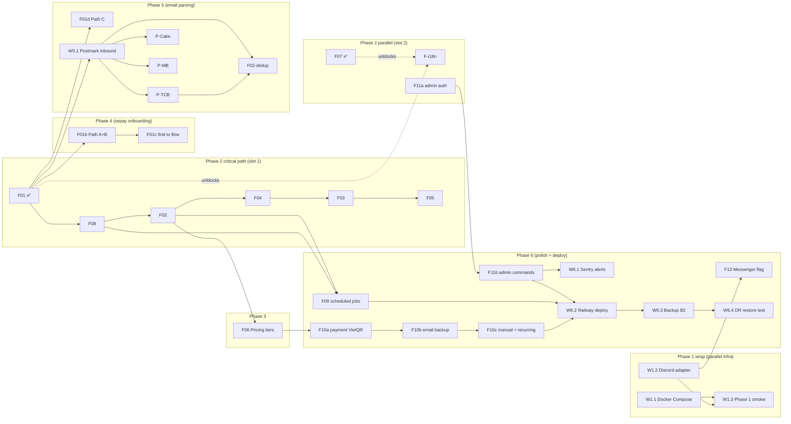

# MVP Build Queue — Pre-Build Verification Snapshot

> **Snapshot date:** 2026-05-14
> **Source:** `docs/implementation-tracker.md` v1.2.4, `docs/mymoneywent-roadmap.md`, `docs/operations/F01-F08-lockdown.md`, `docs/features/`, `docs/features/BE/`, `docs/implementation-plans/`
> **Purpose:** Single-glance verification trước khi tạo Linear issues + kick autopilot batch. Kết hợp inventory, dependency graph, readiness audit, drift findings.
> **NOTE:** Đây là snapshot tại thời điểm verify. Tracker (`implementation-tracker.md`) vẫn là source-of-truth living doc — rebuild dashboard sau mỗi PR merge.

---

## 0. TL;DR

- **Total MVP PRs:** 35 (Phase 1-6, không tính Phase 5b deferred + Phase W deferred)
- **Merged:** 6 (W0.7, W0.8, W0.9, W0.10, F07, F01)
- **Remaining MVP:** 29 PRs
- **Deferred:** 3 parsers (P-ACB, P-STB, P-BIDV → Phase 5b demand-gated) + Phase W web dashboard
- **Drift findings:** 4 (chi tiết §5) — 1 mechanical (pricing/family spec status pending lock), 3 cosmetic (roadmap stale %, F11 split nomenclature, W0.x naming)
- **Linear MCP:** ❌ chưa available trong MCP registry — output markdown để copy-paste thủ công

---

## 1. Build order (critical path + parallel slots)

Theo `docs/implementation-plans/phase-2-handlers.md` "Parallel slots (max 2 active)" + dependency chain trace:



**Recommended ordering (anh kick autopilot theo thứ tự này):**

| # | PR | Phase | Wave | Parallel với | Lý do |
|:-:|----|:-----:|:----:|--------------|-------|
| 1 | **F08** | 2 | Wave 2 | F-i18n hoặc F11a | Critical path; F02 blocked-by; lockdown + autopilot prompt sẵn |
| 2 | **F-i18n** | 2 | Wave 1 | F08 | Slot 2 filler; cần F01+F07 (✅ done); polish EN cho 2 features đã ship |
| 3 | **F02** | 2 | Wave 2 | F11a hoặc W1.2 | Critical path; cần F08 resolver; flip xfail W0.7 contract pin |
| 4 | **F11a** | 2 | Wave 1 | F02 | Slot 2; auth framework chỉ, commands defer F11b |
| 5 | **F04** | 2 | Wave 3 | W1.1 hoặc W1.2 | Critical path; required-by F03; CRUD categories |
| 6 | **F03** | 2 | Wave 3 | W1.2 hoặc F01b | Critical path; cần F04 |
| 7 | **F05** | 2 | Wave 4 | F01b | Pure read; không block ai trong Phase 2 |
| 8 | **W1.1** | 1 | wrap | parallel anywhere | Docker compose dev/prod; standalone infra |
| 9 | **W1.2** | 1 | wrap | parallel anywhere | Discord adapter; required-by F13 |
| 10 | **W1.3** | 1 | wrap | sau W1.1+W1.2 | Phase 1 integration smoke E2E |
| 11 | **F06** | 3 | Wave 5 | W5.1 | Pricing tiers + trial gating; required-by F10a |
| 12 | **F01b** | 4 | Wave 1+ | F05 hoặc F06 | Path A+B SePay onboarding; cần F01 (✅) |
| 13 | **F01c** | 4 | Wave 1+ | sau F01b | First-tx celebration |
| 14 | **W5.1** | 5 | Wave 2+ | F06 | Postmark inbound + dispatch; required-by parsers |
| 15 | **F01d** | 5 | Wave 1+ | sau W5.1 | Path C email forwarding guides |
| 16 | **P-TCB** | 5 | Wave 2+ | P-Cake hoặc P-MB | Parser MVP #1; shell exists |
| 17 | **P-Cake** | 5 | Wave 2+ | P-TCB | Parser MVP #2 |
| 18 | **P-MB** | 5 | Wave 2+ | P-TCB | Parser MVP #3 |
| 19 | **F02-dedup** | 5 | Wave 2+ | sau ≥1 parser ship | Cross-source dedup SePay+Email |
| 20 | **F09** | 6 | Wave 4 | F11b | Scheduled jobs; cần F02+F08 |
| 21 | **F10a** | 6 | Wave 5 | F09 | Payment VietQR + SePay match |
| 22 | **F10b** | 6 | Wave 5 | sau F10a | Email backup payment detect |
| 23 | **F10c** | 6 | Wave 5 | sau F10b | Manual review + recurring billing |
| 24 | **F11b** | 6 | Wave 1+ | F09 hoặc F13 | Admin commands; cần F11a |
| 25 | **W6.1** | 6 | n/a | F11b hoặc F13 | Sentry alerts (7 critical) |
| 26 | **F13** | 6 | Wave 6 | F09 hoặc W6.1 | Messenger adapter (flag-OFF dark deploy) |
| 27 | **W6.2** | 6 | n/a | sau F10c+F09+F11b | Railway deploy + custom domain |
| 28 | **W6.3** | 6 | n/a | sau W6.2 | Backup automation B2 + pg_dump |
| 29 | **W6.4** | 6 | n/a | sau W6.3 | DR runbook validation (test restore) |

**Deferred (không tạo Linear issue ngay):**

| PR | Phase | Unlock criteria |
|----|:-----:|-----------------|
| P-ACB | 5b | ≥3 beta requests OR ≥5 ACB-primary signups/wk |
| P-STB | 5b | Same criteria |
| P-BIDV | 5b | Same criteria |
| Web Dashboard | W | ≥30% user request OR ≥10 Pro ask OR support burden signal OR conversion signal |

---

## 2. Per-feature readiness matrix

| PR | FE spec | BE tech spec | Lockdown | Autopilot prompt | Worktree | Test plan |
|----|:-------:|:------------:|:--------:|:----------------:|:--------:|:---------:|
| W1.1 | n/a (infra) | n/a | phase-1-foundation §W1.1 | gen khi kick | gen khi kick | 2 tests (smoke) |
| W1.2 | feature-discord-channel | feature-discord-channel-tech | phase-1 §W1.2 | gen khi kick | gen khi kick | 8 tests (contract reuse) |
| W1.3 | n/a | n/a | phase-1 §W1.3 | gen khi kick | gen khi kick | 4 tests (E2E) |
| F08 | feature-funding-sources v1.0.0 | feature-funding-sources-tech | F01-F08-lockdown §2 ✅ | **`F08-funding-sources-autopilot.md` ✅ ready** | `~/Projects/MyMoneyWent-F08` (prunable, cần repair) | 18 tests planned |
| F02 | feature-transaction-capture v1.1.0 | feature-transaction-capture-tech | phase-2-handlers §F02 | gen khi kick | gen khi kick | 25 tests planned |
| F04 | feature-category-management v1.0.0 | feature-category-management-tech | phase-2 §F04 | gen khi kick | gen khi kick | 14 tests |
| F03 | feature-categorization v1.0.0 | feature-categorization-tech | phase-2 §F03 | gen khi kick | gen khi kick | 16 tests |
| F05 | feature-reports v1.0.0 | feature-reports-tech | phase-2 §F05 | gen khi kick | gen khi kick | 12 tests |
| F11a | feature-admin-tools v1.0.0 | feature-admin-tools-tech | phase-2 §F11a | gen khi kick | gen khi kick | TBD |
| F-i18n | feature-i18n v1.0.0 | feature-i18n-tech | F01-F08-lockdown §3.1 | gen khi kick | gen khi kick | TBD |
| F06 | feature-pricing-tiers v1.1.0 ⚠️ | feature-pricing-tiers-tech | phase-3-pricing | gen khi kick | gen khi kick | TBD |
| F01b/c/d | feature-onboarding v1.1.0 | feature-onboarding-tech | phase-4-sepay-onboarding | gen khi kick | gen khi kick | TBD |
| W5.1 + parsers | feature-transaction-capture v1.1.0 | feature-transaction-capture-tech | phase-5-email-parsing | gen khi kick | gen khi kick | Golden fixture ≥10 sample/parser |
| F02-dedup | feature-transaction-capture v1.1.0 | feature-transaction-capture-tech | phase-5 | gen khi kick | gen khi kick | TBD |
| F09 | feature-scheduled-jobs v1.0.0 | feature-scheduled-jobs-tech | phase-6-polish-deploy | gen khi kick | gen khi kick | TBD |
| F10a/b/c | feature-payment v1.0.0 | feature-payment-tech | implementation-plan-payment-vietqr-email | gen khi kick | gen khi kick | TBD |
| F11b | feature-admin-tools v1.0.0 | feature-admin-tools-tech | phase-6 | gen khi kick | gen khi kick | TBD |
| W6.1 / W6.2 / W6.3 / W6.4 | n/a | observability-plan / runbooks/disaster-recovery | phase-6 | gen khi kick | gen khi kick | n/a |
| F13 | feature-messenger-channel v1.0.0 | feature-messenger-channel-tech | implementation-plan-messenger | gen khi kick | gen khi kick | TBD |

⚠️ = scope locked nhưng spec status doc còn "pending lock" — xem §5 drift #1.

**Per tracker §0 convention:** Autopilot prompts gen fresh ngay trước khi kick wave (KHÔNG sinh upfront để tránh stale). Worktree tạo theo nhu cầu khi có 2+ session parallel (per `feedback_concurrency_one_session`).

---

## 3. Cross-feature gates (mọi PR phải pass)

Theo tracker §2:

| Gate | Mô tả | Enforced by |
|------|-------|-------------|
| 🔒T | Tenant isolation test (2 user → query verify không thấy nhau) | Per-PR mandatory |
| 🔒I | Import-linter contract (`core/` ↛ `markets/`, `vn` ↛ `global_`, parsers ↛ `core.db`/`core.messenger`) | `.importlinter` CI |
| 🔒M | Migration up+down OK | Migration test |
| 🔒X | Codex cross-model review pass | Workflow §1.2 |

5-category test plan (Workflow §2):

1. Positive (happy path)
2. Edge (boundary, NULL, empty, max)
3. Error (DB down, invalid input)
4. Isolation (multi-tenant)
5. Contract (FK, invariant, xfail pins)

---

## 4. Acceptance criteria template (cho mỗi Linear issue)

Mỗi issue copy block dưới + fill cụ thể từ feature spec + lockdown:

```markdown
## Acceptance criteria

- [ ] FE spec §<X> use cases all implemented
- [ ] BE tech spec §<Y> contracts pass test
- [ ] Lockdown decisions §<Z> không violate
- [ ] 5-category test plan: <N tests> green (positive/edge/error/isolation/contract)
- [ ] Gates: 🔒T 🔒I 🔒M (nếu có DDL) 🔒X
- [ ] Codex review 2× consecutive clean (P1) hoặc 1× clean (P2 mature)
- [ ] Tracker row updated (manual post-merge)
- [ ] Dashboard rebuild auto-triggered

## Negative scope (do NOT touch)

<copy từ autopilot prompt khi gen — section "Negative scope">

## Required reading (autopilot prompt sẽ enforce)

1. <feature spec>
2. <BE tech spec>
3. <lockdown doc>
4. <implementation plan section>
```

---

## 5. Drift findings (verify pass kết quả)

### Drift #1 — Pricing/Family spec status `pending lock` ⚠️ (mechanical)

- `feature-pricing-tiers.md` status = "Draft (Family addendum 2026-05-11 — pending lock)"
- `feature-family-plan.md` status = "Draft (pending lock)"
- Memory `project_family_plan_decisions` ghi rõ **decisions LOCKED 2026-05-11** (Pro 99k, Family 169k, Business 299k, 2P+4C, grandfather 6 tháng).
- Risk register row "F06 addendum doc merge: 🟡 Decisions locked, doc merge pending" xác nhận drift.
- **Action:** Trước khi kick F06 autopilot, merge addendum vào pricing-tiers spec + bump status → "Locked v1.2.0". Nếu không, F06 prompt sẽ đọc spec stale.

### Drift #2 — Roadmap Phase 1 % stale (cosmetic)

- `mymoneywent-roadmap.md` ghi Phase 1 = "🟡 In Progress ~75%"
- `implementation-tracker.md` §5 ghi Phase 1 = "57% (4/7)" sau W0.10 merge (v1.2.4)
- **Action:** Optional — sync roadmap % với tracker hoặc remove % khỏi roadmap (tracker là SoT).

### Drift #3 — F11 split nomenclature (cosmetic, intentional)

- Tracker dùng F11a (Phase 2 auth framework only) + F11b (Phase 6 commands)
- Spec `feature-admin-tools.md` covers F11 unified
- **Action:** Không cần fix — split là intentional shipping strategy. Linear issues nên tag rõ "F11a" / "F11b" để matches tracker IDs.

### Drift #4 — W0.x prefix dùng cho Phase 1 PRs (cosmetic)

- Tracker §0 convention: `W<phase>.<seq>` → Phase 1 should be W1.x
- Nhưng W0.7-W0.10 lại được dùng cho Phase 1 follow-ups (4 PRs đã merged)
- Lý do thực tế: chúng inherit Wave 0 numbering vì là follow-up của Wave 0 work
- **Action:** Không cần fix — rename gây confusion với historical refs. Linear issues giữ nguyên ID hiện tại trong tracker.

---

## 6. Linear export plan (workaround thủ công)

**Linear MCP status:** ❌ Không tìm thấy connector trong MCP registry tại 2026-05-14.

**Workaround — copy-paste flow:**

1. Tạo Linear team `MyMoneyWent` (nếu chưa có)
2. Tạo 6 epics: Phase 1, Phase 2, Phase 3, Phase 4, Phase 5, Phase 6
3. Mỗi PR trong §1 = 1 issue dưới epic tương ứng:
   - Title: `<PR ID> — <feature name>` (vd `F08 — Funding sources resolver + handlers`)
   - Priority: theo Risk tier (P1 = High, P2 = Medium per `project_autopilot_risk_tier_policy`)
   - Order/sort: dùng số thứ tự trong cột "#" của bảng §1 làm sort key
   - Labels: `phase-N`, `wave-N`, `risk-tier-Px`, `merge-policy-<auto|manual>`, `autopilot-<mature|pilot>`
   - Description: copy template §4 + paste relevant FE/BE spec links + acceptance criteria
   - Dependencies (Linear "blocked by"): theo dependency graph §1
4. Mark 6 issues đã merged thành **Done** (W0.7, W0.8, W0.9, W0.10, F07, F01)
5. Mark 3 deferred parsers + Web Dashboard thành **Backlog** với label `deferred-phase-5b` / `deferred-phase-w`

**Suggested Linear states mapping:**

| Tracker status | Linear state |
|----------------|--------------|
| ⬜ not started | Backlog |
| 🟡 in progress | In Progress |
| 🟠 in review | In Review |
| 🟢 ready to merge | Ready |
| ✅ merged | Done |
| ❌ blocked | Blocked (custom state) |
| ⏸️ deferred | Backlog + label |

---

## 7. Pre-kick checklist (per feature trước khi run autopilot)

```markdown
- [ ] FE spec status = Locked (hoặc cập nhật trước nếu drift)
- [ ] BE tech spec exists trong docs/features/BE/
- [ ] Lockdown decisions written (hoặc lock trước nếu chưa)
- [ ] Files-touched estimate (avoid scope creep)
- [ ] 5-category test plan written (concrete count per category)
- [ ] Risk tier classified (P0/P1/P2) → merge policy chosen
- [ ] Worktree created: `git worktree add ~/Projects/MyMoneyWent-<PR-ID> -b feat/<branch-name>`
- [ ] Pre-flight clean: `ls .git/worktrees/<PR-ID>/index.lock` empty
- [ ] STRICT: chỉ 1 Claude Code session per .git/ (per `feedback_concurrency_one_session`)
- [ ] Autopilot prompt gen fresh + paste vào fresh session
```

---

## Changelog

| Version | Ngày | Thay đổi |
|---------|------|----------|
| v1.0.0 | 2026-05-14 | Initial pre-build verification snapshot. 35 PRs MVP cataloged, 4 drift findings, dependency graph + 29-PR ordered build queue, Linear export workaround (no MCP connector). |
