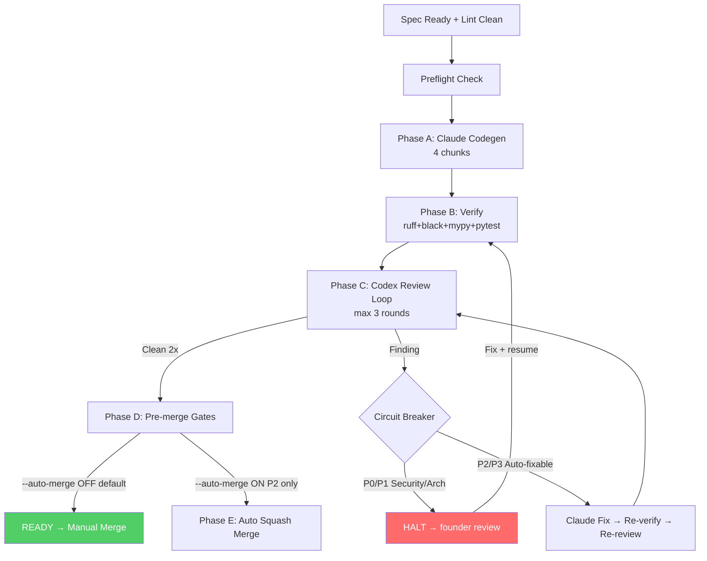

# Autopilot Workflow — Báo cáo Trạng thái Hiện tại

> **Snapshot:** 2026-05-13

---

## TL;DR

Autopilot orchestrator **đã ship scaffold v0.2.0** và **đang chạy pilot đầu tiên trên F07 (Settings)**. Pilot đang ở trạng thái **HALTED** vì Codex review phát hiện 1 security finding (P2 — markdown parsing token). Cần founder fix rồi `resume`.

---

## 1. Kiến trúc Autopilot

```
Spec → [LINT] → [PREFLIGHT] → [A: Codegen] → [B: Verify] → [C: Review/Fix Loop] → [D: Gates] → [E: Merge]
                                  Claude CLI       pytest        Codex + Claude          all checks    git squash
```

**3 execution modes:**

| Mode | Khi nào dùng | Founder touch |
|------|-------------|---------------|
| **Mode 3 — Batch autopilot** | Foundation / chained PRs (đã proven Wave 0) | 1 batch review cuối |
| **Mode 4 — Per-PR strict** | Manual control, high-risk | 1 per PR |
| **Level 3 — Auto Codex loop** | Independent features (Wave 1+) | ~1 start + 1 merge |

## 2. Components đã Ship (trên `main`)

| Module | File | Vai trò |
|--------|------|---------|
| CLI entry | `tools/autopilot/__main__.py` | 6 commands: `lint`, `preflight`, `run`, `resume`, `status`, `abort` |
| Spec linter | `spec_lint.py` | 8 rules + meta-block resolver |
| Codex wrapper | `codex.py` | Parser cho Codex review output |
| Claude codegen | `claude_codegen.py` | Chunked prompts (4 chunks: plan → skeleton → tests → verify) |
| Verify runner | `verify.py` | ruff/black/mypy/lint-imports/pytest |
| Git ops | `git_ops.py` | branch/commit/squash/dry-run-merge |
| State checkpoint | `state.py` | JSON per feature, resume-friendly, atomic write |
| Circuit breaker | `circuit_breaker.py` | 10 halt conditions |
| Auto-merge | `merge.py` | 5 pre-merge gates + squash (default OFF) |
| Main loop | `loop.py` | Phase A→E orchestration |

**15 unit tests** pass. **215 tests** tổng pass (toàn repo).

## 3. Static Enforcement (Code-as-Law)

| Tool | Enforces |
|------|----------|
| `import-linter` | 5 boundary contracts (core↛markets, vn↛global, parsers↛core.db, i18n purity) |
| `pre-commit` | ruff + black + mypy --strict + detect-secrets + import-linter |
| `pytest --strict-markers` | xfail(strict=True) forces future fix |
| GitHub Actions CI | Re-runs all on push/PR |
| `alembic` migrations | Schema constraints (CHECK, UNIQUE, FK) |

## 4. Trạng thái F07 Pilot (FIRST REAL RUN)

### Timeline

| Thời điểm | Sự kiện |
|-----------|---------|
| 2026-05-12 16:34 | `autopilot run F07` khởi chạy |
| Phase A | Claude codegen: 4 chunks (plan → skeleton → tests → verify), tạo 19 commits trên `feat/F07-settings` |
| Phase B | Verify pass (ruff + black + mypy + lint-imports + pytest) |
| Phase C Round 1 | Codex review → **HALTED** |
| 2026-05-12 19:48 | State: `HALTED` @ `VERIFIED` phase |

### Kết quả codegen (Phase A)

```diff
+21 files changed, 2,144 insertions(+), 14 deletions(-)
```

Bao gồm:
- `core/settings_svc.py` (338 LOC) — service layer
- `handlers/settings.py` (351 LOC) — Telegram handler
- `i18n/en.py` + `i18n/vi.py` — localization keys
- Migration 0003 — backfill `inbound_email`
- **8 test files** covering: happy-path, retry/idempotency, missing-optional, pathological, concurrent, tenant isolation, migration

### Halt reason

> **SECURITY_FINDING** — Codex phát hiện:
>
> `[P2] Send regenerated token without Markdown parsing` — `handlers/settings.py:164`
>
> Token từ `secrets.token_urlsafe()` chứa `_` (Markdown control char) → gửi với `parse_mode: "markdown"` sẽ corrupt token hiển thị cho user.

### Next step

```bash
# 1. Fix the markdown parsing issue in handlers/settings.py:164
# 2. Commit fix
# 3. Resume
python -m tools.autopilot resume F07
```

## 5. Blockers đã Resolve (v0.2.0)

| # | Blocker | Status |
|---|---------|--------|
| #1 | `claude -p` behavior probe | ✅ Probed → fallback commit logic added |
| #2 | Single-shot vs multi-turn | ✅ Locked Option A: 4-chunk orchestrator-driven |
| #3 | F07 spec migration to template | ✅ autopilot:meta/gaps/test_plan blocks added |
| #4 | Atomic state.json write | ✅ temp+rename pattern |
| #5 | `--auto-merge` opt-in flag | ✅ Default OFF, safe-by-default |

## 6. Risk Classification Policy

| Class | Ví dụ | Autopilot? | Auto-merge? |
|-------|-------|:----------:|:-----------:|
| **P0** | F02, F08, F06, F10, F11 auth | ❌ Mode 4 only | ❌ Never |
| **P1** | F07 (Settings), F-onboarding | ✅ + circuit breakers | ❌ Manual only |
| **P2** | F-i18n, F-admin-tools read-only | ✅ | ✅ After ≥3 P1 pilots |

## 7. Gaps — Chưa Automated

| Gap | Lý do |
|-----|-------|
| Auto-fix architectural findings | By design — cần human judgment |
| Auto-merge to main | By design — first 3 pilots manual |
| Cross-feature dependency tracking | Manual via tracker |
| Test plan generation | Manual (process rule) |
| Multi-feature parallel | Solo dev limit = 2 branches max |
| Codex JSON output | CLI không support → text parsing |

## 8. Cost Estimate

- **Per pilot feature:** ~$2-5 (Claude codegen $1-3 + Codex review 2-3 rounds ~$1-2)
- **Productivity gain:** ~3-5× so với manual (Wave 0 measured)

---

## Summary Flow



> **Hiện tại F07 đang ở node H (HALT)** — cần fix markdown token issue rồi resume.
