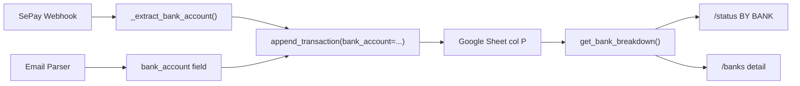

# Code Review — Bank Account Tracking Feature

> **Ngày:** 2026-05-10
> **Files reviewed:** `sheets.py`, `handlers/sepay.py`, `handlers/email_parser.py`, `handlers/reports.py`
> **Feature:** Tracking giao dịch theo bank account / credit card

---

## Architecture Overview



**Data flow:** SePay/Email → extract bank ID (e.g. `TCB-1234`) → write to col P → aggregate for reports.

---

## Verdict per File

| File | Status | Issues |
|------|--------|--------|
| `sheets.py` `get_bank_breakdown()` | ✅ Good | 1 minor |
| `sepay.py` `_extract_bank_account()` | ✅ Good | 1 suggestion |
| `email_parser.py` bank tagging | ✅ Good | 1 minor |
| `reports.py` `/banks` command | ⚠️ 2 bugs | See below |

---

## ✅ What's Good

1. **Bank ID format `{TICKER}-{last4}`** — clean, human-readable, consistent across sources
2. **Graceful fallback chain** — SePay `gateway` → `bankName` → `bank` → `""` (never crashes)
3. **Legacy row handling** — `UNKNOWN_BANK_LABEL = "Không rõ"` for rows without col P — correct
4. **Credit card vs debit distinction** — `Cake-Card-1234` vs `Cake-1234` — excellent UX
5. **`by_category` breakdown** in bank data — enables top-3 category drill-down
6. **Sort by spent desc** — most active bank first
7. **Dedup flow intact** — bank_account param doesn't interfere with existing dedup logic
8. **BANK_ALIASES list** — comprehensive (20 VN banks), ordered long-first to prevent false matches

---

## ⚠️ Bugs Found

### Bug 1: `/banks` Telegram message too long → silent failure

> [!WARNING]
> If user has 5+ bank accounts with many categories, the Telegram message will exceed **4096 char limit** and `sendMessage` will return error 400. The bot silently fails — user sees nothing.

**Location:** `reports.py:186-219`

**Reproduce:** User with 5 banks × 3 categories each × long bank names → ~250 chars/bank × 5 = 1250+ chars (safe now, but fragile)

**Fix:**
```python
# Split into chunks of 4000 chars if msg exceeds limit
if len(msg) > 4000:
    # Send bank-by-bank
    for b in breakdown:
        chunk = _format_single_bank(b, total_spent, name_by_id)
        await tg.send_text(chunk)
else:
    await tg.send_text(msg)
```

**Severity:** Medium — won't crash but user gets no response.

---

### Bug 2: `/status` BY BANK section can push total message over 4096 chars

**Location:** `reports.py:149-164`

Same issue — the `BY BANK` section added to `/status` can push the already-long monthly status message over 4096 chars.

**Fix:** Either truncate to top 3 banks, or move bank section to `/banks` only.

---

## 🔧 Improvements Recommended

### 1. Missing `try/catch` in `send_bank_breakdown()`

```diff
 async def send_bank_breakdown():
+    try:
         ...
+    except Exception as e:
+        print(f"[/banks] error: {e}")
+        await tg.send_text("⚠️ Có lỗi khi tổng hợp dữ liệu bank. Thử lại sau.")
```

Per project rules: **"API calls: BẮT BUỘC try/catch + empty/error state"**

---

### 2. `get_bank_breakdown()` reads ALL rows every time

`sheets.py:626-627` — `ws.get_all_values()` fetches entire transaction sheet. With 1000+ rows this will be slow (Google Sheets API quota).

**Suggestion:** Same pattern as other functions — acceptable for now (Google Sheets phase), will be fixed in PostgreSQL migration (Phase 1).

---

### 3. Bank alias missing: Cake → "Cake by VPBank" in SePay gateway

If SePay sends `gateway: "Cake by VPBank"`, the alias table correctly matches `"cake by vpbank"` → `"Cake"`. ✅ Already handled.

---

### 4. No i18n for `/banks` output

All strings are hardcoded Vietnamese (`"Chi:"`, `"Thu:"`, `"giao dịch"`). When i18n module ships (Phase 1 Day 4), these need to be wrapped in `t()`.

**Non-blocking** — current codebase is pre-i18n.

---

### 5. `_extract_bank_account` could log PII

`sepay.py:208` — `print(f"[sepay] bank_account={bank_account!r}")` logs the bank account ID (e.g. `TCB-1234`). Last 4 digits is mild PII but appears in Railway logs.

**Suggestion:** Mask in production: `print(f"[sepay] bank_account={bank_account[:3]}***")`

---

## 📋 Checklist vs Project Rules

| Rule | Status |
|------|--------|
| try/catch + empty/error state | ⚠️ `/banks` missing try/catch |
| Empty state | ✅ "Chưa có giao dịch nào" message |
| Error state | ❌ No error handling wrapper |
| DEBUG prints cleaned | ⚠️ Multiple `print()` debug statements left |
| Hardcoded hex/rgba | N/A (no UI) |
| i18n `t()` calls | ⚠️ Not yet (pre-i18n phase, acceptable) |
| Cross-user data leakage | ⚠️ `CHAT_ID` from config — single-user only (pre-SaaS) |

---

## Summary

| Category | Score |
|----------|-------|
| **Functionality** | ✅ Correct — bank tagging, aggregation, reporting all work |
| **Data integrity** | ✅ Fallback "Không rõ" prevents data loss |
| **Edge cases** | ⚠️ Message length limit not handled |
| **Security** | ⚠️ PII in logs (mild) |
| **Code quality** | ✅ Clean, well-commented, consistent patterns |
| **Production readiness** | ⚠️ 2 bugs to fix before heavy use |

> [!TIP]
> **Overall: 7/10.** Feature works correctly. Fix the 2 message length bugs + add try/catch and it's production-solid. The rest (i18n, PII masking, perf) will naturally be addressed in the SaaS refactor Phase 1.
