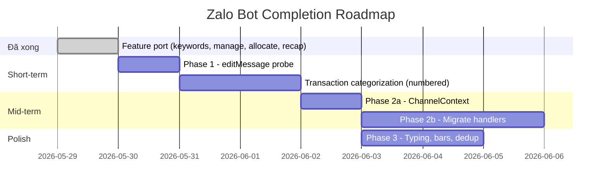

# Zalo Bot — Đánh Giá Tổng Quan

## 1. Tổng quan 3 nguồn thông tin

| Tài liệu | Nội dung | Trạng thái |
|---|---|---|
| [zalo-port-audit.md](file:///Users/maingocanh/Projects/My%20Money%20Went%20Bot/docs/zalo-port-audit.md) | Audit feature parity Telegram ↔ Zalo | ✅ Vừa hoàn thành |
| [implementation-plan-zalo-channel-core.md](file:///Users/maingocanh/Projects/Bot%20Finance/implementation-plan-zalo-channel-core.md) | Architecture baseline cho Zalo channel | ✅ Implemented |
| [implementation-plan-zalo-ux-improvements.md](file:///Users/maingocanh/Projects/Bot%20Finance/implementation-plan-zalo-ux-improvements.md) | UX improvement roadmap (3 phases) | 📋 Planning |

---

## 2. Hiện trạng — Cái gì đã hoạt động

### ✅ Feature coverage (sau audit + implementation vừa rồi)

| Feature | Telegram | Zalo | Ghi chú |
|---|---|---|---|
| SePay notifications | ✅ | ✅ | Fan-out qua `notifier.py` |
| `/today` | ✅ | ✅ | Read-only |
| `/report` | ✅ (buttons) | ✅ (text arg) | `/report tuần` |
| `/accounts` | ✅ (buttons) | ✅ (read-only) | |
| `/keywords` CRUD | ✅ (inline buttons) | ✅ (text menu) | Full: add, edit, delete, change cat |
| `/manage` CRUD | ✅ (inline buttons) | ✅ (text menu) | **Vừa port** — full: rename, amount, delete, add, subs |
| `/allocate` | ✅ (inline buttons) | ✅ (text menu) | **Vừa port** — edit mode |
| `/cancel` | ✅ | ✅ | |
| Daily recap | ✅ | ✅ | **Vừa port** — fan-out best-effort |
| Transaction categorization | ✅ (inline buttons) | ❌ | Phức tạp — xem phân tích bên dưới |
| `/accounts add` wizard | ✅ | ❌ | Low priority |

### 📊 Coverage rate: **~80% features** ported (8/10 core flows)

---

## 3. Phân tích xung đột: Code hiện tại vs Kế hoạch

> [!IMPORTANT]
> Có sự **mâu thuẫn kiến trúc** giữa code hiện tại (main.py) và kế hoạch UX improvements.

### Hiện tại (main.py): Text-based state machine

```
main.py có ~600 LOC Zalo-specific:
- _zalo_kw_*  (12 functions) — keywords
- _zalo_mg_*  (12 functions) — manage     ← vừa thêm
- _zalo_al_*  (3 functions)  — allocate   ← vừa thêm
```

### Kế hoạch (UX improvements Phase 2): ChannelContext abstraction

```
Phase 2 muốn:
- Tạo ChannelContext (ctx.send, ctx.edit, ctx.send_buttons)
- XÓA tất cả _zalo_* functions (~40 functions)
- Unified dispatcher cho cả Telegram + Zalo
- Net: -710 LOC
```

### Đánh giá xung đột

| Aspect | Nhận xét |
|---|---|
| **Code vừa thêm sẽ bị xóa?** | ⚠️ Có — nếu Phase 2 ship, toàn bộ `_zalo_mg_*` và `_zalo_al_*` vừa implement sẽ bị replace bởi unified handlers |
| **Nhưng code hiện tại có giá trị?** | ✅ Có — user có thể dùng ngay mà không cần chờ Phase 2 (có thể mất 3-4 giờ dev nữa) |
| **Phase 2 phụ thuộc Phase 1?** | ✅ Đúng — cần `editMessageText` probe trước. Nếu Zalo API không hỗ trợ, Phase 2 vẫn hữu ích nhưng UX sẽ "new message" style |
| **Phase 1 đã ship?** | ❌ Chưa — chỉ ở trạng thái Planning |

---

## 4. Gap duy nhất còn lại: Transaction Categorization

### Tại sao chưa port?

| Yếu tố | Chi tiết |
|---|---|
| **Zalo API limitation** | Không có inline buttons, không edit/delete message |
| **Flow phức tạp** | SePay → notification → pick parent → pick sub → confirm. Cần track pending uncategorized tx per session |
| **Conflict risk** | Nếu user reply số trên Zalo trong khi đang ở `/manage` flow, sẽ conflict state |

### Theo [channel-core plan](file:///Users/maingocanh/Projects/Bot%20Finance/implementation-plan-zalo-channel-core.md): **Đã implement!**

> [!WARNING]
> Plan channel-core (v2.0.0, trạng thái "Implemented") ghi rõ:
> - "Incoming SePay outgoing transaction sends Telegram inline buttons and a **Zalo numbered picker**"
> - "Zalo numeric reply finalizes the same Google Sheets transaction row"
> - "Queue promotion preserves later pending transactions"
>
> Nhưng code trong `main.py` hiện tại (My Money Went Bot) **KHÔNG có** logic này. Có thể code nằm ở Bot Finance project riêng, hoặc plan đã viết trước implementation thực tế.

### Recommendation

Cần xác nhận:
1. **Bot Finance** project có codebase riêng với transaction categorization trên Zalo không?
2. Nếu có → merge/sync code về My Money Went Bot
3. Nếu chưa → implement theo plan channel-core (numbered picker + queue)

---

## 5. Roadmap khuyến nghị



| Priority | Task | Effort | Giá trị |
|---|---|---|---|
| **1** | Phase 1: `editMessageText` probe | 1-2h | Giải phóng Phase 2 |
| **2** | Transaction categorization (numbered picker) | 3-4h | **Gap lớn nhất** — flow core |
| **3** | Phase 2: ChannelContext + unified handlers | 4-5h | -710 LOC, eliminate duplication |
| **4** | Phase 3: Typing indicator, unicode bars | 30min each | Polish |

---

## 6. Kết luận

### Đánh giá tổng thể: **B+** (Tốt, còn 1 gap quan trọng)

| Tiêu chí | Score | Ghi chú |
|---|---|---|
| Feature coverage | ⭐⭐⭐⭐ | 80% features ported |
| Code quality | ⭐⭐⭐ | Hoạt động nhưng duplicated (~600 LOC sẽ bị thay bằng ChannelContext) |
| Architecture alignment | ⭐⭐⭐ | Text-based state machine là bridge tạm thời, plan Phase 2 sẽ refactor |
| Missing core flow | ⭐⭐ | Transaction categorization chưa có trên Zalo = gap lớn nhất |
| UX parity | ⭐⭐⭐ | Text menus hoạt động OK nhưng kém hơn inline buttons |

### Key decisions cần user input:

1. **Có muốn implement transaction categorization (numbered picker) ngay không?** — Đây là flow core (mỗi giao dịch SePay đều cần categorize)
2. **Có muốn bắt đầu Phase 1 (editMessage probe) trước không?** — Nếu Zalo hỗ trợ, sẽ mở đường cho Phase 2 giảm 710 LOC
3. **Bot Finance vs My Money Went Bot** — 2 project có codebase khác nhau không? Plan channel-core ghi "Implemented" nhưng code main.py chưa có transaction categorization trên Zalo
